# Melearn — คู่มือกติกาธุรกิจและการพัฒนาระบบ

**ฉบับ Final 1.6 — ขอบเขตส่งมอบใน 1 เดือนแรก — 6 ตุลาคม 2026**

ใช้ไฟล์นี้เป็นกติกากลางสำหรับผู้บริหาร ทีมดูแลระบบ และทีมพัฒนา กติกาตามคำยืนยันล่าสุดในบทสนทนานี้มีน้ำหนักเหนือคู่มือเวอร์ชัน 3 และต้นแบบเดิม

เอกสารนี้กำหนดงานที่ต้องทำให้เสร็จในช่วง 1 เดือนแรก ตั้งแต่เริ่มพัฒนารอบนี้ รวมทั้งกติกาและกรณีตรวจรับ การเลือกสแตก ฐานข้อมูล และวิธี deploy เป็นงานออกแบบทางเทคนิคแยกจากเอกสารนี้ ระบบอีเมลวางแผนใช้ Resend วิดีโอใช้ YouTube Link ก่อน ส่วน Mux/Bunny ยังไม่เลือก

## 1. ระบบและขอบเขตรอบแรก

Melearn เป็นเว็บเรียนด้วยตนเอง ผู้สอนสร้างคอร์ส Admin ตรวจและอนุมัติ ผู้เรียนลงคอร์สฟรี ซื้อคอร์สผ่าน Stripe หรือใช้โค้ดมา Redeem เรียน ทำแบบฝึกหัด และรับใบรับรองเมื่อผ่านครบ

| ส่วน | งานที่ต้องมี |
| --- | --- |
| บัญชี | สมัครด้วยอีเมล หรือ Admin สร้าง Username/Password ให้ เข้าสู่ระบบด้วย Username/อีเมลหรือ Google เชื่อม Google กู้รหัสผ่าน และดู/แก้ข้อมูลส่วนตัว |
| คอร์สสาธารณะ | รายการและรายละเอียดคอร์สที่เผยแพร่แล้ว |
| Blog | ทุกคนอ่านบทความ Published ได้ Admin เขียน แก้ และเผยแพร่ |
| การสร้างคอร์ส | คอร์ส บท วิดีโอจาก YouTube Link บทอ่าน แบบฝึกหัด และการจัดลำดับ; Upload Video ยังใช้งานไม่ได้ |
| การตรวจคอร์ส | ส่งตรวจ Admin อนุมัติหรือส่งกลับ และเผยแพร่ |
| สิทธิ์เรียน | Enroll คอร์สฟรี ซื้อคอร์สผ่าน Stripe แล้วรับสิทธิ์ทันที หรือ Redeem โค้ด เรียนได้ตลอด |
| การชำระเงิน | Stripe Checkout สำหรับซื้อคอร์สรายคอร์ส ยืนยันผลที่ server และให้ Enrollment อัตโนมัติ ไม่ต้องใช้โค้ดหลังจ่าย |
| การเรียน | เปิดบทเรียน กดเรียนจบ ดูเปอร์เซ็นต์ความคืบหน้า และกลับมาเรียนต่อ |
| แบบฝึกหัด | เลือกตอบ ข้อเขียน และแนบภาพ ตรวจคะแนน ทำซ้ำ และใช้คะแนนสูงสุด |
| ใบรับรอง | ออกอัตโนมัติเมื่อ Progress 100% ดูและดาวน์โหลดได้ |
| งาน Admin | สร้างบัญชีผู้ใช้ เพิ่มผู้สอน สร้าง/แก้/เผยแพร่คอร์สแทน ออกโค้ด และดูว่าใครใช้โค้ด |
| อีเมล | ส่ง Verification Link ผ่าน Resend ไม่ใช้ OTP ลิงก์ยืนยันอายุ 24 ชั่วโมง ใช้ครั้งเดียว และมี Reset password |
| AI Course Support | AI Chat เดิมและ Video Transcript พร้อมระบบเข้าเรียนทุกช่องทาง; มีคำสั่งสร้างแบบฝึกหัดในแชต ประวัติ ค้นหา เปลี่ยนชื่อ ลบแชต และเก็บคำถาม/คำตอบใน Database และจำกัด 20 Prompt สำเร็จต่อบัญชีต่อวัน |

รายละเอียดสิ่งที่ไม่ทำอยู่ในบท 8 ทุกส่วนในตารางนี้เป็นงานส่งมอบใน 1 เดือนแรก แม้แบ่งพัฒนาเป็นหลายชุดงาน หน้าดูคำถาม AI สำหรับ Admin และระบบวิเคราะห์ Big Data ทำภายหลัง แต่เริ่มเก็บข้อมูลคำถามใน Database ในรอบนี้

### 1.1 รายการ Domain และข้อมูลสำคัญ

Domain คือข้อมูลหลักที่ระบบต้องเข้าใจ ตารางนี้บอกชื่อ หน้าที่ และข้อมูลที่ต้องมีความหมายตรงกัน ไม่บังคับว่าต้องแยกหนึ่งตารางฐานข้อมูลต่อหนึ่ง Domain

| ข้อมูล | หน้าที่ | ข้อมูลสำคัญ |
| --- | --- | --- |
| User | ตัวตนและบทบาท | ID ชื่อ Username ไม่ซ้ำ อีเมลถ้ามี Password hash ถ้าใช้รหัสผ่าน บทบาท แหล่งสร้าง self/admin/google ค่า email_verified ผู้สร้าง/เวลา |
| AuthIdentity | บัญชีภายนอกที่เชื่อมกับ User เดิม | User ผู้ให้บริการ Google รหัสตัวตนจากผู้ให้บริการ อีเมลที่ยืนยันแล้ว เวลาเชื่อม; LINE ยังไม่ทำ |
| EmailVerification | หลักฐานยืนยันอีเมลผ่านลิงก์ | User อีเมลที่ยืนยัน Token hash created_at expires_at หลังออก 24 ชั่วโมง used_at ข้อมูลจำกัดความถี่ขอใหม่ |
| PasswordReset | คำขอตั้งรหัสผ่านใหม่ | User หลักฐานยืนยันที่เก็บอย่างปลอดภัย เวลาหมดอายุ เวลาใช้ สถานะ; ไม่เก็บรหัสผ่านใหม่ในรายการคำขอ |
| EmailDelivery | ประวัติอีเมลระบบ | User ผู้รับ ประเภท verify_email/password_reset สถานะส่ง เวลาอ้างอิง และหมายเลขจาก Resend ถ้ามี |
| Course | คอร์สและ Instructor ประจำคอร์ส | ID ชื่อ คำอธิบาย ภาพปก Instructor ประเภทฟรี/เสียเงิน ราคาขาย/currency สถานะ ai_enabled ผู้สร้าง/ผู้แก้ เวลา |
| CourseReview | ประวัติส่งตรวจ อนุมัติ และส่งกลับ | Course ผู้ส่ง ผู้ตรวจ ผล เหตุผล เวลา และฉบับข้อมูลที่ตรวจ |
| Chapter | บทภายในคอร์ส | ID Course ชื่อบท ลำดับ |
| ContentItem | รายการเรียนภายในบท | ID Chapter ชนิด ชื่อ ลำดับ และข้อมูลวิดีโอ/บทอ่าน/Quiz; Video รอบแรกมี video_source=youtube และ video_url |
| VideoTranscript | ข้อความถอดเสียงสำหรับ AI ของวิดีโอ | Video ContentItem ข้อความ Plain Text ที่เก็บบรรทัดและ Timestamp ตามต้นฉบับ Admin ผู้แก้ updated_at; ตามกลับไปยัง Chapter และ Course ได้ |
| AIConversation | แชตของหนึ่งบัญชี | ID user_id ชื่อแชต ชื่อที่ผู้ใช้ตั้งเองหรือชื่อเริ่มต้น บริบทคอร์สที่เลือก created_at updated_at |
| AIMessage | คำถามและคำตอบในแชต | ID conversation_id user_id บทบาท user/assistant ข้อความหรือชุดคำตอบ course_id และบริบทบท/Video/Attempt/Question ถ้ามี request_id สถานะ pending/succeeded/failed created_at completed_at error_code ถ้าล้มเหลว |
| AIUsageDaily | จำนวน Prompt สำเร็จรายวัน | user_id usage_date ตาม Asia/Bangkok success_count และข้อมูลกันสิทธิ์ชั่วคราวของคำขอกำลังตอบ; หนึ่งรายการต่อบัญชีต่อวัน |
| AIPractice | แบบฝึกหัดที่ AI สร้างในแชต | ID AIMessage เจ้าของบัญชี หัวข้อ คอร์ส/บทที่อ้างถ้ามี ชุดโจทย์/ตัวเลือกพร้อม ID ที่คงที่ภายในชุด เฉลย/คำอธิบาย คำตอบที่เลือก ผลและเวลาตอบ; เก็บเป็น Snapshot ในแชต ไม่ใช่ Quiz ของคอร์ส |
| Quiz | แบบฝึกหัดหนึ่งชุด | ID ContentItem ชื่อ คำชี้แจง คะแนนเต็ม ข้อคำถาม |
| Question | คำถามและวิธีตรวจ | ID Quiz ชนิด โจทย์ ตัวเลือก เฉลย คะแนนเต็ม |
| Enrollment | สิทธิ์เรียนของหนึ่งบัญชีในหนึ่งคอร์ส | ID User Course แหล่งสิทธิ์ free/redeem/stripe โค้ดที่ใช้ถ้ามี เวลาได้รับสิทธิ์ completed_at และ completion_snapshot ของรายการที่ใช้ตัดสินการจบ |
| Progress | ผลการเรียนรายรายการ | Enrollment ContentItem สถานะ เวลาเรียนจบ และข้อมูลกลับมาเรียนต่อ |
| QuizAttempt | การทำแบบฝึกหัดแต่ละครั้ง | ID Enrollment Quiz ชุดคำถามที่เก็บ ณ ตอนเริ่ม สถานะ เวลาเริ่ม/ส่ง คะแนนรวม ผลผ่าน |
| Answer | คำตอบและผลตรวจรายข้อ | Attempt Question ในชุดที่เก็บ คำตอบ/ภาพ คะแนน ความคิดเห็น ผู้ตรวจ เวลา |
| RedeemCode | รหัสให้สิทธิ์หนึ่งคอร์ส | รหัสไม่ซ้ำ Course สถานะ Unused/Used/Revoked Admin ผู้ออก เวลาออก User ผู้ใช้ เวลาใช้ Enrollment ที่ได้รับ revoked_by และ revoked_at ถ้ายกเลิก |
| Payment | การซื้อคอร์สผ่าน Stripe แต่ละครั้ง | ID User Course ราคา/currency ณ ตอนเริ่ม amount_minor สถานะ request_id Stripe Checkout Session ID PaymentIntent ID ถ้ามี paid_at สถานะให้สิทธิ์และ Enrollment ที่ได้รับ; ไม่เก็บข้อมูลบัตร |
| PaymentEvent | เหตุการณ์ชำระเงินที่ server รับ | Stripe event_id ไม่ซ้ำ ชนิดเหตุการณ์ Payment/Session ที่อ้าง เวลา สถานะประมวลผลและข้อผิดพลาด; รับเฉพาะเหตุการณ์ที่ตรวจลายเซ็นผ่าน |
| Certificate | หลักฐานจบคอร์ส | รหัสไม่ซ้ำ Enrollment ชื่อผู้รับ/คอร์ส ณ ตอนออก วันที่ออก และอ้าง completion_snapshot ที่ใช้จบ |
| BlogPost | บทความสาธารณะ แยกจากบทอ่านในคอร์ส | ID ชื่อบทความ Slug ภาพปก คำเกริ่น เนื้อหา Admin ผู้เขียน สถานะ Draft/Published created_at updated_at published_at |

CourseReview เก็บผู้ส่ง/ผู้ตรวจแยกจาก Instructor ประจำคอร์ส ชื่อผู้รับและชื่อคอร์สบนใบรับรองเก็บ ณ วันที่ออก เพื่อรักษาใบเดิมเมื่อข้อมูลปัจจุบันเปลี่ยน ความสัมพันธ์และข้อจำกัดอยู่ในบท 4

### 1.2 ชื่อ Permission และความหมาย

Role คือบทบาท Learner/Instructor/Admin ส่วน Permission คือสิทธิ์ทำงานแต่ละอย่าง ชื่อด้านล่างเป็นชื่อกลางที่เอกสารและทีมพัฒนาใช้ร่วมกัน คำว่า self หมายถึงข้อมูลของบัญชีที่เข้าสู่ระบบ

| ชื่อบทบาท | ความหมาย |
| --- | --- |
| Guest | ผู้เยี่ยมชมที่ยังไม่เข้าสู่ระบบ ดูคอร์สสาธารณะได้ |
| Learner | ผู้เรียน ลงเรียนและดูผลของตนเอง |
| Instructor | ผู้สอน จัดการคอร์สตนเอง และเรียนคอร์สคนอื่นได้ |
| Admin | ผู้ดูแลระบบ สร้างบัญชี เพิ่มผู้สอน ตรวจ/จัดการคอร์ส และออกโค้ด |

| Permission | Domain | ความหมาย | ผู้ใช้และขอบเขต |
| --- | --- | --- | --- |
| user.create | User | สร้างบัญชีและตั้ง Username/Password | Admin |
| user.assign_instructor | User | เพิ่มสิทธิ์ Instructor | Admin |
| user.profile_self | User | อ่าน/แก้ข้อมูลส่วนตัว | บัญชีตนเอง ไม่เปลี่ยน Role |
| auth.verify_email_self | EmailVerification/User | ยืนยันอีเมลจากลิงก์ | ผู้มีลิงก์ที่ถูกต้องของอีเมลนั้น ใช้ครั้งเดียวภายใน 24 ชั่วโมง |
| auth.resend_verification_self | EmailVerification/EmailDelivery | ขอลิงก์ยืนยันใหม่ | บัญชีที่ยังไม่ยืนยันอีเมล ภายใต้ข้อจำกัดความถี่ |
| auth.link_google_self | AuthIdentity | เชื่อม Google กับบัญชีเดิม | ผู้ที่เข้าสู่ระบบอยู่ เชื่อมบัญชีตนเอง |
| auth.reset_password_self | PasswordReset | ตั้งรหัสผ่านใหม่ผ่านลิงก์อีเมล | บัญชีที่มีอีเมลยืนยันแล้วและหลักฐาน Reset ถูกต้อง |
| course.read_public | Course | อ่านรายการ/รายละเอียดสาธารณะ | ทุกคน เฉพาะ Published |
| course.read_content | Course/Chapter/ContentItem | เปิดเนื้อหาที่จำกัดสิทธิ์ | ผู้มี Enrollment; เจ้าของคอร์สและ Admin ดูเพื่อจัดการ |
| course.create | Course | สร้างคอร์ส | Instructor สร้างตนเอง; Admin สร้างแทนและระบุ Instructor |
| course.update | Course/Chapter/ContentItem/Quiz/Question | แก้เนื้อหาการเรียนและจัดลำดับ ไม่รวมการตั้งค่า AI/Transcript | Instructor เฉพาะคอร์สตนเอง; Admin จัดการแทน |
| course.preview | Course/Quiz | ดูตัวอย่างเพื่อจัดการ | เจ้าของคอร์สหรือ Admin ไม่สร้างผลเรียนจริง |
| course.submit_review | CourseReview | ส่งคอร์สให้ตรวจ | Instructor เจ้าของคอร์ส |
| course.review | CourseReview | อนุมัติ/ส่งกลับพร้อมเหตุผล | Admin |
| course.publish | Course | เผยแพร่ครั้งแรก | Instructor เจ้าของหลังอนุมัติ; Admin ตรวจและเผยแพร่แทนได้ |
| course.learners_read | Enrollment/Progress/QuizAttempt/Answer | ดูผู้เรียนและผลเพื่อดูแลคอร์ส | Instructor คอร์สตนเอง; Admin ตามงานจัดการคอร์ส |
| enrollment.create_self | Enrollment | ลงเรียนคอร์สฟรีให้ตนเอง | Learner/Instructor ในคอร์สคนอื่น ตามเงื่อนไขบัญชี |
| enrollment.read_self | Enrollment | อ่านคอร์สที่ตนลงเรียน | เจ้าของ Enrollment |
| redeem_code.create | RedeemCode | ออกโค้ดผูกคอร์ส | Admin |
| redeem_code.read | RedeemCode | ดูรหัส สถานะ และผู้ใช้ | Admin |
| redeem_code.revoke | RedeemCode | ยกเลิกรหัสที่ยังไม่ใช้ | Admin เฉพาะ Unused ไม่ยกเลิก Used |
| redeem_code.redeem_self | RedeemCode/Enrollment | ใช้โค้ดให้สิทธิ์ตนเอง | Learner/Instructor ในคอร์สคนอื่น; ห้าม Admin และเจ้าของคอร์ส |
| learning.read_self | Progress/QuizAttempt/Answer | อ่านความคืบหน้า คำตอบ คะแนน | เจ้าของผลเรียน |
| payment.checkout_self | Payment/Course | เริ่มซื้อคอร์สผ่าน Stripe | Learner หรือ Instructor ซื้อคอร์สคนอื่น บัญชีพร้อมเรียน; ห้าม Admin/เจ้าของคอร์ส/ผู้มี Enrollment แล้ว |
| payment.read_self | Payment | อ่านสถานะซื้อและสิทธิ์ที่ได้รับ | เจ้าของ Payment เท่านั้น ตรวจ User จาก session |
| payment.read_admin | Payment/PaymentEvent | อ่านข้อมูลชำระเงินเพื่อดูแลรายการผิดปกติ | Admin; ไม่ใช่สิทธิ์คืนเงินหรือทำรายงานส่วนแบ่ง |
| progress.update_self | Progress | บันทึกจุดเรียนต่อ/กดจบเนื้อหา | เจ้าของ Enrollment วิดีโอและบทอ่านกดจบได้ |
| quiz.attempt_self | QuizAttempt/Answer | เริ่ม บันทึก ส่ง และทำซ้ำ | เจ้าของ Enrollment ในคอร์สที่เรียน |
| quiz.grade | Answer/QuizAttempt | ตรวจข้อเขียน/ภาพและให้ความคิดเห็น | Instructor เจ้าของคอร์ส |
| certificate.read_self | Certificate | อ่านและดาวน์โหลดใบรับรอง | เจ้าของ Enrollment ที่ได้รับใบ |
| email.send_system | EmailDelivery | ส่งยืนยันอีเมล/ลิงก์ Reset | ระบบส่งตามขั้นตอนบัญชี ไม่ใช่สิทธิ์ส่งอีเมลทั่วไปของผู้ใช้ |
| blog.read_public | BlogPost | อ่านรายการ/บทความสาธารณะ | ทุกคน เฉพาะ Published |
| blog.create | BlogPost | เขียนบทความใหม่ | Admin |
| blog.update | BlogPost | แก้บทความและภาพปก | Admin |
| blog.publish | BlogPost | เผยแพร่บทความ | Admin |
| ai.configure_course | Course | เปิด/ปิด ai_enabled | Admin เท่านั้น |
| ai.manage_knowledge | VideoTranscript | เพิ่ม แก้ หรือแทนที่ Transcript สำหรับ AI | Admin เท่านั้น ตรวจว่าเป็น Video ในคอร์สนั้น |
| ai.chat_course | Course/Chapter/ContentItem/VideoTranscript | ถาม AI จาก Knowledge ของคอร์ส | คอร์สเปิด AI และผู้ใช้มีสิทธิ์อ่านเนื้อหา; ไม่ให้สิทธิ์อ่าน Raw Transcript |
| ai.history_self | AIConversation/AIMessage | สร้าง อ่าน ค้นหา เปลี่ยนชื่อ และลบแชต | Learner/Instructor/Admin เฉพาะแชตตนเอง; Admin ยังไม่มีหน้าดูแชตผู้อื่นในรอบนี้ |
| ai.practice_self | AIConversation/AIMessage/AIPractice | สั่งสร้าง ตอบ และอ่านผลแบบฝึกหัดในแชต | Learner/Instructor/Admin เฉพาะแชตตนเอง ใช้กติกาสิทธิ์คอร์สและโควตา AI เดิม |
| ai.usage_self | AIUsageDaily | อ่านโควตา AI วันนี้ | เจ้าของบัญชี; server เป็นผู้ตรวจและนับจำนวน |

Permission ต้องตรวจขอบเขตและสถานะร่วมด้วย เช่น course.publish ไม่ทำให้ Instructor เผยแพร่ก่อนอนุมัติได้ และ course.update ไม่ทำให้แก้คอร์สคนอื่นได้ รายละเอียดตารางสิทธิ์อยู่ในบท 3


### 1.3 คำศัพท์กลางสำหรับเนื้อหาและหน้าจอ

ใช้ชื่อเหล่านี้ร่วมกันในเอกสาร หน้าจอ และการคุยงาน เพื่อไม่เรียกข้อมูลคนละชนิดด้วยชื่อเดียวกัน

| คำไทย | ชื่อกลาง | ความหมาย/ชื่อชนิดข้อมูล |
| --- | --- | --- |
| คอร์ส | Course | หน่วยการเรียนที่มี Instructor หนึ่งคนและหลายบท |
| ภาพปกคอร์ส | Course Cover Image | ภาพแสดงคอร์สในรายการและหน้ารายละเอียด ไม่ใช่ภาพวิดีโอ |
| ผู้สอนประจำคอร์ส | Course Instructor | Instructor ที่ผูกกับ Course ผู้สร้างแทนอาจเป็น Admin |
| บท | Chapter | กลุ่มรายการเนื้อหาภายในคอร์ส |
| รายการเนื้อหา | Content Item | รายการหนึ่งในบท เป็น video, article หรือ quiz |
| วิดีโอบทเรียน | Lesson Video | ContentItem ชนิด video |
| เปิด AI ของคอร์ส | AI Support / ai_enabled | Admin อนุญาตให้ใช้เนื้อหาคอร์สเป็น Knowledge สำหรับ AI |
| ข้อความถอดเสียงสำหรับ AI | AI Transcript / Video Transcript | Plain Text ของ Video มี Timestamp ได้ ไม่แสดงเป็นบทอ่านให้ผู้เรียน |
| ข้อมูลประกอบคำตอบ | Course Knowledge | Course Description, Lesson Article และ Video Transcript ของคอร์สที่เปิด AI |
| บทสนทนา AI | AI Conversation / Chat | แชตหนึ่งรายการ มีชื่อและหลายข้อความ เป็นของบัญชีเดียว |
| ข้อความ AI | AI Message | คำถามของผู้ใช้หรือคำตอบของ AI มีเวลาและบริบทของข้อความนั้น |
| แบบฝึกหัดฝึกเองในแชต | AI Practice | ชุดข้อเลือกตอบที่ AI สร้างจากหัวข้อหรือบริบทคอร์ส แสดงและตอบในแชต ไม่ใช่ QuizAttempt และไม่คิด Progress |
| คำสั่งสร้างแบบฝึกหัด | สร้างแบบฝึกหัด / /quiz | ผู้ใช้ระบุหัวข้อและจำนวนข้อได้ เช่น “สร้างแบบฝึกหัดเศษส่วน 5 ข้อ” หรือ “/quiz เศษส่วน 5 ข้อ” ไม่ต้องแนบ PDF |
| หนึ่งคำถามที่ส่งให้ AI | Prompt | การส่งข้อความหนึ่งครั้ง; นับโควตาเมื่อ AI ตอบสำเร็จ ไม่ใช่จำนวน Token หรือจำนวนแชต |
| บทอ่านในคอร์ส | Lesson Article | ContentItem ชนิด article นับเป็นรายการเรียน |
| แบบฝึกหัด/แบบทดสอบ | Quiz | ContentItem ชนิด quiz หนึ่งชุดมีหลาย Question |
| ข้อคำถาม | Question | โจทย์หนึ่งข้อภายใน Quiz |
| ข้อเลือกตอบ/ข้อกา | Choice Question / MCQ | คำถามที่ผู้เรียนเลือกจากตัวเลือก มีเฉลยตรวจโดยระบบ |
| ตัวเลือก | Choice Option | คำตอบให้เลือกใน Choice Question |
| เฉลย | Answer Key | ข้อมูลตรวจคำตอบ เก็บฝั่งระบบ ไม่เปิดในข้อมูลข้อสอบของผู้เรียน |
| ข้อเขียน | Written Question / Essay | คำถามที่ Instructor ตรวจคำตอบและให้คะแนน |
| คำตอบแนบภาพ | Image Attachment | ภาพที่ส่งประกอบคำตอบและให้ Instructor ตรวจ แยกจากภาพปกคอร์ส |
| คำตอบผู้เรียน | Learner Answer | Answer ของการทำแบบฝึกหัดแต่ละครั้ง |
| การทำหนึ่งครั้ง | Quiz Attempt | คำถามที่เก็บไว้ คำตอบ สถานะตรวจ และคะแนนของครั้งนั้น |
| คะแนนเต็ม / คะแนนที่ได้ | Maximum Score / Earned Score | ใช้คำนวณเปอร์เซ็นต์ คะแนนมากกว่า 70% จึงผ่าน |
| ความคิดเห็นจากผู้ตรวจ | Grading Feedback | ข้อความประกอบผลตรวจคำตอบ |
| ความคืบหน้า / จบคอร์ส | Progress / Course Completion | ผลรายรายการและผลจบคอร์ส 100% |
| รายการ ณ วันจบ | Completion Snapshot | สำเนารายการและผลที่ใช้ตัดสินจบเมื่อ completed_at |
| ใบรับรอง | Certificate | หลักฐานจบคอร์ส ออกอัตโนมัติ |
| หน้ารับชำระเงิน | Stripe Checkout | หน้า Stripe สำหรับจ่ายค่าคอร์สหนึ่งคอร์ส ไม่ใช่ตะกร้าของ Melearn |
| รายการชำระเงิน | Payment | ข้อมูลตรวจผลการจ่ายและให้สิทธิ์เรียน ไม่ใช่หน้ารายการสั่งซื้อแบบเต็ม |
| เหตุการณ์จาก Stripe | Webhook / PaymentEvent | ข้อมูลที่ Stripe ส่งให้ server ใช้ตรวจผลและให้สิทธิ์ ไม่เชื่อสถานะจ่ายจาก browser |
| โค้ดแลกสิทธิ์เรียน | Redeem Code | รหัสผูกหนึ่งคอร์ส ใช้ครั้งเดียว ไม่ใช่โค้ดส่วนลด |
| บทความ Blog | Blog Post | BlogPost สาธารณะ ไม่เป็นรายการเรียนและไม่คิด Progress |
| ภาพปกบทความ | Blog Cover Image | ภาพของ BlogPost แยกจาก Course Cover Image |
| รอตรวจคอร์ส | Pending Review / In review | Course สถานะ pending_review รอ Admin ตรวจ |
| ยังไม่ยืนยันอีเมล | Email Unverified | User มี email_verified=false ไม่ใช่บัญชีรอ Admin อนุมัติ |

## 2. กติกาธุรกิจ (Business Logic)

### 2.1 บัญชีและการเข้าสู่ระบบ

#### วิธีได้บัญชีและเงื่อนไขเริ่มเรียน

| วิธีได้บัญชี | วิธีเข้าสู่ระบบ | เงื่อนไขเริ่มเรียน |
| --- | --- | --- |
| สมัครด้วยอีเมลเอง | อีเมลและรหัสผ่าน | ยืนยันอีเมลก่อน Enroll/ซื้อผ่าน Stripe/Redeem และเรียน |
| สมัคร/เข้าสู่ระบบด้วย Google | Google ที่ระบบตรวจแล้ว | เริ่มลงเรียนได้ ใช้อีเมลที่ Google ยืนยันแล้ว |
| Admin สร้างให้ | Username และรหัสผ่านที่ Admin ตั้ง | เริ่มลงเรียนได้ทันที ไม่ต้องรอเพิ่มอีเมลหรือเชื่อม Google |

ทุกกรณียังต้อง Enroll คอร์สฟรี ซื้อคอร์สผ่าน Stripe หรือ Redeem โค้ดคอร์สเสียเงิน การสร้างบัญชีไม่ได้ให้สิทธิ์ทุกคอร์สเอง

- ผู้สมัครทั่วไปเริ่มเป็น Learner และเพิ่มสิทธิ์ Instructor ให้ตนเองไม่ได้
- ผู้สมัครด้วยอีเมลเองที่ยังไม่ยืนยัน Login ได้ แต่ต้องยืนยันก่อน Enroll/ซื้อผ่าน Stripe/Redeem และเริ่มเรียน
- รองรับ Google login ในรอบแรก ใช้อีเมลที่ Google ยืนยันแล้วได้โดยไม่ต้องยืนยันซ้ำกับ Melearn
- บัญชีที่ใช้รหัสผ่านกู้รหัสผ่านผ่านอีเมลที่ยืนยันแล้วของตนเองได้ หลักฐานกู้รหัสใช้ได้ครั้งเดียวและมีเวลาหมดอายุ
- ดูและแก้ข้อมูลส่วนตัวของตนเองได้ การแก้ข้อมูลส่วนตัวไม่เปลี่ยนบทบาทหรือสถานะยืนยันอีเมลเอง
- ระบบรู้ตัวตนและสิทธิ์จากการเข้าสู่ระบบที่ server ตรวจแล้ว ไม่เชื่อ User ID หรือ Role ที่หน้าเว็บส่งมาเพื่อเพิ่มสิทธิ์
- ไม่ส่งรหัสผ่านกลับในข้อมูลบัญชี และไม่เก็บรหัสผ่านเป็นข้อความอ่านได้

#### บัญชีที่ Admin สร้าง

- Admin ตั้ง Username ไม่ซ้ำและรหัสผ่านเริ่มต้น แล้วส่งข้อมูลให้ผู้ใช้เข้าสู่ระบบได้
- สร้างบัญชีโดยยังไม่มีอีเมลได้ บัญชีนี้เริ่มเรียนได้ทันทีตามสิทธิ์คอร์ส
- บัญชีเริ่มเป็น Learner ถ้าต้องเป็น Instructor ให้ Admin เพิ่มสิทธิ์ผ่านขั้นตอนเพิ่มผู้สอน
- ผู้ใช้เข้าสู่บัญชีเดิมแล้วเพิ่มอีเมล ยืนยันอีเมล หรือเชื่อม Google ภายหลังเองได้
- รหัสผ่านเก็บเป็น Password hash การมอบรหัสให้ผู้ใช้ทำจากรหัสที่ตั้ง ไม่เปิดอ่านรหัสเดิมจากฐานข้อมูล
- บันทึก Admin ผู้สร้างและเวลาแยกจากชื่อผู้ใช้

ตัวอย่างขั้นตอน: Admin สร้าง Username melearn_user และกำหนดรหัสผ่าน → ส่งให้ผู้ใช้ → ผู้ใช้ Login → Enroll/ซื้อผ่าน Stripe/Redeem → เรียนได้ → เชื่อม Google ภายหลังได้

#### เชื่อม Google กับบัญชีเดิม

- หาก Google Email ตรงกับบัญชีเดิมที่ยังไม่ได้เชื่อม ให้ Login บัญชีเดิมก่อนแล้วกด Link Google ห้ามจับคู่อีเมลแล้วรวมบัญชีอัตโนมัติหรือสร้าง User ซ้ำ

- ผู้ใช้ต้องเข้าสู่บัญชี Melearn เดิมก่อนเริ่มเชื่อม Google
- ระบบตรวจการเข้าสู่ Google แล้วผูกตัวตน Google กับ User ID เดิม
- หลังเชื่อม เข้าด้วย Google หรือ Username/Password เดิมได้ คอร์ส คะแนน Progress และใบรับรองยังเป็นข้อมูลชุดเดิม
- การเชื่อมไม่สร้าง User ใหม่และไม่เปลี่ยน Role
- ตัวตน Google หนึ่งรายการเชื่อมได้กับ User เดียว หากผูกกับบัญชีอื่นอยู่แล้วต้องไม่รวมบัญชีหรือย้ายข้อมูลอัตโนมัติ
- การเพิ่มอีเมลเองต้องยืนยันอีเมลก่อนใช้รับลิงก์ Reset password อีเมลจาก Google ที่ตรวจแล้วใช้เป็นอีเมลยืนยันได้

#### Email Verification ผ่านลิงก์

- เมื่อสมัครด้วยอีเมล ระบบสร้างบัญชี Learner ที่ email_verified=false และส่ง Verification Link ไปอีเมลที่ลงทะเบียนผ่าน Resend
- ยืนยันด้วยการกดลิงก์ ไม่ใช้การกรอก OTP
- ลิงก์มีอายุ 24 ชั่วโมงนับจากเวลาออกและใช้ได้ครั้งเดียว ระบบตรวจอายุจากเวลาที่ server
- เมื่อใช้ลิงก์สำเร็จ ตั้ง email_verified=true ใน User เดิม ไม่สร้าง User ใหม่
- ผู้สมัครอีเมลเองที่ยังไม่ยืนยันเข้าสู่ระบบได้ แต่ Enroll, ซื้อผ่าน Stripe, Redeem และเริ่มเรียนไม่ได้
- ลิงก์หมดอายุให้กด Resend Verification Email เพื่อขอลิงก์ใหม่ได้ จำกัดความถี่การขอส่งใหม่ที่ server
- เปิดลิงก์ที่ใช้แล้วให้แสดง “ยืนยันแล้ว” หรือสถานะการใช้ลิงก์ที่เหมาะสม ไม่ยืนยันซ้ำและไม่สร้างบัญชีเพิ่ม
- ลิงก์ไม่ถูกต้องไม่เปลี่ยนสถานะบัญชี การส่งอีเมลล้มเหลวไม่ทำให้บัญชีถือว่ายืนยันแล้ว
- Google ที่ server ตรวจว่าอีเมลยืนยันแล้วไม่ต้องยืนยันซ้ำกับ Melearn
- บัญชี Admin สร้างยังเริ่มลงเรียนได้ทันทีแม้ไม่มีอีเมล การยืนยันอีเมลเพื่อกู้รหัสผ่านเป็นคนละเงื่อนไข
- Email Unverified ไม่ใช่ pending_review ของคอร์ส และไม่เพิ่มขั้นอนุมัติบัญชีโดย Admin

#### ลืมรหัสผ่านและส่งอีเมล

- มี Forgot password และ Reset password สำหรับรหัสผ่านของบัญชี Melearn
- ผู้ใช้ระบุ Username หรืออีเมล ระบบส่งลิงก์ Reset ไปยังอีเมลที่ยืนยันแล้วของบัญชีนั้น
- เปิดลิงก์ที่ยังใช้ได้ → ตั้งรหัสผ่านใหม่ → เข้าสู่ระบบด้วยรหัสใหม่ ลิงก์ที่ใช้แล้วหรือหมดอายุใช้ซ้ำไม่ได้
- บัญชีที่ Admin สร้างและยังไม่มีอีเมลยืนยันต้องเพิ่ม/ยืนยันอีเมลหรือเชื่อม Google ก่อนใช้การกู้รหัสผ่านทางอีเมล
- วางแผนใช้ Resend ส่งอีเมลยืนยันและลิงก์ Reset password เก็บผลการส่งและข้อผิดพลาดที่ใช้ตรวจปัญหา
- การส่งเมลสำเร็จไม่ใช่การยืนยันอีเมลหรือ Reset สำเร็จ ต้องมีการใช้ลิงก์และบันทึกผลจริง
- LINE login เป็นงานอนาคต ยังไม่สร้างการเชื่อม LINE หรือปุ่ม Login LINE ในรอบแรก

### 2.2 Instructor และ Admin

- Admin เท่านั้นที่เพิ่ม Instructor ไม่มีแบบฟอร์มขอเป็นผู้สอนหรือขั้นตอนอนุมัติคำขอจากผู้เรียน
- Instructor จัดการคอร์สของตนเอง และลงเรียนคอร์สของผู้สอนอื่นได้ในบัญชีเดียวกัน
- Admin สร้างและแก้คอร์สแทน Instructor ได้ รวมถึงกดเผยแพร่แทน
- หนึ่งคอร์สมี Instructor คนเดียว แม้ Admin เป็นผู้สร้างคอร์ส
- ผู้สร้างข้อมูลกับ Instructor ประจำคอร์สอาจเป็นคนละคน ต้องแยกข้อมูลสองอย่างนี้

### 2.3 คอร์สและการเผยแพร่

- คอร์สมีชื่อ คำอธิบาย ภาพปก Instructor และประเภทฟรี/เสียเงิน
- โครงสร้างคือ Course → Chapter → ContentItem โดย ContentItem เป็นวิดีโอ บทอ่าน หรือแบบฝึกหัด
- หนึ่งบทมีเนื้อหาได้หลายรายการ ไม่จำกัดหนึ่งวิดีโอต่อบท เพิ่ม แก้ และจัดลำดับได้
- บทอ่านมีข้อความจัดรูปแบบและภาพได้
- Instructor เผยแพร่ครั้งแรกได้หลัง Admin อนุมัติ
- หาก Approved แล้วแก้ข้อมูลคอร์ส บท เนื้อหา หรือแบบฝึกหัดก่อน Publish ให้กลับ Draft และส่งตรวจใหม่ Approval เดิมเก็บเป็นประวัติแต่ใช้เผยแพร่ฉบับที่แก้ไม่ได้
- Admin ส่งกลับให้แก้ได้ พร้อมเหตุผล และเผยแพร่แทน Instructor ได้
- Instructor แก้เนื้อหาที่เผยแพร่แล้วได้ทันที ไม่ต้องส่งอนุมัติใหม่ทุกครั้ง
- รอบแรกไม่มีการปิดขายคอร์สหรือ Archive

#### วิดีโอในรอบ 1 เดือนแรก

- Instructor เจ้าของคอร์สหรือ Admin ใส่ YouTube Link ใน Video ContentItem ระบบตรวจรูปแบบลิงก์ เก็บแหล่งวิดีโอเป็น YouTube และแสดง Player ในบทเรียนเดิม
- วิดีโอต้องเปิดให้ฝังและเล่นได้ หากลิงก์ผิด วิดีโอถูกลบ หรือไม่อนุญาตให้เล่น ต้องแจ้งข้อผิดพลาด ไม่แสดงว่าดูสำเร็จหรือเพิ่ม Progress เอง
- UI สำหรับ Upload Video แสดงไว้ได้ แต่ Upload API ต้องตอบว่า **“ขออภัย ระบบนี้ยังไม่พร้อมใช้งาน”** ไม่รับเก็บไฟล์ ไม่สร้างรายการอัปโหลดสำเร็จ และรักษา YouTube Link เดิม
- ยังไม่เลือก Mux หรือ Bunny และไม่เชื่อมระบบ Upload/แปลงไฟล์วิดีโอในรอบนี้ ข้อจำกัดนี้ใช้กับ Video เท่านั้น การใส่ภาพปกและแนบภาพคำตอบยังอยู่ในขอบเขตเดิม
- Melearn ตรวจสิทธิ์ก่อนเปิดบทเรียนและคืนลิงก์วิดีโอ แต่ไม่รับรองการป้องกันการแชร์ YouTube Link นอกระบบ การกดเรียนจบยังใช้กติกา Progress เดิม
- AI Transcript เป็นการวางข้อความโดย Admin แยกจาก YouTube Link ไม่ถอดเสียงหรือดึง Transcript จาก YouTube อัตโนมัติ

### 2.4 การซื้อคอร์ส โค้ด และสิทธิ์เรียน

- คอร์สฟรี: เข้าสู่ระบบและกด Enroll แล้วเรียนได้ ไม่ใช้โค้ดและไม่จ่ายเงิน
- คอร์สเสียเงิน: ซื้อผ่าน Stripe แล้วได้สิทธิ์เรียนทันที หรือซื้อโค้ดแล้ว Redeem
- รอบแรกใช้ Stripe Payment Gateway ซื้อคอร์สแล้วได้สิทธิ์เรียนอัตโนมัติ และยังมี Redeem Code เป็นอีกช่องทาง ไม่ทำตะกร้าหรือหน้ารายการสั่งซื้อแบบเต็ม
- Admin เท่านั้นที่ออกโค้ด หนึ่งรหัสใช้กับหนึ่งคอร์ส ใช้ได้ครั้งเดียว และไม่มีวันหมดอายุ
- Admin ยกเลิกได้เฉพาะรหัส Unused เมื่อยกเลิกเป็น Revoked แลกไม่ได้ รหัส Used ยกเลิกไม่ได้
- ต้องบันทึกว่าบัญชีใดใช้โค้ดกับคอร์สใดและใช้เมื่อไร
- สิทธิ์เรียนจาก Enroll, Stripe และ Redeem เรียนได้ตลอด ไม่มีวันหมดอายุ
- Instructor ซื้อหรือ Redeem คอร์สของตนเองไม่ได้ เพราะเข้าดูคอร์สนั้นได้อยู่แล้ว
- Admin ซื้อหรือ Redeem คอร์สไม่ได้ เพราะเข้าดูทุกคอร์สได้อยู่แล้ว
- การลงเรียนคอร์สของคนอื่นไม่ให้สิทธิ์แก้คอร์ส ดูเฉลยเพื่อจัดการ หรือตรวจคำตอบของผู้เรียนอื่น

#### ซื้อคอร์สผ่าน Stripe

- ซื้อรายคอร์สแบบจ่ายครั้งเดียวจากหน้ารายละเอียดคอร์ส ไม่ต้องมีตะกร้า ใช้ Stripe Checkout เป็นหน้ารับเงิน
- ผู้ซื้อเข้าสู่ระบบและผ่านเงื่อนไขบัญชีในหัวข้อ 2.1 ก่อนเริ่มจ่าย ผู้สมัครอีเมลเองต้องยืนยันก่อน บัญชีที่ Admin สร้างเริ่มซื้อ/เรียนได้ทันทีตามสิทธิ์เดิม
- ซื้อได้เฉพาะคอร์สเสียเงิน Published ที่ไม่มีสิทธิ์เรียนอยู่แล้ว Instructor ซื้อคอร์สคนอื่นได้ ห้ามซื้อคอร์สตนเอง และ Admin ซื้อไม่ได้
- Server สร้าง Payment และ Checkout Session จากราคาและ currency ของคอร์ส ไม่รับราคาหรือสถานะจ่ายสำเร็จจาก browser เก็บราคา ณ ตอนเริ่มจ่ายไว้ตรวจผล
- เมื่อ server ตรวจ Stripe ว่าชำระสำเร็จแล้ว ให้ Enrollment ทันทีโดยไม่รอ Admin อนุมัติและไม่ต้อง Redeem เพิ่ม สิทธิ์เรียนใช้ได้ตลอดตามกติกาเดิม
- ถ้ายังรอยืนยันผล จ่ายไม่สำเร็จ หรือ Session หมดอายุ ยังไม่ให้สิทธิ์ใหม่ หน้าเว็บแสดงสถานะจริงและทางกลับคอร์ส การกดกลับ/ยกเลิกที่ browser ไม่ใช่หลักฐานว่าจ่ายล้มเหลว
- การกลับจาก Stripe ให้ server ตรวจ Session ของ Payment ที่เป็นของบัญชีนั้น แล้วใช้คำสั่งให้สิทธิ์เดียวกับ Webhook เพื่อให้เริ่มเรียนได้ทันทีเมื่อยืนยันได้ การปิด browser ก่อนกลับไม่ทำให้สิทธิ์หาย
- Webhook และการตรวจ Session ซ้ำให้สิทธิ์ได้ครั้งเดียว หากมี Enrollment อยู่แล้ว เช่น Redeem ระหว่างรอผล ให้ใช้สิทธิ์เดิม เก็บ Payment สำเร็จไว้ ไม่ใช้โค้ดหรือสร้าง Enrollment ซ้ำ
- เก็บข้อมูล Payment และสถานะให้สิทธิ์ใน Database ตั้งแต่รอบแรก ผู้ซื้ออ่านผลการซื้อครั้งนั้นได้ Admin อ่านข้อมูลเพื่อจัดการกรณีผิดปกติ ไม่เพิ่ม Finance Dashboard หรือหน้าประวัติ Orders แบบเต็ม
- ยังไม่มีนโยบาย Refund ที่ยืนยัน การเพิ่ม Stripe ไม่ใช่การอนุมัติระบบคืนเงินอัตโนมัติ ส่วนแบ่ง Instructor, payout, subscription หรือ coupon

ใช้ Checkout Sessions สำหรับหน้ารับเงิน และตรวจผลที่ server/ให้สิทธิ์ซ้ำอย่างปลอดภัยตาม [Stripe Checkout](https://docs.stripe.com/payments/checkout) และ [Stripe Fulfillment](https://docs.stripe.com/checkout/fulfillment.md?payment-ui=stripe-hosted)

### 2.5 การเรียนและ Progress

- วิดีโอและบทอ่านจบเมื่อกด “เรียนจบ” รอบแรกไม่ใช้ระยะเวลาที่ดูวิดีโอตัดสิน
- แบบฝึกหัดจบเมื่อส่งคำตอบครบและคะแนนมากกว่า 70% ของคะแนนเต็มในชุดนั้น
- แต่ละรายการเนื้อหานับหนึ่งหน่วย แบบฝึกหัดหนึ่งชุดนับเป็นหนึ่งรายการ ไม่ได้นับแยกตามจำนวนคำถาม
- Progress = รายการเนื้อหาที่จบ ÷ รายการเนื้อหาทั้งหมด × 100
- ครบ 100% คือผ่านคอร์ส ต้องจบครบจริง ไม่ปัดเศษจากค่าที่ต่ำกว่าให้กลายเป็น 100%
- ตอนจบเก็บ completed_at และ completion_snapshot ของรายการที่ใช้ตัดสินจบ พร้อมผลและ Attempt ที่ใช้ตัดสินแบบฝึกหัด
- เก็บความคืบหน้าที่ server กลับมาเรียนต่อได้หลังออกจากระบบหรือเปลี่ยนอุปกรณ์
- เจ้าของคอร์สและ Admin เข้าดูเพื่อจัดการได้ การเปิดดูนี้ไม่สร้าง Progress คะแนน หรือใบรับรองโดยอัตโนมัติ

ตัวอย่าง: คอร์สมีวิดีโอ 2 รายการ บทอ่าน 1 รายการ และแบบฝึกหัด 1 ชุด รวม 4 รายการ กดจบวิดีโอและบทอ่านครบจะได้ 75% เมื่อแบบฝึกหัดส่งครบและคะแนนมากกว่า 70% จึงเป็น 100%

### 2.6 แบบฝึกหัดและคะแนน

- รองรับข้อเลือกตอบ ข้อเขียน และคำตอบแนบภาพ
- ข้อที่มีเฉลยแน่นอนตรวจโดยระบบ ข้อเขียนและภาพให้ Instructor เจ้าของคอร์สตรวจ พร้อมคะแนนและความคิดเห็น
- เมื่อเริ่มทำ ระบบเก็บชุดคำถาม ตัวเลือก เฉลย และคะแนนเต็มของครั้งนั้น การแก้แบบฝึกหัดภายหลังไม่เปลี่ยนผลครั้งเดิม
- คะแนนคำนวณที่ server หน้าเว็บส่งคำตอบ ไม่ส่งคะแนนที่ระบบยอมรับเป็นผลจริง
- ต้องส่งคำตอบครบและได้คะแนน **มากกว่า 70%** จึงผ่าน คะแนน 70% พอดียังไม่ผ่าน
- ถ้ามีคำตอบที่ต้องตรวจเอง ต้องรอคะแนนครบก่อนสรุปผลครั้งนั้น
- ทำซ้ำได้ เก็บประวัติแต่ละครั้งและใช้คะแนนสูงสุดของแต่ละชุดที่ตรวจเสร็จแล้ว
- ผลครั้งใหม่ต่ำกว่าเดิมไม่ทำให้ชุดที่ผ่านแล้วกลับเป็นไม่ผ่าน
- การลองใหม่เริ่มการทำครั้งใหม่ ไม่เปิดคำตอบที่ส่งแล้วกลับมาแก้

### 2.7 ใบรับรองและเนื้อหาที่เพิ่มภายหลัง

**วิดีโอ/บทอ่านจบครบ + แบบฝึกหัดทุกชุดส่งครบและคะแนนมากกว่า 70% → Progress 100% → ออกใบรับรองอัตโนมัติ**

- ไม่ต้องให้ Instructor หรือ Admin กดออกใบรับรอง
- ใบรับรองแสดงชื่อผู้เรียน ชื่อคอร์ส วันที่ออก และรหัสใบรับรอง
- ผู้เรียนดูและดาวน์โหลดใบรับรองของตนเองได้
- หนึ่ง Enrollment มีใบรับรองได้หนึ่งใบ การ Refresh หรือเรียกคำสั่งซ้ำไม่สร้างใบใหม่
- เพิ่มบทเรียนหลังผู้เรียนจบคอร์สแล้ว ใบรับรองและสถานะจบเดิมยังอยู่ เลือกเรียนเพิ่มได้แต่ไม่บังคับ
- ผู้ที่ยังไม่จบคอร์สเรียนตามรายการเนื้อหาปัจจุบัน

### 2.8 Blog

- Blog เป็นบทความสาธารณะ แยกจาก Lesson Article ภายในคอร์ส
- Admin เขียน แก้ และเผยแพร่บทความได้ Learner และ Instructor ไม่มีสิทธิ์เขียน/เผยแพร่ Blog
- Guest และผู้ใช้ทุกบทบาทอ่านรายการและบทความ Published ได้ ไม่ต้อง Enroll หรือ Redeem
- บทความมีชื่อ Slug ภาพปก คำเกริ่น เนื้อหาจัดรูปแบบและภาพ ผู้เขียน และวันที่เผยแพร่
- เริ่มเป็น Draft เมื่อ Admin เผยแพร่จึงเป็น Published การบันทึกแก้บทความที่ Published แล้วมีผลกับบทความนั้นทันที
- บทความ Blog ไม่สร้าง Progress แบบฝึกหัด หรือใบรับรองให้ผู้อ่าน

### 2.9 AI Course Support และ Video Transcript

- AI Course Support อยู่ในรอบแรกและต้องพร้อมใช้งานพร้อมระบบ Redeem ใช้ AI Chat เดิม ไม่สร้าง AI Knowledge Dashboard แยก
- Admin เท่านั้นเปิด/ปิด `Course.ai_enabled` และเพิ่ม แก้ หรือแทนที่ Transcript ของแต่ละ Video ค่าเริ่มต้นเมื่อยังไม่ตั้งคือ false คอร์สที่ยังไม่เปิด AI เรียนได้ตามปกติ
- AI ใช้ Course Description, Lesson Article และ Video Transcript เฉพาะคอร์สที่เปิด AI และผู้ใช้มีสิทธิ์อ่านเนื้อหา ห้ามใช้ข้อมูลของคอร์สอื่นที่ไม่ได้รับสิทธิ์
- ผู้เรียนใช้ AI หลังผ่านเงื่อนไขบัญชีและมี Enrollment; Instructor คอร์สคนอื่นใช้ตาม Enrollment ส่วนเจ้าของคอร์สและ Admin ใช้เพื่อดูแลคอร์สได้ โดยไม่สร้างผลเรียนจริง
- Transcript ผูกกับ Video ContentItem และตามกลับไปยังบทและคอร์สได้ รองรับ Plain Text ยาวจากการ Copy/Paste เช่น YouTube หรือ Google Drive ไม่ต้องเชื่อมบริการเหล่านั้นเพื่อวางข้อความ
- เก็บ Timestamp เช่น `30:00`, `30:06`, `30:12` ตามข้อความต้นฉบับ เพื่อรองรับการอ้างตำแหน่งวิดีโอในอนาคต รอบแรกไม่บังคับแปลง Timestamp เป็นลิงก์
- Transcript เป็นข้อมูลสำหรับ AI ผู้เรียนไม่มีหน้าหรือ API สำหรับอ่าน Raw Transcript ทั้งหมด และ Instructor ไม่มีช่องแก้ Transcript
- คอร์สเปิด AI ได้แม้บางวิดีโอไม่มี Transcript ใช้เฉพาะ Knowledge ที่มี หากข้อมูลไม่พอ ต้องแจ้งว่าไม่มีข้อมูลรองรับในคอร์ส ไม่อ้างว่าคอร์สมีเนื้อหานั้น
- เปิด/ปิด AI หรือแก้ Transcript ไม่เปลี่ยน Progress, Quiz, Enrollment, Certificate หรือสถานะ Approval เนื่องจากเป็นข้อมูล AI ที่แยกจากเนื้อหาสำหรับผู้เรียน
- Description และ Lesson Article ใช้เนื้อหาคอร์สเดิม ไม่สร้างสำเนาให้แก้สองที่ สิทธิ์ Instructor แก้เนื้อหาการเรียนยังใช้กติกาเดิม แต่ไม่ได้สิทธิ์แก้การตั้งค่า AI หรือ Transcript โดยตรง

### 2.10 AI Chat ประวัติ และโควตารายวัน

#### การใช้หน้าจอเดิม

- สร้างแชตใหม่ เปิดแชตเดิม ดูคำถาม/คำตอบ ค้นหาจากชื่อหรือข้อความของตนเอง และเรียงแชตตามกิจกรรมล่าสุด
- ชื่อเริ่มต้นมาจากคำถามแรก ผู้ใช้เปลี่ยนชื่อได้ ชื่อต้องไม่ว่างและยาวไม่เกิน 80 ตัวอักษร การตอบครั้งต่อไปไม่ทับชื่อที่ผู้ใช้ตั้งไว้
- ผู้ใช้ลบแชตของตนเองหลังยืนยัน เมื่อแชตที่เปิดอยู่ถูกลบให้เปิดแชตที่เหลือหรือหน้าแชตใหม่ การลบแชตไม่คืนโควตา Prompt ที่ใช้สำเร็จแล้ว
- พิมพ์ `/` เพื่อเลือกคอร์สที่เปิด AI และมีสิทธิ์ ระบบรักษาคำถามที่พิมพ์ค้างไว้เมื่อเลือกหรือเปลี่ยนคอร์ส แชตไม่สร้าง Enrollment หรือผลเรียนเอง
- เข้าแชตจากแบบฝึกหัดได้พร้อมบริบท Attempt/Question ของตนเอง และมีทางกลับไปทำแบบฝึกหัด บริบทนี้ไม่ให้สิทธิ์อ่านเฉลยภายใน Editor
- รองรับข้อความ สมการ และโจทย์ให้ลองตอบในคำตอบ AI ตามรูปแบบหน้าจอเดิม โจทย์ในแชตเป็นการฝึกทำความเข้าใจ ไม่ใช่ QuizAttempt และไม่เพิ่มคะแนน Progress หรือสิทธิ์ใบรับรอง
- แสดงประวัติใน Sidebar และใช้เมนูบนจอเล็กได้ กลับไปหน้าหลักตามบทบาทของบัญชี ไม่สร้าง Dashboard สำหรับจัดการ AI แยก

#### 20 Prompt ต่อบัญชีต่อวัน

- หนึ่งบัญชีถามได้ **20 Prompt ที่ AI ตอบสำเร็จต่อวัน** รวมทุกคอร์ส ทุกแชต และทุกบทบาท ไม่มีสิทธิ์ยกเว้นสำหรับ Admin หรือ Instructor
- วันอ้างอิงใช้ `Asia/Bangkok` เริ่มโควตาใหม่เวลา 00:00 น. ของวันไทย ประวัติและข้อมูลการใช้ของวันก่อนยังอยู่
- ค่าเริ่มต้นเขียนไว้ที่ config กลางของ Backend เป็น `AI_DAILY_PROMPT_LIMIT = 20` เพื่อแก้ได้ภายหลัง ไม่กระจายเลข 20 ตามหน้าเว็บ และไม่ต้องมีหน้าตั้งค่า Admin ในรอบนี้
- Prompt คือการส่งคำถามหนึ่งครั้ง ไม่ใช่จำนวนข้อความย่อยในคำตอบหรือจำนวน Token การเปิดประวัติ ค้นหา เปลี่ยนชื่อ ลบแชต หรือเลือกคอร์สไม่นับ Prompt
- นับเมื่อ AI ตอบเสร็จและระบบบันทึกผลสำเร็จ คำขอที่ผิดสิทธิ์ เกินโควตา ล้มเหลว หมดเวลา หรือไม่มีคำตอบที่ใช้งานได้ไม่นับ; คำตอบสำเร็จที่แจ้งว่า Knowledge ไม่พอก็นับหนึ่งครั้ง
- เมื่อใช้ครบ แสดงว่าใช้ครบโควตาวันนี้แล้ว พร้อมเวลาเริ่มใหม่ ไม่เรียก AI เพิ่ม ผู้ใช้ยังอ่านและจัดการประวัติได้ หน้าแชตแสดงจำนวนใช้แล้ว/คงเหลือจาก server
- คำขอซ้ำด้วย `request_id` เดิมไม่สร้างคำถาม/คำตอบหรือนับซ้ำ การเปิดหลายแท็บหรือส่งพร้อมกันต้องไม่ทำให้สำเร็จเกินโควตา

#### เก็บข้อมูลตั้งแต่รอบแรก

- เก็บแชต คำถามที่ส่ง และคำตอบใน **Database ของระบบตั้งแต่รอบแรก** ข้อมูลยังอยู่เมื่อ Refresh ออกจากระบบ หรือเปลี่ยนอุปกรณ์ ไม่ใช้ localStorage เป็นแหล่งหลักของระบบจริง
- แยกคำถามของผู้ใช้กับคำตอบของ AI เก็บ ID บัญชี แชต เวลา สถานะตอบ และบริบทคอร์ส/บท/Video/แบบฝึกหัดที่เกี่ยวข้องเท่าที่มี เพื่อเชื่อมกลับไปยังการใช้งานจริงได้
- เก็บบริบท ณ ตอนส่งไว้กับแต่ละคำถาม การเปลี่ยนคอร์สของแชตภายหลังไม่เปลี่ยนว่าคำถามเก่ามาจากคอร์สใด คำถามที่ไม่มีคอร์สไม่อาศัย Knowledge ของคอร์สที่ยังไม่ได้เลือก
- บันทึกคำถามหลัง server ตรวจสิทธิ์และรับคำขอแล้ว ก่อนเรียก AI จากนั้นบันทึกคำตอบหรือสถานะล้มเหลว ไม่เก็บทุกตัวอักษรของฉบับร่างที่ยังไม่ได้ส่งเป็นคำถาม
- ชื่อแชตที่เปลี่ยนได้ไม่ใช้แทน ID และไม่ใช้ชื่อผู้เรียนเป็นตัวเชื่อมข้อมูลหลัก เวลาเก็บในรูปแบบเดียวกันและแปลงเป็นเวลาไทยสำหรับโควตา/หน้าจอ
- เตรียมข้อมูลสำหรับ Admin ดูคำถามและวิเคราะห์ผู้ใช้ภายหลัง แต่ **ยังไม่สร้างหน้าดูคำถามของนักเรียน ระบบวิเคราะห์ Big Data หรือ Pipeline วิเคราะห์ในรอบ 1 เดือนนี้**

### 2.11 คำสั่ง AI สร้างแบบฝึกหัดในแชต

- ผู้ใช้พิมพ์ “สร้างแบบฝึกหัด” พร้อมหัวข้อ เช่น “สร้างแบบฝึกหัดเศษส่วน 5 ข้อ” หรือใช้ `/quiz เศษส่วน 5 ข้อ` แล้วส่งเป็น Prompt ในแชตเดิม
- AI คิดโจทย์ ตัวเลือก คำตอบที่ถูกและคำอธิบายจากหัวข้อที่สั่ง ไม่ต้องอัปโหลด PDF หากระบุจำนวนข้อให้สร้างตามจำนวนที่ขอ ข้อมูลไม่ครบให้ถามเพิ่มแทนการเดาหัวข้อ
- ถ้าเลือกคอร์สหรือบท ให้ตรวจ `ai_enabled` และสิทธิ์ก่อนใช้ Knowledge ของคอร์สนั้น ถ้าไม่ได้เลือกคอร์ส ให้สร้างโจทย์ทั่วไปตามหัวข้อ ไม่อ้างว่าโจทย์มาจากคอร์สใด หาก Knowledge ไม่พอให้แจ้งตามจริง
- `/quiz` ใช้สั่งสร้างชุดฝึก ส่วน `/` สำหรับเลือกคอร์สยังทำงานตามเดิม ต้องแยกสองคำสั่งโดยไม่ทำให้ฉบับร่างข้อความหาย
- รอบแรกเป็นแบบเลือกตอบ มีคำตอบถูกหนึ่งตัวเลือกต่อข้อ ไม่สร้างข้อเขียนที่ต้องมีคิวตรวจ AI แบบฝึกหัดแสดงเป็นชุดการ์ดในคำตอบแชต กดเลือกและตอบได้จากหน้าเดิม
- แสดงโจทย์และตัวเลือกก่อนตอบ หลังตอบแสดงถูก/ผิดพร้อมคำอธิบาย เมื่อทำครบแสดงจำนวนข้อถูกและผลรวม ไม่ให้เฉลย Editor ของ Quiz คอร์สหลุดมาใช้
- ตอบซ้ำเพื่อฝึกได้และแสดงผลคำตอบล่าสุด โดยใช้ชุดโจทย์เดิม ไม่ต้องเรียก AI ใหม่ คะแนนฝึกไม่มีเกณฑ์ออกใบรับรองและไม่ใช้แทนคะแนน Quiz ของคอร์ส
- Server ตรวจรูปแบบชุดโจทย์ก่อนแจ้งสำเร็จ: โจทย์/ตัวเลือกไม่ว่าง คำตอบถูกอ้างตัวเลือกที่มีจริง และมีคำอธิบาย ถ้าผลไม่ครบหรือผิดรูปแบบไม่แสดงชุดฝึกที่ใช้ไม่ได้ และไม่คิด Prompt สำเร็จ
- การสร้างชุดฝึกสำเร็จหนึ่งคำขอนับหนึ่ง Prompt ในโควตา 20 ต่อบัญชีต่อวัน การกดตอบ ดูผล เปิดประวัติ หรือลองตอบชุดเดิมไม่นับเพิ่ม หากสั่งสร้างชุดใหม่หรือถาม AI ต่อเป็นคำขอใหม่
- เก็บชุดโจทย์ที่สร้างและคำตอบ/ผลของผู้ใช้ในข้อมูลแชตของบัญชีนั้นใน Database เปิดประวัติแล้วได้โจทย์เดิมและผลที่บันทึก ไม่ให้ AI สร้างใหม่โดยเงียบ ๆ
- AIPractice แยกจาก Quiz, Question และ QuizAttempt ของคอร์ส ไม่เพิ่ม ContentItem, Progress, Enrollment หรือ Certificate และไม่เผยแพร่โจทย์เป็นเนื้อหาคอร์สอัตโนมัติ

ใช้การแสดงข้อเลือกตอบของ [Vercel PDF to Quiz Generator](https://vercel.com/templates/ai/pdf-to-quiz-generator) เป็นตัวอย่างรูปแบบการโต้ตอบ แต่ Melearn ใช้คำสั่งและบริบทแชตเป็นต้นทาง ไม่ใช้ PDF และไม่ได้เลือกสแตกตาม template

## 3. สิทธิ์และขอบเขตการใช้งาน

### 3.1 วิธีอ่านตาราง

Guest คือผู้ที่ยังไม่เข้าสู่ระบบ “ตามสิทธิ์เรียน” หมายถึงมี Enrollment ของบัญชีตนเองในคอร์สนั้นและผ่านเงื่อนไขบัญชีตามหัวข้อ 2.1 แล้ว ผู้สมัครอีเมลเองต้องยืนยันก่อน ส่วนบัญชี Admin สร้างเริ่มเรียนได้ทันที “คอร์สตนเอง” หมายถึงเป็น Instructor ที่กำหนดไว้ใน Course

Instructor ใช้สิทธิ์ผู้เรียนในคอร์สคนอื่นได้ ส่วนสิทธิ์ดูของ Admin และเจ้าของคอร์สเป็นสิทธิ์ทำงาน ไม่ถือเป็นการลงเรียน

### 3.2 การดูและการเรียน

| การกระทำ | Guest | Learner | Instructor | Admin |
| --- | --- | --- | --- | --- |
| ดูรายการและรายละเอียดคอร์ส Published | ได้ | ได้ | ได้ | ได้ |
| อ่านรายการและบทความ Blog Published | ได้ | ได้ | ได้ | ได้ |
| เปิดเนื้อหาที่ต้องมีสิทธิ์เรียน | ไม่ได้ | ตามสิทธิ์เรียน | คอร์สตนเองดูได้; คอร์สคนอื่นตามสิทธิ์เรียน | ดูได้ทุกคอร์ส |
| ดูคอร์ส Draft/In review/Approved | ไม่ได้ | ไม่ได้ | เฉพาะคอร์สตนเอง | ได้ทุกคอร์ส |
| ดูคอร์สของฉันและผลการเรียน | ไม่ได้ | เฉพาะตนเอง | ผลการเรียนตนเองในคอร์สคนอื่น | การดูเพื่อจัดการไม่สร้างผลเรียน |
| บันทึก Progress และทำแบบฝึกหัดจริง | ไม่ได้ | ตามสิทธิ์เรียน | ตามสิทธิ์เรียนในคอร์สคนอื่น | การดูเพื่อจัดการไม่สร้างผลเรียน |
| ดูคำตอบและความคิดเห็นของตนเอง | ไม่ได้ | ได้ | ได้เมื่อเป็นผู้เรียนคอร์สคนอื่น | ตามหน้าที่จัดการ ไม่ใช้แทนผลเรียน |
| ดู/ดาวน์โหลดใบรับรองตนเอง | ไม่ได้ | เมื่อผ่านคอร์ส | เมื่อผ่านคอร์สคนอื่น | ไม่เกิดจากการเปิดดูเพื่อจัดการ |
| เปิดเฉลยและตัวอย่างข้อสอบเพื่อจัดการ | ไม่ได้ | ไม่ได้ | เฉพาะคอร์สตนเอง | ในคอร์สที่จัดการ |
| ถาม AI จากคอร์สที่เปิด AI | ไม่ได้ | ตาม Enrollment และเงื่อนไขบัญชี | คอร์สตนเองเพื่อดูแล; คนอื่นตาม Enrollment | เพื่อดูแลคอร์ส |
| สั่ง AI สร้างแบบฝึกหัดและตอบในแชต | ไม่ได้ | แชตตนเอง ตามสิทธิ์บัญชี/คอร์ส | แชตตนเอง ตามสิทธิ์บัญชี/คอร์ส | แชตตนเอง ไม่ให้สิทธิ์ดูแชตผู้อื่น |
| ประวัติแชต ค้นหา เปลี่ยนชื่อ และลบแชต | ไม่ได้ | เฉพาะตนเอง | เฉพาะตนเอง | เฉพาะตนเอง |
| อ่านโควตา AI วันนี้ | ไม่ได้ | เฉพาะตนเอง | เฉพาะตนเอง | เฉพาะตนเอง |
| ดูคำถาม AI ของบัญชีอื่นเพื่อวิเคราะห์ | ไม่ได้ | ไม่ได้ | ไม่ได้ | ยังไม่ทำในรอบนี้ |
| อ่าน Raw Transcript ทั้งหมด | ไม่ได้ | ไม่ได้ | ไม่ได้ | เฉพาะหน้าจัดการวิดีโอ |

การอ่านรายละเอียดคอร์สสาธารณะต้องไม่คืนเนื้อหาที่จำกัดสิทธิ์หรือเฉลยแบบฝึกหัดเพื่อจัดการ ผู้เรียนอ่านผลของตนได้ แต่ไม่ได้สิทธิ์อ่านชุดเฉลยภายใน Editor

### 3.3 การลงเรียน ชำระเงิน และโค้ด

| การกระทำ | Guest | Learner | Instructor | Admin |
| --- | --- | --- | --- | --- |
| Enroll คอร์สฟรี | เข้าสู่ระบบก่อน | ได้ | ได้ในคอร์สคนอื่น | ใช้สิทธิ์ดูทุกคอร์สเพื่อจัดการ |
| ซื้อคอร์สผ่าน Stripe | เข้าสู่ระบบก่อน | ได้ตามเงื่อนไขบัญชี | ได้เฉพาะคอร์สคนอื่น | ไม่ได้ |
| อ่านสถานะ Payment และผลการซื้อ | ไม่ได้ | เฉพาะตนเอง | เฉพาะตนเอง | อ่านเพื่อจัดการตาม payment.read_admin |
| ซื้อ/Redeem โค้ด | เข้าสู่ระบบก่อน | ได้ | ได้เฉพาะคอร์สคนอื่น | ไม่ได้ |
| ซื้อ/Redeem คอร์สตนเอง | ไม่เกี่ยวข้อง | ไม่เกี่ยวข้อง | ไม่ได้ | ไม่ได้ทุกคอร์ส |
| ออกโค้ด | ไม่ได้ | ไม่ได้ | ไม่ได้ | ได้ |
| ดูรายการโค้ดทั้งหมดและผู้ใช้รหัส | ไม่ได้ | ไม่ได้ | ไม่ได้ | ได้ |
| ยกเลิกโค้ด Unused ให้เป็น Revoked | ไม่ได้ | ไม่ได้ | ไม่ได้ | ได้ |
| อ่านสิทธิ์เรียนของตนเอง | ไม่ได้ | ได้ | ได้เมื่อเรียนคอร์สคนอื่น | สิทธิ์ดูเพื่อจัดการแยกจาก Enrollment |

### 3.4 การสร้างคอร์สและการดูแลระบบ

ผู้ใช้ที่เข้าสู่ระบบจัดการข้อมูลส่วนตัวและเชื่อม Google ของตนเองได้ตาม user.profile_self และ auth.link_google_self ส่วน Forgot/Reset password ตรวจจากหลักฐานลิงก์ ไม่ต้องเข้าสู่ระบบก่อนใช้ลิงก์

| การกระทำ | Guest | Learner | Instructor | Admin |
| --- | --- | --- | --- | --- |
| เขียน/แก้/เผยแพร่ Blog | ไม่ได้ | ไม่ได้ | ไม่ได้ | ได้ |
| เปิด/ปิด AI ของคอร์ส | ไม่ได้ | ไม่ได้ | ไม่ได้ | ได้ |
| เพิ่ม/แก้/แทนที่ AI Transcript | ไม่ได้ | ไม่ได้ | ไม่ได้ | ได้ เฉพาะ Video |
| สร้างบัญชีและตั้ง Username/Password เริ่มต้น | ไม่ได้ | ไม่ได้ | ไม่ได้ | ได้ |
| เพิ่มบัญชีให้มีสิทธิ์ Instructor | ไม่ได้ | ไม่ได้ | ไม่ได้ | ได้ |
| สร้าง Course | ไม่ได้ | ไม่ได้ | เป็น Instructor ของคอร์สนั้น | ได้ โดยระบุ Instructor หนึ่งคน |
| แก้ Course/Chapter/ContentItem/Quiz/Question ยกเว้นข้อมูล AI | ไม่ได้ | ไม่ได้ | เฉพาะคอร์สตนเอง | ได้แทน Instructor |
| จัดลำดับบทและเนื้อหา | ไม่ได้ | ไม่ได้ | เฉพาะคอร์สตนเอง | ได้แทน Instructor |
| ดูตัวอย่างคอร์สก่อนเผยแพร่ | ไม่ได้ | ไม่ได้ | เฉพาะคอร์สตนเอง | ได้ |
| ส่งคอร์สตรวจ | ไม่ได้ | ไม่ได้ | เฉพาะคอร์สตนเอง | จัดการและตรวจคอร์สที่สร้างแทนได้ |
| อนุมัติหรือส่งกลับคอร์ส | ไม่ได้ | ไม่ได้ | ไม่ได้ | ได้ |
| เผยแพร่ครั้งแรก | ไม่ได้ | ไม่ได้ | คอร์สตนเองหลัง Admin อนุมัติ | อนุมัติและเผยแพร่แทนได้ |
| แก้เนื้อหาที่ Published แล้ว | ไม่ได้ | ไม่ได้ | เฉพาะคอร์สตนเอง มีผลทันที | ได้แทน Instructor |
| ดูผู้เรียนและผลแบบฝึกหัดเพื่อดูแลคอร์ส | ไม่ได้ | ไม่ได้ | เฉพาะผู้เรียนในคอร์สตนเอง | ตามงานจัดการคอร์ส |
| ตรวจข้อเขียน/ภาพและให้ความคิดเห็น | ไม่ได้ | ไม่ได้ | เฉพาะคอร์สตนเอง | รอบแรกใช้ Instructor เจ้าของคอร์สเป็นผู้ตรวจ |

ไม่มีคำขอเป็น Instructor, Archive, Finance Dashboard หรือคำสั่งคืนเงินในตารางสิทธิ์รอบแรก สิทธิ์อ่าน Payment ใช้ดูแลผลการจ่าย ไม่ใช่สิทธิ์ทำ Refund

### 3.5 การตรวจสิทธิ์ที่ Backend

ทุกคำสั่งที่อ่านหรือแก้ข้อมูลจำกัดสิทธิ์ต้องตรวจ:

1. ผู้เรียกเป็นใคร จากการเข้าสู่ระบบที่ server ตรวจแล้ว
2. ทำงานนี้ได้หรือไม่ เช่น ออกโค้ดต้องเป็น Admin
3. ข้อมูลอยู่ในขอบเขตที่มีสิทธิ์หรือไม่ เช่น Instructor ต้องเป็นเจ้าของคอร์ส
4. ข้อมูลลูกอยู่ในคอร์สเดียวกันจริงหรือไม่ เช่น Question ต้องเป็นของ Quiz ในคอร์สที่แก้ได้
5. สถานะอนุญาตให้ทำหรือไม่ เช่น Instructor ต้องได้รับอนุมัติก่อนเผยแพร่ครั้งแรก

ผู้เรียนเปลี่ยน User ID, Course ID, Enrollment ID หรือ Attempt ID ใน Request แล้วต้องเข้าถึงข้อมูลของคนอื่นไม่ได้ Instructor ที่ลงเรียนคอร์สคนอื่นยังเปิด Editor หรือคิวตรวจงานของคอร์สนั้นไม่ได้

หากระบบเก็บหลายบทบาท การมีสิทธิ์ Admin ยังต้องถูกห้ามซื้อ/Redeem ไม่ใช้บทบาท Learner มาข้ามกฎนี้

## 4. แบบจำลองข้อมูลธุรกิจและความสัมพันธ์

### 4.1 ภาพรวม

แบบจำลองนี้บอกว่าต้องเก็บอะไรและเชื่อมกันอย่างไร ชื่อข้อมูลใช้คุยกับ Dev ไม่บังคับให้หนึ่งรายการเท่ากับหนึ่งตารางฐานข้อมูล

แยกเนื้อหา/การอนุมัติ สิทธิ์เรียน/ผลการเรียน โค้ดที่ให้สิทธิ์ และประวัติ/โควตา AI การลบแชตหรือแก้ Transcript ไม่แก้ผลเรียนหรือจำนวน Prompt ที่สำเร็จแล้ว

### 4.2 การใช้ Domain ร่วมกัน

รายการ Domain และข้อมูลสำคัญอยู่ต้นเอกสารในหัวข้อ 1.1 และชื่อ Permission อยู่หัวข้อ 1.2 โดยเชื่อมงานหลักดังนี้:

| กลุ่มงาน | Domain ที่ใช้ | Permission หลัก |
| --- | --- | --- |
| สร้างบัญชีและเพิ่มผู้สอน | User | user.create, user.assign_instructor |
| ยืนยันอีเมลและขอส่งใหม่ | User, EmailVerification, EmailDelivery | auth.verify_email_self, auth.resend_verification_self |
| เชื่อม Google และกู้รหัสผ่าน | User, AuthIdentity, PasswordReset, EmailDelivery | auth.link_google_self, auth.reset_password_self |
| เขียนและอ่าน Blog | BlogPost, User | blog.read_public, blog.create, blog.update, blog.publish |
| สร้าง/ตรวจ/เผยแพร่คอร์ส | Course, Chapter, ContentItem, Quiz, Question, CourseReview | course.create, course.update, course.submit_review, course.review, course.publish |
| ซื้อคอร์สด้วย Stripe | User, Course, Payment, PaymentEvent, Enrollment | payment.checkout_self, payment.read_self, payment.read_admin; server ให้สิทธิ์เมื่อยืนยันผล |
| ลงเรียนคอร์สฟรี | User, Course, Enrollment | enrollment.create_self |
| ออก/ใช้โค้ด | RedeemCode, Course, User, Enrollment | redeem_code.create, redeem_code.read, redeem_code.redeem_self |
| เรียนและทำแบบฝึกหัด | Enrollment, Progress, QuizAttempt, Answer | course.read_content, progress.update_self, quiz.attempt_self |
| ตรวจคำตอบและดูแลผู้เรียน | Enrollment, QuizAttempt, Answer | quiz.grade, course.learners_read |
| รับใบรับรอง | Enrollment, Progress, Certificate | certificate.read_self; ระบบออกอัตโนมัติ |
| เปิด AI และจัดการ Transcript | Course, Chapter, Video ContentItem, VideoTranscript | ai.configure_course, ai.manage_knowledge |
| ถาม AI จากคอร์สที่มีสิทธิ์ | Course, ContentItem, VideoTranscript และสิทธิ์อ่านเนื้อหา | ai.chat_course |
| จัดการแชตและประวัติตนเอง | User, AIConversation, AIMessage | ai.history_self |
| สร้าง/ตอบโจทย์ฝึกในแชต | AIConversation, AIMessage, AIPractice | ai.practice_self; การสร้างใช้โควตา Prompt เดิม |
| ดูและตรวจโควตา AI | User, AIUsageDaily, AIMessage | ai.usage_self; server นับเมื่อสำเร็จ |

Enrollment เชื่อมสิทธิ์กับผลเรียน AuthIdentity เพิ่มวิธีเข้าสู่บัญชีเดิม ไม่มี Enrollment หรือคะแนนชุดใหม่เพียงเพราะเชื่อม Google

### 4.3 Cardinality

| Relation | Cardinality | ความหมาย |
| --- | --- | --- |
| User → BlogPost | one-to-many | Admin หนึ่งบัญชีเขียนหลายบทความ แต่ละบทความมีผู้เขียนหนึ่งบัญชี |
| User → EmailVerification | one-to-many | มีประวัติออกลิงก์หลายครั้ง แต่ยืนยันบัญชีสำเร็จเพียงครั้งเดียว |
| User → AuthIdentity | one-to-many | บัญชีมีวิธีเข้าสู่ระบบภายนอกที่เชื่อมไว้ได้; รอบแรกใช้ Google |
| User → PasswordReset | one-to-many | บัญชีมีประวัติขอ Reset ได้หลายครั้ง หลักฐานแต่ละรายการใช้ครั้งเดียว |
| User → EmailDelivery | one-to-many | บัญชีมีประวัติส่งเมลยืนยัน/Reset หลายครั้ง |
| Instructor → Course | one-to-many | ผู้สอนหนึ่งคนมีหลายคอร์ส คอร์สหนึ่งมี Instructor คนเดียว |
| Course → CourseReview | one-to-many | คอร์สมีประวัติส่งตรวจ/ผลตรวจได้หลายครั้ง |
| Course → Chapter | one-to-many | คอร์สหนึ่งมีหลายบท |
| Chapter → ContentItem | one-to-many | บทหนึ่งมีหลายรายการเนื้อหา |
| Video ContentItem → VideoTranscript | one-to-one | วิดีโอมี Transcript ปัจจุบันได้หนึ่งรายการ ไม่มีก็ได้ ไม่ผูกกับ Article หรือ Quiz |
| User → AIConversation | one-to-many | บัญชีหนึ่งมีหลายแชต แชตหนึ่งเป็นของบัญชีเดียว |
| AIConversation → AIMessage | one-to-many | แชตมีหลายคำถาม/คำตอบ เรียงตามเวลาและลำดับข้อความ |
| Course → AIMessage | one-to-many | ข้อความอ้างคอร์สที่ใช้เป็นบริบท ณ ตอนส่ง ไม่อ้างคอร์สก็ได้ |
| AIMessage → AIPractice | one-to-one | คำตอบที่สร้างชุดฝึกมีหนึ่งชุดพร้อมโจทย์/คำตอบที่บันทึก ข้อความทั่วไปไม่มีชุดฝึก |
| User → AIUsageDaily | one-to-many | บัญชีมีข้อมูลใช้ AI หลายวัน หนึ่งคู่ User/วันไทยมีหนึ่งรายการ |
| ContentItem ชนิด Quiz → Quiz | one-to-one | รายการแบบฝึกหัดหนึ่งรายการผูกหนึ่งชุด ส่วนวิดีโอและบทอ่านไม่มี Quiz |
| Quiz → Question | one-to-many | แบบฝึกหัดหนึ่งชุดมีหลายข้อ |
| User → Enrollment | one-to-many | บัญชีหนึ่งลงเรียนหลายคอร์ส |
| Course → Enrollment | one-to-many | คอร์สหนึ่งมีหลายผู้เรียน |
| Enrollment → Progress | one-to-many | มีผลการเรียนรายเนื้อหาหลายรายการ |
| ContentItem → Progress | one-to-many | รายการหนึ่งมีผลเรียนของหลาย Enrollment |
| Enrollment → QuizAttempt | one-to-many | ลงเรียนหนึ่งคอร์ส ทำแบบฝึกหัดหลายชุด/หลายครั้ง |
| Quiz → QuizAttempt | one-to-many | หนึ่งชุดมีการทำหลายครั้ง |
| QuizAttempt → Answer | one-to-many | การทำหนึ่งครั้งมีคำตอบหลายข้อ |
| Course → RedeemCode | one-to-many | คอร์สมีหลายรหัส แต่ละรหัสผูกคอร์สเดียว |
| User → RedeemCode ที่ใช้แล้ว | one-to-many | บัญชีใช้ได้หลายรหัส แต่ละรหัสมีผู้ใช้ได้คนเดียว |
| RedeemCode ที่ใช้แล้ว → Enrollment | one-to-one | รหัสที่ใช้สำเร็จเชื่อมสิทธิ์เรียนที่ให้ |
| User → Payment | one-to-many | บัญชีซื้อได้หลายครั้ง แต่ซื้อคอร์สที่มีสิทธิ์แล้วไม่ได้ |
| Course → Payment | one-to-many | คอร์สมีรายการพยายามจ่ายจากหลายบัญชีหรือหลายครั้งได้ |
| Payment → PaymentEvent | one-to-many | Stripe ส่งหลายเหตุการณ์/ลองส่งใหม่ แต่ event_id เดิมประมวลผลสำเร็จครั้งเดียว |
| Enrollment → Payment | one-to-many | Payment ที่สำเร็จชี้สิทธิ์ที่ได้รับ; กรณีจ่ายซ้ำหรือ Redeem ก่อนผลจ่าย ใช้ Enrollment เดิม ไม่สร้างสิทธิ์เพิ่ม |
| Enrollment → Certificate | one-to-one | มีใบรับรองหนึ่งใบเมื่อเรียนผ่าน ก่อนผ่านยังไม่มี |

User กับ Course เชื่อมแบบ many-to-many ผ่าน Enrollment โดยหนึ่งคู่ User/Course มี Enrollment ไม่เกินหนึ่งรายการ

### 4.4 แผนภาพความสัมพันธ์หลัก

#### 4.4.1 ความสัมพันธ์ข้อมูล

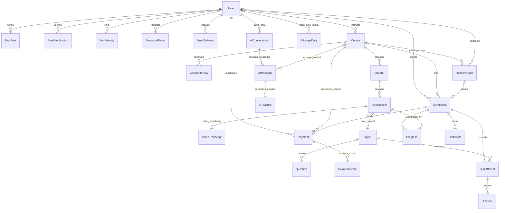

User ที่เชื่อม Course ผ่าน instructs คือ Instructor ประจำคอร์ส รหัส Unused ยังไม่มีผู้ใช้และ Enrollment ใบรับรองยังไม่มีจนกว่าจะผ่านคอร์ส

#### 4.4.2 ภาพรวมบทบาทและการเข้าสู่ระบบ

ชื่อหน้าในผังหมายถึงงานที่ต้องรองรับในรอบแรก ไม่กำหนดชื่อ URL หรือบังคับให้ทุกกล่องเป็นหน้าใหม่ กล่องสี่เหลี่ยมคือหน้า/ขั้นตอน กล่องรูปเพชรคือจุดตรวจเงื่อนไข ชื่อ Permission อ้างหัวข้อ 1.2

Guest เป็นสถานะก่อนเข้าสู่ระบบ ไม่ใช่ Role ที่บันทึกแทน Learner บัญชีที่สมัครใหม่เป็น Learner ส่วนบัญชีเดิมเข้าใช้ตาม Role ที่ server ตรวจ การยืนยันอีเมลเป็นเงื่อนไขเริ่มเรียนของผู้สมัครอีเมลเอง ไม่ใช่การเปลี่ยน Role

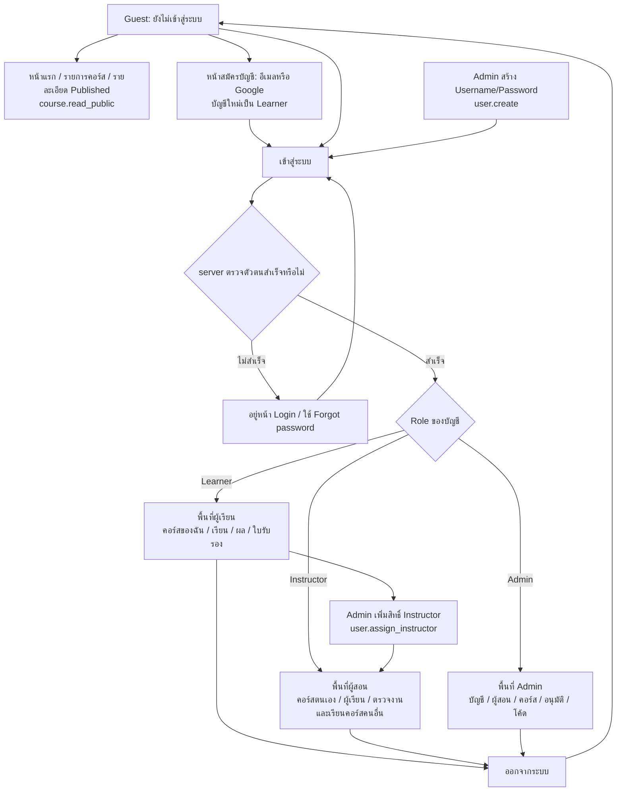

การเพิ่ม Instructor ใช้บัญชีเดิมและเก็บผลเรียนเดิม ผู้ใช้เปลี่ยน Role ตนเองไม่ได้ การเริ่มเรียนของ Learner/Instructor ยังตรวจเงื่อนไขบัญชีและ Enrollment ตามผังถัดไป

#### 4.4.3 Guest — หน้าที่เปิดได้และการเข้าสู่ Learner

Guest ดูได้เฉพาะข้อมูลคอร์ส Published และหน้าเกี่ยวกับการเข้าใช้บัญชี ยังเข้าเนื้อหาที่ต้องมีสิทธิ์ คอร์สของฉัน Editor หรือหน้าจัดการไม่ได้

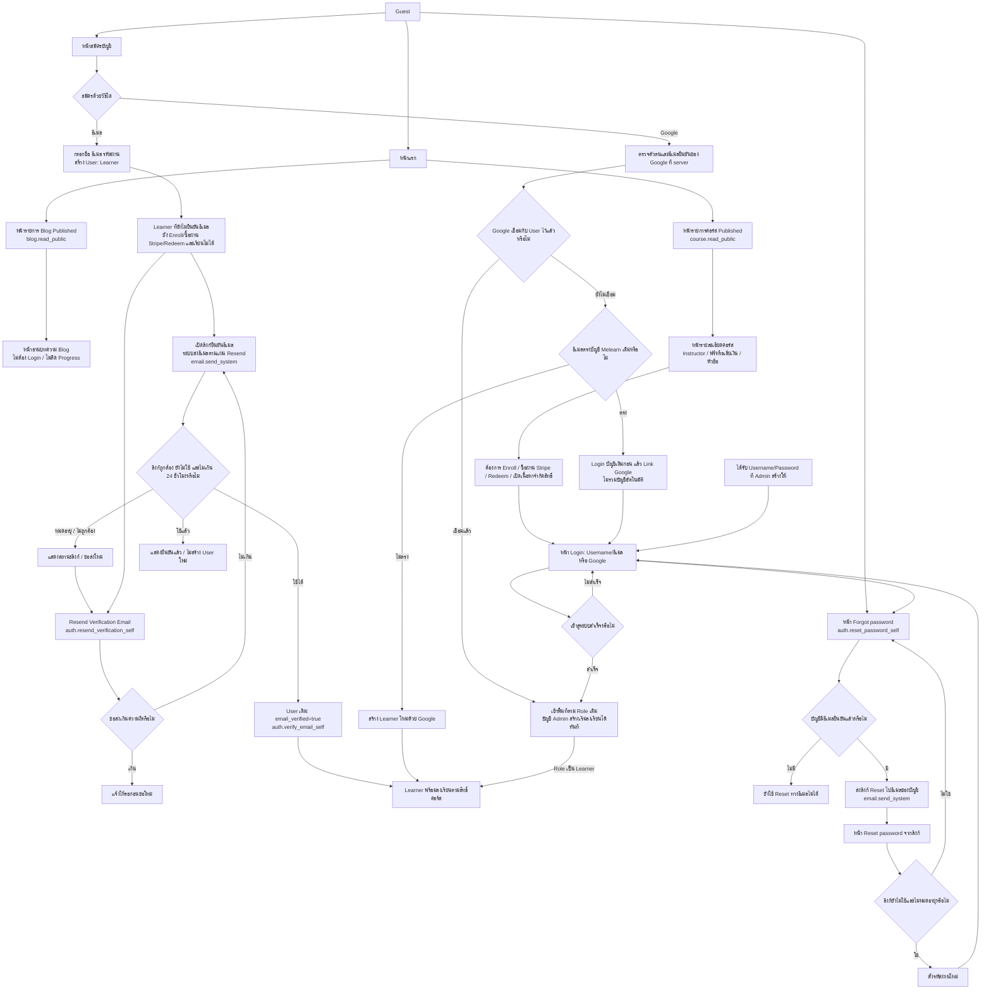

การสมัครสร้าง Role Learner ก่อนยืนยันอีเมลได้ แต่ผู้สมัครอีเมลเองเริ่มเรียนได้หลังยืนยัน บัญชีที่ Admin สร้างใช้ข้อยกเว้นเริ่มเรียนได้ทันที ส่วน Google ของบัญชีที่เชื่อมไว้แล้วเข้าสู่ User เดิม ไม่สร้าง Learner ใหม่

#### 4.4.4 Learner — ลงเรียน เรียนต่อ แบบฝึกหัด และใบรับรอง

Learner ใช้ข้อมูลของตนเอง ไม่มีสิทธิ์สร้างคอร์ส อนุมัติ ออกโค้ด หรืออ่านผลเรียนของบัญชีอื่น

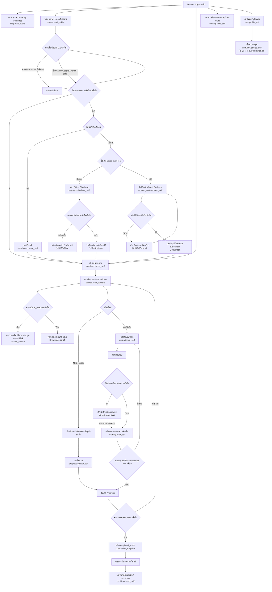

ผลครั้งใหม่ที่ต่ำกว่าคะแนนสูงสุดไม่ทำให้แบบฝึกหัดกลับเป็นไม่ผ่าน ผู้ที่จบแล้วคงใบรับรองเดิมและเลือกเรียนเนื้อหาที่เพิ่มภายหลังได้

#### 4.4.5 Instructor — ดูแลคอร์สตนเองและเรียนคอร์สคนอื่น

ผังแยกสองงานในบัญชีเดียวกัน: จัดการคอร์สที่ตนเป็น Instructor และเรียนคอร์สของผู้สอนอื่น การมี Enrollment ในคอร์สคนอื่นไม่ให้สิทธิ์ Editor หรือคิวตรวจงานของคอร์สนั้น

```mermaid
flowchart TD
    I_START["Instructor เข้าสู่ระบบแล้ว"] --> I_BLOG["หน้ารายการ / อ่าน Blog Published<br/>blog.read_public<br/>ไม่มีสิทธิ์เขียนหรือเผยแพร่"]
    I_START --> I_MANAGE["หน้าคอร์สที่ฉันดูแล"]
    I_START --> I_OTHER["หน้ารายการ / รายละเอียดคอร์สคนอื่น<br/>course.read_public"]
    I_START --> I_PROFILE["หน้าข้อมูลบัญชี / เชื่อม Google ตนเอง<br/>user.profile_self / auth.link_google_self"]
    I_MANAGE --> I_NEW["หน้าสร้างคอร์สตนเอง<br/>course.create"]
    I_MANAGE --> I_SELECT["เลือกคอร์ส"]
    I_SELECT --> I_OWNER{"เป็น Instructor ของคอร์สนี้หรือไม่"}
    I_OWNER -->|ไม่ใช่| I_DENY["ปฏิเสธ Editor และการจัดการ"]
    I_OWNER -->|ใช่| I_EDITOR["หน้า Editor<br/>Course / Chapter / Item / Quiz / Question<br/>course.update"]
    I_NEW --> I_EDITOR
    I_EDITOR --> I_PREVIEW["หน้าตัวอย่างคอร์ส<br/>course.preview<br/>ไม่สร้าง Progress หรือใบรับรอง"]
    I_PREVIEW --> I_AI_CHECK{"คอร์สตนเองเปิด ai_enabled หรือไม่"}
    I_AI_CHECK -->|เปิด| I_AI["AI Chat เพื่อดูแลคอร์ส<br/>ai.chat_course<br/>ไม่แก้ Transcript หรือเปิด/ปิด AI"]
    I_EDITOR --> I_STATUS{"สถานะคอร์ส"}
    I_STATUS -->|Draft| I_SUBMIT["ส่งตรวจ<br/>course.submit_review"]
    I_STATUS -->|In review| I_REVIEW
    I_SUBMIT --> I_REVIEW["In review: รอ Admin"]
    I_REVIEW --> I_DECISION{"ผลตรวจจาก Admin"}
    I_DECISION -->|ส่งกลับพร้อมเหตุผล| I_EDITOR
    I_DECISION -->|อนุมัติ| I_APPROVED["Approved"]
    I_STATUS -->|Approved| I_APPROVED
    I_APPROVED -->|แก้ข้อมูลก่อน Publish| I_REAPPROVE["กลับ Draft ต้องส่งตรวจใหม่"]
    I_REAPPROVE --> I_EDITOR
    I_APPROVED --> I_PUBLISH["กดเผยแพร่<br/>course.publish"]
    I_PUBLISH --> I_PUBLISHED["Published"]
    I_STATUS -->|Published| I_LIVE_EDIT["แก้เนื้อหาได้ทันที<br/>ไม่รออนุมัติใหม่"]
    I_LIVE_EDIT --> I_PUBLISHED
    I_OWNER -->|ใช่| I_LEARNERS["หน้าผู้เรียนและผลในคอร์สตนเอง<br/>course.learners_read"]
    I_LEARNERS --> I_QUEUE["หน้าคำตอบข้อเขียน / ภาพรอตรวจ"]
    I_QUEUE --> I_GRADE["หน้าตรวจคำตอบ: คะแนน / ความคิดเห็น<br/>quiz.grade"]
    I_GRADE --> I_LEARNER_RESULT["อัปเดตคะแนนและผลเรียนของผู้เรียน"]
    I_OTHER --> I_OTHER_ACCESS["Enroll ฟรี / ซื้อ Stripe / Redeem โค้ดของคนอื่น<br/>ตรวจเงื่อนไขบัญชีและ Enrollment"]
    I_OTHER_ACCESS --> I_MY_LEARNING["หน้าคอร์สที่ฉันลงเรียน"]
    I_MY_LEARNING --> I_LEARN["หน้าเรียน / แบบฝึกหัด / ผล / ใบรับรอง<br/>ใช้ Flow Learner ตามหัวข้อ 4.4.4"]
```

การซื้อ/Redeem คอร์สตนเองถูกปฏิเสธ Instructor เข้าดูคอร์สตนเองผ่านสิทธิ์จัดการได้โดยไม่ต้อง Enroll และเผยแพร่ครั้งแรกก่อน Admin อนุมัติไม่ได้

#### 4.4.6 Admin — บัญชี ผู้สอน คอร์ส การอนุมัติ และโค้ด

Admin เข้าดูคอร์สทุกสถานะได้เพื่อทำงาน ไม่มีเส้นทางซื้อ/Redeem เพื่อเรียน การเปิดดูคอร์สไม่สร้างผลเรียนหรือใบรับรองให้ Admin

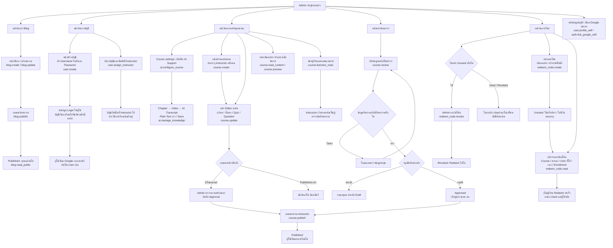

บัญชีผู้ใช้ที่ Admin สร้างไม่ได้รับสิทธิ์ทุกคอร์สจากการสร้างบัญชี ต้อง Enroll หรือ Redeem ตามประเภทคอร์ส Admin ดูผลเรียนเพื่อจัดการได้ ส่วนผู้ตรวจข้อเขียน/ภาพในรอบแรกคือ Instructor เจ้าของคอร์ส

#### 4.4.7 สรุปหน้าที่เข้าถึงได้ตามบทบาท

หน้าข้อมูลบัญชีและการเชื่อม Google ใช้กับบัญชีตนเอง ส่วน Forgot/Reset password ใช้หลักฐานลิงก์และอีเมลยืนยัน ไม่ต้อง Login ก่อนตั้งรหัสใหม่จากลิงก์

| หน้า/พื้นที่ | Guest | Learner | Instructor | Admin |
| --- | --- | --- | --- | --- |
| หน้าแรก / รายการคอร์ส / รายละเอียด Published | ได้ | ได้ | ได้ | ได้ |
| รายการ / อ่าน Blog Published | ได้ | ได้ | ได้ | ได้ |
| จัดการ / เขียน / แก้ / เผยแพร่ Blog | ไม่ได้ | ไม่ได้ | ไม่ได้ | ได้ |
| สมัคร / Login / Forgot password / Reset จากลิงก์ | ได้ตามขั้นตอนบัญชี | ใช้กับบัญชีตนเอง | ใช้กับบัญชีตนเอง | ใช้กับบัญชีตนเอง |
| ข้อมูลบัญชี / เพิ่มอีเมล / เชื่อม Google | ไม่ได้ | ตนเอง | ตนเอง | ตนเอง |
| คอร์สของฉันที่ลงเรียน / Enroll / Stripe / Redeem | เข้าสู่ระบบก่อน | ตามสิทธิ์และเงื่อนไขบัญชี | คอร์สคนอื่น | ดูผ่านพื้นที่จัดการ ไม่ซื้อ/Redeem |
| หน้าเรียนวิดีโอและบทอ่าน | ไม่ได้ | คอร์สที่มี Enrollment | คอร์สตนเองเพื่อจัดการ; คนอื่นตาม Enrollment | ทุกคอร์สเพื่อจัดการ |
| หน้าทำแบบฝึกหัดและผลเรียนจริง | ไม่ได้ | ตาม Enrollment ของตน | ตาม Enrollment ในคอร์สคนอื่น | เปิดตัวอย่างเพื่อจัดการ ไม่สร้างผลเรียน |
| ใบรับรองของฉัน / ดาวน์โหลด | ไม่ได้ | ใบที่ตนได้รับ | ใบที่ได้จากคอร์สคนอื่น | ไม่เกิดจากการดูเพื่อจัดการ |
| คอร์สที่ฉันดูแล / สร้าง / Editor | ไม่ได้ | ไม่ได้ | เฉพาะคอร์สตนเอง | จัดการทุกคอร์สและสร้างแทน |
| คอร์ส Draft/In review/Approved และ Preview ภายใน | ไม่ได้ | ไม่ได้ | เฉพาะคอร์สตนเอง | ได้ทุกคอร์ส |
| ส่งตรวจ / อ่านสถานะและเหตุผลส่งกลับ | ไม่ได้ | ไม่ได้ | เฉพาะคอร์สตนเอง | ผ่านหน้าจัดการ/ตรวจคอร์ส |
| คิว Admin ตรวจคอร์ส / อนุมัติ / ส่งกลับ | ไม่ได้ | ไม่ได้ | ไม่ได้ | ได้ |
| เผยแพร่คอร์สครั้งแรก | ไม่ได้ | ไม่ได้ | คอร์สตนเองหลังอนุมัติ | ตรวจและเผยแพร่แทนได้ |
| ผู้เรียนและผลเพื่อดูแลคอร์ส | ไม่ได้ | อ่านผลตนเองเท่านั้น | เฉพาะคอร์สตนเอง | ตามงานจัดการคอร์ส |
| คิวข้อเขียน/ภาพและหน้าตรวจคะแนน | ไม่ได้ | ไม่ได้ | เฉพาะคอร์สตนเอง | ใช้ Instructor เป็นผู้ตรวจในรอบแรก |
| สร้างบัญชี Username/Password / เพิ่ม Instructor | ไม่ได้ | ไม่ได้ | ไม่ได้ | ได้ |
| ออกโค้ด / รายการโค้ด / ผู้ใช้รหัส / ยกเลิก Unused | ไม่ได้ | ไม่ได้ | ไม่ได้ | ได้ |
| AI Chat ของคอร์สที่เปิด AI | ไม่ได้ | ตาม Enrollment และเงื่อนไขบัญชี | เจ้าของเพื่อดูแล; คอร์สคนอื่นตาม Enrollment | เพื่อดูแลคอร์ส |
| ประวัติ / ค้นหา / เปลี่ยนชื่อ / ลบแชต / โควตา AI | ไม่ได้ | เฉพาะตนเอง | เฉพาะตนเอง | เฉพาะตนเอง |
| หน้าดูคำถามนักเรียนเพื่อวิเคราะห์ | ไม่ได้ | ไม่ได้ | ไม่ได้ | ยังไม่ทำ |
| สวิตช์ AI Support ใน Course settings | ไม่ได้ | ไม่ได้ | ไม่ได้ | ได้ |
| ช่อง AI Transcript ใน Video Editor | ไม่ได้ | ไม่ได้ | ไม่ได้ | ได้ |

ทุกหน้าและคำสั่งต้องตรวจ Permission ที่ server การเข้าหน้าได้ไม่ทำให้ได้สิทธิ์กับข้อมูลทุกคอร์สหรือทุกบัญชี เช่น หน้า Editor ของ Instructor ยังจำกัดคอร์สตนเอง

#### 4.4.8 AI Course Support — การตั้งค่าและแหล่งข้อมูล

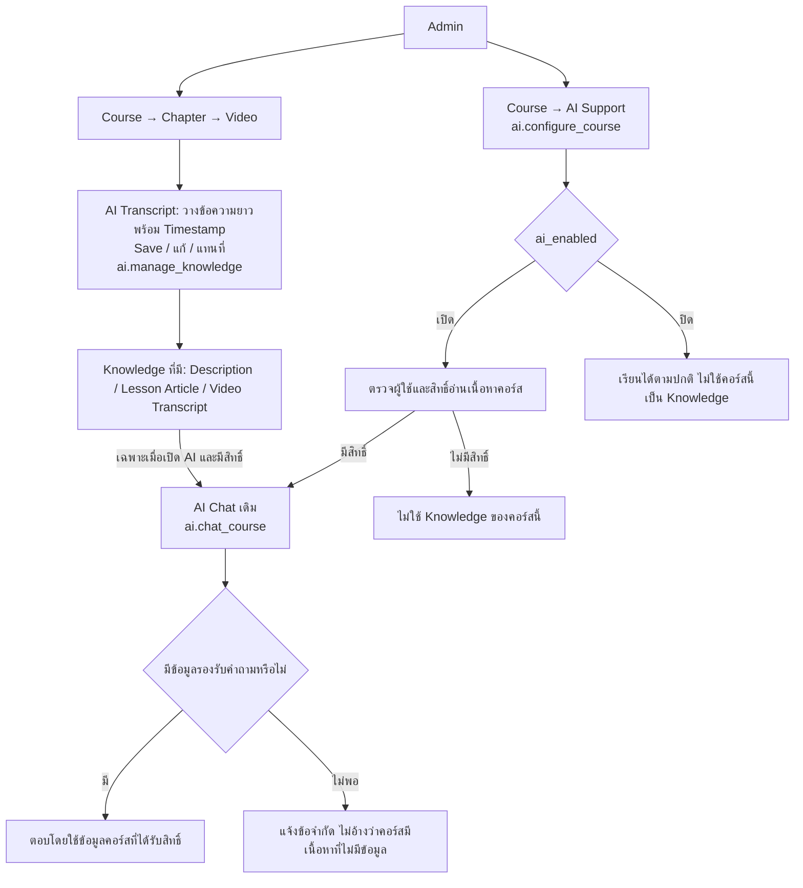

Raw Transcript เปิดให้ Admin จัดการใน Video Editor เท่านั้น การตอบ AI ไม่ใช่หน้าสำหรับอ่าน Transcript ทั้งหมด

#### 4.4.9 AI Chat — ประวัติ ข้อมูล และโควตา

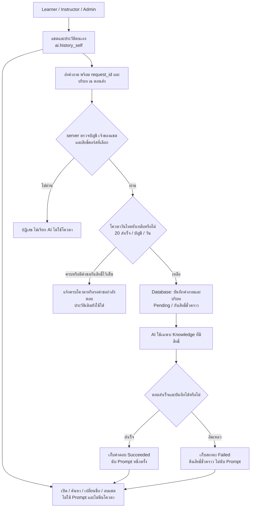

คำขอซ้ำอ้างผลจาก request_id เดิม ไม่เปิดคำขอใหม่หรือนับซ้ำ วันใหม่เริ่มโควตาใหม่โดยไม่ล้างประวัติ

#### 4.4.10 Stripe — จ่ายแล้วได้สิทธิ์เรียน

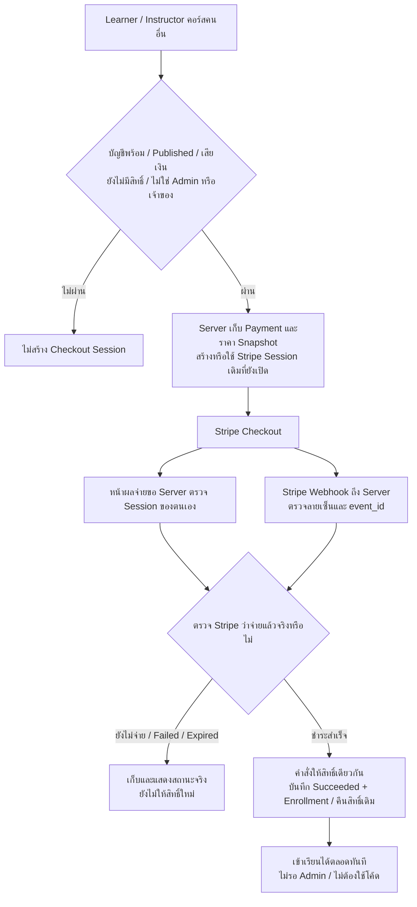

#### 4.4.11 AI — สร้างและตอบแบบฝึกหัดในแชต

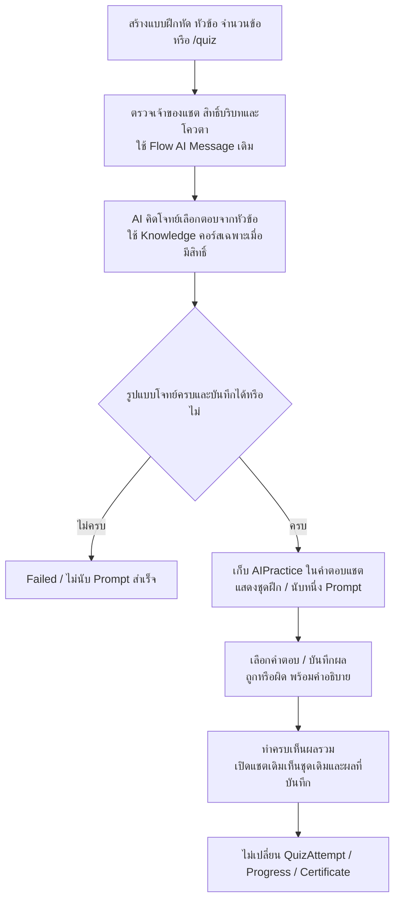

### 4.5 ข้อจำกัดของข้อมูลที่ต้องรักษา

- Username ต้องไม่ซ้ำ และตัวตน Google หนึ่งรายการต้องไม่เชื่อมกับหลาย User
- การเชื่อม Google ต้องรักษา User ID เดิม ไม่แยก Enrollment/คะแนน/ใบรับรองไปสร้างบัญชีใหม่
- สถานะยืนยันอีเมลกับสิทธิ์เริ่มเรียนต้องแยกกัน บัญชี Admin สร้างเรียนได้แม้ยังไม่มีอีเมล
- Chapter → ContentItem → Quiz → Question ต้องอยู่ใน Course เดียวกันตามเส้นทางข้อมูล
- VideoTranscript ต้องอ้าง Video ContentItem ใน Chapter/Course เดียวกัน เปลี่ยน ID ใน Request แล้วต้องแก้ Transcript ของอีกคอร์สไม่ได้
- Instructor บันทึกข้อมูลวิดีโอตามปกติแล้วต้องไม่ลบหรือเขียนทับ Transcript ที่ Admin บันทึกไว้
- คำขอ AI ตรวจ ai_enabled และสิทธิ์คอร์สทุกครั้ง ปิด AI แล้วแชตเดิมหรือ URL เดิมไม่ทำให้ใช้ Knowledge ต่อได้
- AIConversation เป็นของ User เดียว AIMessage ต้องอยู่ในแชตของ User นั้น บริบทในข้อความเป็นข้อมูล ณ ตอนส่ง ไม่เปลี่ยนตามคอร์สที่เลือกภายหลัง
- request_id ไม่ซ้ำภายในบัญชีสำหรับการส่งคำถามหนึ่งครั้ง หนึ่ง Prompt อ้างข้อความ user หนึ่งรายการและผลตอบของคำขอนั้น ไม่เพิ่มโควตาอีกเมื่อสร้างข้อความ assistant
- หนึ่งคู่ User/usage_date มี AIUsageDaily หนึ่งรายการ ทุกบทบาทและทุกคอร์สใช้ยอดเดียวกัน การลบแชตไม่ลด success_count
- ชื่อแชตและเนื้อหาคำถามไม่ใช้แทน ID หลัก ตรวจ ID ที่เชื่อมแชต บัญชี และคอร์สทุกคำขอ ไม่ให้ Admin เปิดแชตผู้อื่นผ่านสิทธิ์จัดการคอร์ส
- หนึ่ง User/Course มี Enrollment ไม่ซ้ำ การกด Enroll ซ้ำคืนสิทธิ์เดิม
- Progress ของหนึ่ง Enrollment/ContentItem ไม่ซ้ำ กดเรียนจบซ้ำไม่เพิ่มจำนวนที่จบ
- Enrollment ที่มาจาก Redeem ต้องตามกลับไปหาโค้ดและบัญชีที่ใช้จริงได้
- รหัสที่ Used มีผู้ใช้คนเดียว เวลาใช้ และสิทธิ์เรียนที่ให้สำเร็จ ไม่มีกรณีใช้รหัสแล้วแต่สิทธิ์หาย
- Revoked แลกไม่ได้ การยกเลิกกับ Redeem ที่เกิดพร้อมกันต้องตัดสินจาก Unused ได้เพียงทางเดียว ถ้า Used แล้วห้ามยกเลิก
- completed_at และ completion_snapshot บันทึกตอนจบครั้งแรก เพิ่มเนื้อหาภายหลังไม่เขียนทับให้ผู้จบเดิมกลับไปเรียนใหม่
- Google Email ตรง User เดิมที่ยังไม่เชื่อมต้อง Login User เดิมก่อน Link Google ไม่สร้างบัญชีซ้ำตามอีเมล
- คะแนนรายข้อไม่เกินคะแนนเต็ม คะแนนรวมและผลผ่านคำนวณจากชุดของ Attempt นั้น
- แบบฝึกหัดที่รอตรวจยังไม่มีผลผ่านสุดท้ายของครั้งนั้น
- Certificate ผูก Enrollment ที่จบแล้ว ไม่เกิดจากการเปิด Preview หรือการเป็น Admin
- การบันทึกผลจบและการออกใบรับรองต้องตรวจซ้ำได้โดยไม่สร้างใบซ้ำ

### 4.6 การแก้ข้อมูลและประวัติเดิม

- Instructor แก้เนื้อหา Published ได้ทันที แต่ไม่แก้คำตอบหรือคะแนนของ Attempt เดิมตามชุดคำถามใหม่
- เก็บประวัติส่งตรวจและผลตรวจเดิม ไม่เขียนทับจนตรวจย้อนหลังไม่ได้
- เพิ่มเนื้อหาหลังมีผู้จบ ไม่ลบวันที่จบ ความคืบหน้าที่จบ หรือใบรับรองเดิม
- รอบแรกไม่มีคำสั่งลบคอร์สที่ทำให้ Enrollment ผลเรียน หรือใบรับรองที่อ้างคอร์สนั้นหายไป
- การเก็บ Snapshot ใช้เฉพาะข้อมูลที่ต้องรักษาประวัติ เช่น ข้อสอบและใบรับรอง ไม่บังคับสร้างระบบจัดการเวอร์ชันคอร์สเต็มรูปแบบ

## 5. สถานะและขั้นตอนการทำงาน

ชื่อสถานะต่อไปนี้ใช้ระบุพฤติกรรมที่ Dev ต้องทำ บางสถานะเก็บจริงและบางสถานะคำนวณจากข้อมูลได้ แต่ผลการทำงานต้องตรงกัน

### 5.1 บัญชีและการเพิ่มผู้สอน

| ขั้นตอน | เงื่อนไข | ผล |
| --- | --- | --- |
| สมัครด้วยอีเมล | ข้อมูลสมัครถูกต้อง | ได้บัญชี Learner ที่ยังไม่ยืนยันอีเมล |
| ยืนยันอีเมล | หลักฐานยืนยันเป็นของบัญชีนั้น | เปิดสิทธิ์ Enroll/Redeem และเรียน |
| Google login | server ตรวจการเข้าสู่ระบบและอีเมลยืนยันแล้ว | เข้าใช้บัญชีและลงเรียนได้ |
| Admin สร้างบัญชี | ตั้ง Username ไม่ซ้ำและรหัสผ่าน | ได้บัญชี Learner Login และเริ่มลงเรียนได้ทันที |
| เชื่อม Google | ผู้ใช้ Login บัญชีเดิมและยืนยันตัวตน Google | เพิ่มวิธีเข้าสู่ User เดิม ไม่เปลี่ยนผลเรียน |
| Forgot password | บัญชีมีอีเมลยืนยันแล้ว | ส่งลิงก์ Reset ผ่านระบบอีเมล |
| Reset password | ลิงก์ยังไม่หมดอายุและยังไม่ใช้ | เปลี่ยน Password hash ใช้รหัสใหม่ได้ และทำเครื่องหมายใช้ลิงก์แล้ว |
| Admin เพิ่ม Instructor | ผู้ทำเป็น Admin | บัญชีได้รับสิทธิ์สร้างและจัดการคอร์สตนเอง |

การเพิ่ม Instructor ไม่สร้างคำขอ pending จากผู้เรียน และไม่ลบประวัติการเรียนเดิมของบัญชีนั้น

### 5.2 Authoring และ Course Approval

| สถานะ | ความหมาย |
| --- | --- |
| Draft | กำลังสร้าง/แก้ก่อนเผยแพร่ ไม่แสดงในรายการคอร์สสาธารณะ |
| In review / pending_review | ส่งคอร์สให้ Admin ตรวจแล้ว แยกจากสถานะยืนยันอีเมลของ User |
| Approved | Admin อนุมัติ พร้อมเผยแพร่ |
| Published | ผู้ใช้เห็นในรายการคอร์สและลงเรียนได้ตามประเภท |

| จาก | การกระทำ | ผู้ทำ/เงื่อนไข | ไปและผล |
| --- | --- | --- | --- |
| ยังไม่มี | สร้างคอร์ส | Instructor สร้างตนเอง หรือ Admin ระบุ Instructor | Draft |
| Draft | ส่งตรวจ | Instructor เจ้าของคอร์ส ข้อมูลพร้อมตรวจ | In review เก็บผู้ส่ง/เวลา/ฉบับที่ส่ง |
| In review | ส่งกลับ | Admin ระบุเหตุผล | Draft ผู้สอนเห็นสิ่งที่ต้องแก้ |
| In review | อนุมัติ | Admin ตรวจข้อมูลฉบับที่ส่ง | Approved เก็บผู้อนุมัติและเวลา |
| Approved | แก้เนื้อหาการเรียนก่อน Publish | เจ้าของหรือ Admin | Draft ต้องส่งตรวจ/อนุมัติฉบับแก้ใหม่ |
| Approved | เผยแพร่ | Instructor เจ้าของคอร์ส หรือ Admin | Published เปิดรายการคอร์สและการลงเรียน |
| Draft/In review | Admin ตรวจและเผยแพร่แทน | Admin ตรวจความพร้อมและบันทึกการอนุมัติ | Published โดยรักษาประวัติอนุมัติ |
| Published | แก้เนื้อหา | Instructor เจ้าของคอร์ส หรือ Admin | ยังคง Published มีผลทันที |
| ทุกสถานะ | เปิด/ปิด AI หรือบันทึก Transcript | Admin | สถานะคอร์สและประวัติ Approval คงเดิม |

ก่อนเผยแพร่ครั้งแรกต้องมีชื่อคอร์ส Instructor ประเภทคอร์ส และเนื้อหาที่เรียนได้ แบบฝึกหัดต้องมีคำถาม วิธีตรวจ และคะแนนเต็มที่คำนวณได้ ไม่เผยแพร่คอร์สเปล่าที่ระบบอาจนับจบโดยไม่มีการเรียน

หากข้อมูลที่ Admin เปิดตรวจถูกแก้ระหว่างนั้น ระบบต้องแจ้งให้โหลด/ตรวจข้อมูลล่าสุด ไม่บันทึกการอนุมัติให้ข้อมูลคนละฉบับโดยเงียบ การเผยแพร่ครั้งแรกต้องใช้ฉบับที่ตรวจแล้ว ส่วน Published ใช้กติกาแก้ได้ทันที

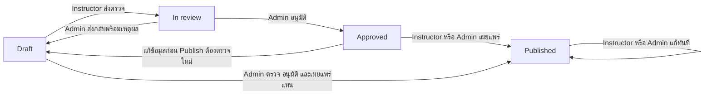

### 5.3 คอร์สฟรีและ Enrollment

ผู้เรียนที่ผ่านเงื่อนไขบัญชีตามหัวข้อ 2.1 → เลือกคอร์สฟรี Published → กด Enroll → server ตรวจประเภทคอร์สและสิทธิ์ → สร้าง Enrollment หรือคืนรายการเดิม → คอร์สของฉัน → เข้าเรียน

Instructor ใช้ขั้นตอนนี้กับคอร์สคนอื่นได้ การเปลี่ยน Request ให้คอร์สเสียเงินเป็น free ต้องไม่ทำให้ลงเรียนฟรีได้

### 5.4 ออกโค้ดและ Redeem

Admin เลือกคอร์ส → ออกรหัสไม่ซ้ำ → ผู้เรียนซื้อโค้ด → เข้าสู่ระบบ → Redeem → บันทึกผู้ใช้/เวลาและสร้าง Enrollment → เข้าเรียน

| สถานะโค้ด | ความหมาย | เปลี่ยนสถานะเมื่อ |
| --- | --- | --- |
| Unused | ยังไม่มีใครใช้ ไม่มีวันหมดอายุ | Redeem สำเร็จพร้อมให้สิทธิ์เรียน |
| Used | ใช้แล้ว มีผู้ใช้และเวลา | สถานะสุดท้าย ใช้ซ้ำและยกเลิกไม่ได้ |
| Revoked | Admin ยกเลิกแล้ว มี revoked_by และ revoked_at | จาก Unused เท่านั้น Redeem ไม่ได้ |

ก่อน Redeem ตรวจรหัส คอร์ส บัญชี เงื่อนไขเริ่มเรียนตามหัวข้อ 2.1 และข้อห้าม Admin/เจ้าของคอร์ส หากบัญชีมีสิทธิ์เรียนคอร์สนั้นแล้ว ให้แสดงสิทธิ์เดิมโดยไม่ใช้โค้ดเพิ่ม

คำสั่งล้มเหลวต้องไม่ทิ้งรหัสเป็น Used โดยไม่มี Enrollment คนสองคน Redeem รหัสเดียวกันพร้อมกันต้องสำเร็จได้เพียงคนเดียว

### 5.5 Progress และการจบคอร์ส

| ระดับ | สถานะ | วิธีเปลี่ยน |
| --- | --- | --- |
| รายการเนื้อหา | Not started | ยังไม่มีผลเรียน |
| รายการเนื้อหา | In progress | เริ่มเรียน/ทำ แต่ยังไม่ครบเงื่อนไขจบ |
| รายการเนื้อหา | Completed | วิดีโอ/บทอ่านกดเรียนจบ หรือแบบฝึกหัดส่งครบและผ่าน |
| คอร์ส | In progress | รายการยังไม่ครบ Progress ต่ำกว่า 100% |
| คอร์ส | Completed | รายการครบ Progress 100% บันทึก completed_at และ completion_snapshot |

การกดจบวิดีโอหรือบทอ่านเป็นวิธีที่อนุญาตในรอบแรก จึงรับคำสั่งนี้ได้หลังตรวจบัญชีและสิทธิ์เรียน แต่หน้าเว็บตั้งเปอร์เซ็นต์คอร์สหรือผลผ่านแบบฝึกหัดเองไม่ได้

ผู้ที่เคยจบแล้วคงสถานะ Completed เมื่อเพิ่มเนื้อหาใหม่ ส่วนความคืบหน้าของผู้ที่ยังไม่จบคำนวณตามรายการปัจจุบัน

completion_snapshot เก็บรายการ ContentItem ที่ใช้ตัดสินจบ ณ completed_at เช่น ID ชนิด ชื่อ ผลจบ และข้อมูลอ้างอิงฉบับที่มี สำหรับ Quiz เก็บ Attempt/คะแนนที่ใช้ตัดสินผ่านด้วย ข้อมูลนี้อ้างกลับไปยังใบรับรองเดิมได้โดยไม่คำนวณผลจบใหม่จากรายการปัจจุบัน

### 5.6 Quiz Attempt

| สถานะ | ความหมาย | คำสั่งถัดไป |
| --- | --- | --- |
| In progress | เริ่มครั้งนี้และเก็บชุดข้อสอบแล้ว | บันทึกคำตอบ ส่งคำตอบ |
| Submitted | ส่งครบและตรึงคำตอบแล้ว | ระบบตรวจคะแนน |
| Pending review | มีข้อเขียน/ภาพรอ Instructor ตรวจ | ตรวจให้ครบ |
| Graded | คะแนนครบ สรุปผลครั้งนี้ได้ | อ่านผล หรือเริ่มครั้งใหม่ |

Passed/Not passed เป็นผลของ Attempt ที่ Graded แล้ว ไม่ใช่สถานะรอตรวจ

ขั้นตอน: เริ่ม → เก็บชุดคำถาม → บันทึกคำตอบ → ส่งครบ → ตรวจอัตโนมัติ/รอผู้สอน → คะแนนครบ → คำนวณผล → อัปเดตคะแนนสูงสุด → อัปเดต Progress → ตรวจการออกใบรับรอง

หลัง Submitted บันทึกคำตอบทับไม่ได้ การส่งซ้ำคืนผลเดิม ไม่เริ่ม Attempt ใหม่เอง

### 5.7 Certificate

เมื่อ Progress ครบ 100% → บันทึกจบคอร์ส → ตรวจว่ามีใบรับรองแล้วหรือไม่ → ออกใบรับรองหรือคืนใบเดิม

ถ้าขั้นตอนสร้างไฟล์ใบรับรองขัดข้อง ต้องลองออกจากผลจบเดิมได้โดยไม่ให้ผู้เรียนทำใหม่และไม่สร้างใบซ้ำ

### 5.8 Email Verification

สมัครอีเมล → User เดิม email_verified=false → ส่งลิงก์ผ่าน Resend → Login ได้แต่ยังลงเรียนไม่ได้ → กดลิงก์ที่ถูกต้องภายใน 24 ชั่วโมงและยังไม่ใช้ → ตั้ง email_verified=true → Enroll/Redeem และเรียนได้ตามสิทธิ์

| สถานะลิงก์/บัญชี | การทำงาน |
| --- | --- |
| Active | ลิงก์ยังไม่ใช้และยังไม่ถึง expires_at ใช้ยืนยัน User เดิมได้ |
| Expired | ไม่ยืนยัน ให้ขอลิงก์ใหม่ผ่าน Resend Verification Email |
| Used | ไม่ยืนยันซ้ำและไม่สร้าง User แจ้งสถานะยืนยันแล้ว/ลิงก์ใช้แล้ว |
| Invalid | ไม่เปลี่ยน User แจ้งว่าลิงก์ไม่ถูกต้อง |
| email_verified=false | ผู้สมัครอีเมลเอง Login ได้ แต่ยัง Enroll/Redeem/เรียนไม่ได้ |
| email_verified=true | ผ่านเงื่อนไขยืนยันอีเมล ไม่ได้ให้สิทธิ์ทุกคอร์สเอง |

การขอส่งใหม่ต้องผ่านข้อจำกัดความถี่ การบันทึก used_at และ email_verified=true ต้องสอดคล้องกันเมื่อเปิดลิงก์พร้อมกันหลายครั้ง ส่วน pending_review เป็นสถานะ Course ไม่ใช่ขั้นอนุมัติบัญชี

### 5.9 Blog

Admin สร้างบทความ Draft → เพิ่มชื่อ Slug ภาพปก คำเกริ่น และเนื้อหา → ดูตัวอย่าง → Publish → ทุกคนอ่าน Blog Published ได้

การแก้ Draft ยังไม่แสดงสาธารณะ การแก้ Published มีผลเมื่อ Admin บันทึก ไม่มีขั้นให้ Instructor ส่ง Blog รออนุมัติ และไม่มีผลกับ Progress

### 5.10 AI Message และโควตา

| สถานะ/การกระทำ | ข้อมูลที่บันทึก | ผลต่อโควตา |
| --- | --- | --- |
| Pending | คำถาม เจ้าของแชต บริบท ณ ตอนส่ง request_id และเวลา | กันสิทธิ์ชั่วคราว ยังไม่นับว่าสำเร็จ |
| Succeeded | คำตอบที่บันทึกครบ completed_at และ usage_date | เพิ่ม success_count หนึ่งครั้งและปล่อยสิทธิ์ชั่วคราว |
| Failed | คำถามและสถานะผิดพลาดจาก server | ไม่นับสำเร็จและปล่อยสิทธิ์ชั่วคราว |
| Request เดิมส่งซ้ำ | อ่านสถานะ/ผลเดิม ไม่สร้างข้อความซ้ำ | ไม่เพิ่มจำนวน |
| ครบโควตา | ตอบข้อจำกัดและเวลาเริ่มใหม่ ไม่เรียก AI | ไม่เพิ่มจำนวน |
| วันใหม่เวลา 00:00 น. ไทย | ใช้ AIUsageDaily ของวันใหม่ | มีสิทธิ์ 20 ครั้งใหม่ ไม่ล้างประวัติวันก่อน |
| อ่าน ค้นหา เปลี่ยนชื่อ หรือลบแชต | เปลี่ยนเฉพาะประวัติของเจ้าของ | ไม่ใช้ Prompt และไม่คืนจำนวนที่ใช้ไปแล้ว |

คำขอที่ล้มเหลวและต้องลองใหม่จริงใช้ request_id ใหม่ ส่วนการส่งซ้ำเพื่อตามคำขอเดิมใช้ request_id เดิม ข้อมูลกันสิทธิ์ของคำขอค้างต้องหมดอายุหรือคืนเมื่อ server ตรวจว่าล้มเหลว เพื่อไม่ล็อกโควตาค้าง

### 5.11 Payment และการให้สิทธิ์จาก Stripe

| สถานะ | ความหมายและผล |
| --- | --- |
| Pending | มี Payment/Session แต่ยังไม่ยืนยันว่าเงินสำเร็จ ยังไม่ให้สิทธิ์ |
| Processing | วิธีจ่ายที่เปิดใช้กำลังรอผลจาก Stripe ยังไม่ให้สิทธิ์ |
| Succeeded | Server ยืนยันว่าจ่ายสำเร็จ เก็บ paid_at และให้/เชื่อม Enrollment |
| Failed | Stripe ยืนยันว่าจ่ายไม่สำเร็จ เก็บเหตุผลที่แสดงได้ ลองซื้อใหม่ได้ตามผลจริง |
| Expired | Stripe Session หมดอายุโดยยังไม่จ่าย สร้างคำขอซื้อใหม่ได้ |

เก็บ `fulfillment_status` แยกจากสถานะเงิน เช่น pending/granted/failed จ่ายสำเร็จแล้วแต่บันทึกสิทธิ์ผิดพลาดต้องคง Succeeded และลองให้สิทธิ์เดิมใหม่ ไม่เรียกเก็บเงินใหม่และไม่แจ้งว่าผู้ใช้ยังไม่จ่าย

การกดปุ่มซื้อซ้ำ/สองแท็บใช้ request_id และ Checkout Session ที่ยังเปิดของ User/Course เดิมเมื่อทำได้ ไม่สร้างรายการเรียกเก็บใหม่ทุกครั้ง Event เก่าหรือ callback ซ้ำไม่ลดสถานะ Succeeded หรือสร้าง Enrollment เพิ่ม ถ้าจ่ายซ้ำจริงยังเก็บทุกรายการสำเร็จและระบุกรณีผิดปกติให้ดูแล ไม่ลบเงินรับหรือกำหนดนโยบายคืนเงินเอง

### 5.12 AIPractice ในแชต

Prompt สร้างชุดฝึก → Pending ตาม Flow AI เดิม → ตรวจชุดโจทย์และบันทึก AIPractice → Succeeded และนับหนึ่ง Prompt → แสดงชุดฝึกในแชต → ตอบแต่ละข้อและเก็บผล → ทำครบแสดงผลรวม

การเลือกคำตอบและอ่านผลไม่เปลี่ยน AIUsageDaily ให้ server ตรวจคำตอบจากชุดโจทย์ที่บันทึกไว้ ไม่รับคะแนนถูก/ผิดที่ client กำหนดเอง ผลในแชตไม่ใช่คะแนน Quiz ของคอร์ส

## 6. งาน API และข้อมูลที่ต้องส่งระหว่างระบบ

บทนี้ระบุคำสั่ง ข้อมูล และผลที่ต้องได้ ชื่อ Path ใช้เป็นรายการอ้างอิงสำหรับ Dev จัดทำ API Contract วิธีจัดกลุ่ม URL และการยืนยันตัวตนทางเทคนิคปรับได้โดยรักษาสิทธิ์และพฤติกรรมในเอกสารนี้

ตารางนี้ไม่ได้หมายความว่ามี API เหล่านี้แล้วในต้นแบบ

### 6.1 หลักการร่วม

- ตัวตน บทบาท เจ้าของคอร์ส เปอร์เซ็นต์ คะแนน และผลผ่านต้องตรวจ/คำนวณที่ server
- Request ของผู้เรียนไม่เลือก User ที่จะรับสิทธิ์หรือผลเรียนแทนคนอื่น
- คำสั่งเดิมที่ส่งซ้ำต้องไม่สร้าง Enrollment ผลส่ง หรือ Certificate ซ้ำ
- การแก้ข้อมูลชนกันต้องแจ้งให้โหลดข้อมูลล่าสุด ไม่เขียนทับงานที่เปลี่ยนไปโดยเงียบ
- ข้อมูลสาธารณะ ข้อมูลผู้เรียน และข้อมูลสำหรับจัดการใช้ขอบเขตต่างกัน

### 6.2 Auth และ Profile

| Method/Path | หน้าที่ | ข้อมูลและผลที่ต้องได้ |
| --- | --- | --- |
| POST /auth/register | สมัครด้วยอีเมล | ชื่อ อีเมล รหัสผ่าน; คืน Learner เดิมที่ email_verified=false และส่ง Verification Link ผ่าน Resend |
| POST /auth/verify-email | ยืนยันอีเมลโดยลิงก์ | ตรวจ Token ของอีเมล อายุ 24 ชั่วโมงและยังไม่ใช้; ตั้ง email_verified=true และ used_at |
| POST /auth/resend-verification-email | ขอลิงก์ใหม่ | บัญชีที่ยังไม่ยืนยัน จำกัดความถี่ สร้าง/ส่งลิงก์ใหม่ ไม่สร้าง User ใหม่ |
| POST /auth/login | เข้าใช้ด้วย Username หรืออีเมล | ตรวจรหัสผ่าน; คืน User เดิมและสิทธิ์ที่ใช้ได้ |
| Google sign-in/callback | เข้าใช้ด้วย Google | ตรวจหลักฐานที่ server; เชื่อมแล้วคืน User เดิม อีเมลตรง User ที่ยังไม่เชื่อมให้ Login เดิมก่อน Link ห้าม auto merge |
| POST /me/auth-identities/google และ callback | เชื่อม Google กับบัญชีเดิม | ต้อง Login ก่อน ตรวจตัวตน Google และบัญชีที่ผูกอยู่; ไม่สร้าง User ซ้ำ |
| POST /admin/users | Admin สร้างบัญชี | Username/รหัสผ่านเริ่มต้น อีเมลไม่บังคับ; บันทึกผู้สร้าง ให้เริ่มลงเรียนได้ทันที |
| POST /auth/password-reset/request | ขอ Reset password | รับ Username/อีเมล ส่งลิงก์ไปอีเมลที่ยืนยันแล้ว ผ่านแผนระบบ Resend |
| POST /auth/password-reset/confirm | ตั้งรหัสผ่านใหม่ | ตรวจหลักฐานใช้ครั้งเดียวและยังไม่หมดอายุ แล้วเปลี่ยน Password hash |
| POST /auth/logout | ออกจากระบบ | สิ้นสุดการเข้าสู่ระบบปัจจุบัน |
| GET /me | อ่านข้อมูลตนเอง | ชื่อ Username อีเมลถ้ามี บทบาท สถานะยืนยัน แหล่งสร้าง และวิธี Login ที่เชื่อมไว้ |
| PATCH /me | แก้ข้อมูลส่วนตัว | เฉพาะ Field ที่แก้ได้ ไม่รับการเปลี่ยน Role |
| POST /admin/users/{id}/instructor | Admin เพิ่ม Instructor | ตรวจ Admin บันทึกผู้ทำ เวลา และบทบาทที่เพิ่ม |

### 6.3 Catalog, Enrollment และ Redeem

| Method/Path | ผู้ทำ | เงื่อนไขและผล |
| --- | --- | --- |
| GET /courses | สาธารณะ | รายการ Published พร้อมข้อมูลแสดงคอร์ส |
| GET /courses/{id} | สาธารณะ | รายละเอียด Instructor ประเภทคอร์สและหัวข้อ ไม่คืนเนื้อหาจำกัดสิทธิ์/เฉลย |
| POST /courses/{id}/enroll | ผู้เรียน/Instructor ที่เรียนคนอื่น | ผ่านเงื่อนไขบัญชี 2.1 คอร์สฟรี Published; สร้างหรือคืน Enrollment เดิม |
| GET /me/enrollments | เจ้าของข้อมูล | คอร์สที่ตนมีสิทธิ์ พร้อม Progress และสถานะจบ |
| POST /redeem | ผู้เรียน/Instructor ที่เรียนคนอื่น | รับรหัส ตรวจเงื่อนไข; ใช้โค้ดและให้สิทธิ์ร่วมกัน |
| POST /admin/codes | Admin | เลือก Course สร้างรหัสไม่ซ้ำ และเก็บผู้ออก/เวลา |
| GET /admin/codes | Admin | รหัส Course สถานะ ผู้ใช้ เวลาใช้ และ Enrollment ที่ให้ |
| POST /admin/codes/{id}/revoke | Admin | เฉพาะ Unused ตั้ง Revoked และผู้ทำ/เวลา ถ้า Used แล้วปฏิเสธ |

ตัวอย่างผล Redeem สำเร็จ:

```json
{
  "enrollment": {
    "id": "enr_example_01",
    "course_id": "course_example_01",
    "source": "redeem",
    "access": "lifetime"
  },
  "code_status": "used"
}
```

### 6.4 การเรียนและ Progress

| Method/Path | หน้าที่ | เงื่อนไขและผล |
| --- | --- | --- |
| GET /learn/courses/{id} | อ่านรายการเนื้อหาที่เข้าได้ | ตรวจ Enrollment หรือสิทธิ์ดูเพื่อจัดการ; คืนบริบท learner/owner/admin |
| GET /learn/courses/{id}/items/{item_id} | เปิดวิดีโอ/บทอ่าน/แบบฝึกหัด | ตรวจว่า Item อยู่ใน Course และผู้ใช้มีสิทธิ์ |
| GET /me/progress | อ่านผลเรียนตนเอง | Progress ราย Item เปอร์เซ็นต์คอร์ส วันที่จบ |
| POST /learn/items/{id}/complete | กดจบวิดีโอ/บทอ่าน | ตรวจสิทธิ์; บันทึกจบ คำนวณ Progress และเงื่อนไข Certificate |
| PUT /learn/items/{id}/resume | บันทึกจุดกลับมาเรียนต่อ | เก็บข้อมูลตำแหน่ง/รายการล่าสุด ไม่เปลี่ยนเป็น Completed เอง |

แบบฝึกหัด Completed จากคะแนนที่ตรวจเสร็จแล้ว ไม่ใช้คำสั่งกดจบวิดีโอมาข้ามผลสอบ ระบบตรวจสิทธิ์ก่อนคืนเนื้อหาและ YouTube Link ให้ผู้เรียน แต่รอบที่ใช้ YouTube ไม่ถือว่าป้องกันการคัดลอกหรือแชร์ลิงก์นอก Melearn ได้ทั้งหมด

### 6.5 Authoring และ Approval

Authoring คือการสร้างและแก้คอร์ส ส่วน Approval คือการตรวจให้เผยแพร่ครั้งแรกได้

| Method/Path หรือชุดคำสั่ง | ผู้ทำ | ข้อมูล/เงื่อนไข | ผล |
| --- | --- | --- | --- |
| POST /instructor/courses | Instructor | ชื่อ รายละเอียด ประเภท; Instructor จากบัญชีผู้สร้าง | Course Draft |
| POST /admin/courses | Admin | ระบุ Instructor หนึ่งคนและข้อมูลคอร์ส | Draft โดย Admin เป็นผู้สร้างแทน |
| PATCH /courses/{id} | เจ้าของหรือ Admin | ตรวจสิทธิ์และข้อมูลล่าสุด | ถ้า Approved และแก้ก่อน Publish กลับ Draft ต้องตรวจใหม่; Published มีผลทันที |
| เพิ่ม/แก้/จัดลำดับ Chapter | เจ้าของหรือ Admin | Course ที่มีสิทธิ์ ชื่อบท ลำดับ | โครงสร้างบทที่บันทึกแล้ว |
| เพิ่ม/แก้/จัดลำดับ ContentItem | เจ้าของหรือ Admin | Chapter ใน Course ที่มีสิทธิ์ ชนิดและข้อมูลเนื้อหา | รายการเนื้อหาที่บันทึกแล้ว |
| เพิ่ม/แก้ Video ด้วย YouTube Link | เจ้าของหรือ Admin | Video อยู่ใน Course ที่มีสิทธิ์; ตรวจ URL ของ YouTube | เก็บ video_source=youtube และ video_url ไม่สร้างไฟล์อัปโหลด |
| POST /courses/{id}/videos/uploads | เจ้าของหรือ Admin | ตรวจสิทธิ์ก่อน; Upload Video ยังไม่เปิด | ตอบ VIDEO_UPLOAD_NOT_AVAILABLE และ “ขออภัย ระบบนี้ยังไม่พร้อมใช้งาน”; ไม่เก็บไฟล์หรือสร้าง Upload record |
| เพิ่ม/แก้ Quiz และ Question | เจ้าของหรือ Admin | ContentItem ในคอร์ส โจทย์ วิธีตรวจ คะแนนเต็ม | แบบฝึกหัดสำหรับครั้งใหม่ ไม่เปลี่ยน Attempt เดิม |
| GET /courses/{id}/authoring-preview | เจ้าของหรือ Admin | ตรวจสิทธิ์จัดการ | ตัวอย่างคอร์ส ไม่มีผลเรียนจริง |
| POST /courses/{id}/submit-review | Instructor เจ้าของคอร์ส | Draft พร้อมตรวจ | In review เก็บฉบับ ผู้ส่ง และเวลา |
| GET /admin/course-reviews | Admin | คอร์สรอตรวจ | รายการส่งตรวจและข้อมูลสำหรับตรวจ |
| POST /admin/course-reviews/{id}/approve | Admin | ข้อมูลที่ตรวจตรงฉบับปัจจุบัน | Approved พร้อมประวัติผู้อนุมัติ |
| POST /admin/course-reviews/{id}/return | Admin | เหตุผลส่งกลับ | Draft ผู้สอนอ่านเหตุผลได้ |
| POST /courses/{id}/publish | เจ้าของหรือ Admin | เจ้าของใช้ Approval ที่ตรงฉบับ; Admin ตรวจและบันทึก Approval ได้ในขั้นตอนเดียว | Published พร้อมผู้เผยแพร่และเวลา |

Request แก้ Chapter/Item/Quiz ต้องตรวจข้อมูลลูกทุกระดับ ไม่เพียงเช็ก Course ID ใน URL ตัวอย่าง Instructor A ส่ง Item ID ของคอร์ส B มาแก้ในคอร์ส A ต้องถูกปฏิเสธ

การอนุมัติบันทึกผู้ตรวจ เวลา ผล และฉบับข้อมูล หากมีการแก้ชนกันให้หยุดและตรวจฉบับล่าสุด การแก้ Approved ก่อน Publish ทั้ง Course และข้อมูลลูกต้องทำให้กลับ Draft และตรวจใหม่ ส่วนการแก้ Published ยังคงเผยแพร่และไม่เริ่มคิวตรวจใหม่อัตโนมัติ

### 6.5.1 Stripe Checkout และยืนยันผลจ่าย

| Method/Path | ผู้ทำ | เงื่อนไขและผล |
| --- | --- | --- |
| POST /me/payments/checkout | payment.checkout_self | รับ course_id/request_id ตรวจบัญชี/สิทธิ์/ราคา ณ server สร้าง Payment และ Stripe Checkout Session คืน payment_id และ checkout_url; ถ้ามีสิทธิ์แล้วคืนสิทธิ์เดิมโดยไม่เก็บเงินเพิ่ม |
| GET /me/payments/{id} | payment.read_self | คืนสถานะจ่าย สถานะให้สิทธิ์ และทางเข้าเรียนของบัญชีตนเอง |
| POST /me/payments/{id}/verify | payment.read_self | ตรวจ Stripe Session ที่ server และให้สิทธิ์ด้วยคำสั่งเดียวกับ Webhook ไม่เชื่อผลจาก URL/Request |
| POST /webhooks/stripe | Stripe → server | ตรวจลายเซ็นจาก raw body ผูก Session/Payment/User/Course ที่ server เก็บไว้ บันทึก PaymentEvent แล้วประมวลผลซ้ำอย่างปลอดภัย |
| GET /admin/payments/{id} | payment.read_admin | อ่านผลจ่ายและเหตุการณ์เพื่อดูแลรายการผิดปกติ ไม่ใช่ Finance Dashboard หรือคำสั่ง Refund |

Webhook สำหรับ `checkout.session.completed` ต้องตรวจ payment_status ว่าจ่ายจริงก่อนให้สิทธิ์ หากเปิดวิธีจ่ายที่ยืนยันช้า ให้รองรับ `checkout.session.async_payment_succeeded` และ `checkout.session.async_payment_failed` ด้วยตาม [Stripe Fulfillment](https://docs.stripe.com/checkout/fulfillment.md?payment-ui=stripe-hosted)

ตรวจ [Stripe-Signature](https://docs.stripe.com/webhooks/signature) ก่อนเชื่อเหตุการณ์ ไม่ส่ง Secret Key/Webhook Secret ให้ frontend บันทึกการประมวลผลกับผล Payment/Enrollment ให้สอดคล้องกัน event_id ที่เคยรับแต่ประมวลผลล้มเหลวต้องลองต่อได้ การเห็น event_id เดิมไม่ใช่เหตุให้ข้ามงานที่ยังไม่เสร็จ

รอบนี้มีหน้าผลจ่าย/รอผล/ผิดพลาดและทางเข้าเรียน ไม่มี Cart/Order history แบบเต็ม คำว่า `orderId` ใน URL ต้นแบบเดิมไม่บังคับให้สร้าง Order Domain ในระบบจริง

### 6.6 Assessment

| คำสั่ง | ผู้ทำ | เงื่อนไขและผล |
| --- | --- | --- |
| Start attempt | ผู้มี Enrollment | ตรวจ Quiz ของคอร์สที่เรียน; เก็บชุดคำถาม ณ ตอนเริ่ม |
| Save answers | เจ้าของ Attempt | ยัง In progress; รับเฉพาะคำตอบในชุดนั้น |
| Submit attempt | เจ้าของ Attempt | คำตอบครบ; ตรึงคำตอบ ตรวจคะแนนหรือรอผู้สอน |
| Read results | เจ้าของผลเรียน | คะแนนแต่ละครั้ง คะแนนสูงสุด สถานะตรวจ และความคิดเห็น |
| Read grading queue | Instructor เจ้าของคอร์ส | คำตอบที่รอตรวจในคอร์สตนเอง |
| Grade written/image answer | Instructor เจ้าของคอร์ส | คะแนนไม่เกินเต็ม; บันทึกความคิดเห็น ผู้ตรวจ เวลา |
| Start retake | ผู้มี Enrollment | เริ่ม Attempt ใหม่ ใช้แบบฝึกหัดฉบับปัจจุบัน |

เมื่อคะแนนครบ คำนวณเปอร์เซ็นต์ ผลผ่าน คะแนนสูงสุด และ Progress ต่อเนื่องกัน ไม่รับ passed=true หรือ score ที่ผู้เรียนกำหนดเอง

### 6.7 Certificate

| คำสั่ง | เงื่อนไขและผล |
| --- | --- |
| ตรวจ/ออกใบรับรองอัตโนมัติ | เรียกเมื่อผลเรียนครบ 100%; ออกหนึ่งใบต่อ Enrollment หรือคืนใบเดิม |
| GET /me/certificates | คืนใบรับรองของบัญชีตนเอง |
| GET /me/certificates/{id} | ตรวจเจ้าของข้อมูลก่อนอ่านรายละเอียด |
| Download certificate | ตรวจเจ้าของข้อมูลและคืนไฟล์ใบรับรองเดิม |

รอบแรกใช้การออกอัตโนมัติ ไม่มีระบบอนุมัติใบรับรองเพิ่ม หรือหน้าตรวจสอบใบรับรองสาธารณะที่ไม่ได้อยู่ในขอบเขต

### 6.8 ข้อผิดพลาดที่ต้องจัดการ

| กรณี | ผลที่ต้องได้ |
| --- | --- |
| ยังไม่เข้าสู่ระบบ | ให้เข้าสู่ระบบก่อนทำคำสั่งที่จำกัดสิทธิ์ |
| ผู้สมัครอีเมลเองยังไม่ยืนยันอีเมล | ให้ยืนยันก่อน Enroll/ซื้อผ่าน Stripe/Redeem หรือเรียน; บัญชี Admin สร้างเรียนได้ทันที |
| บัญชีไม่มีอีเมลยืนยันและขอ Reset ทางอีเมล | ใช้ Reset ทางอีเมลยังไม่ได้จนเพิ่ม/ยืนยันอีเมลหรือเชื่อม Google |
| ลิงก์ Reset ใช้แล้วหรือหมดอายุ | ไม่เปลี่ยนรหัสผ่าน ให้ขอลิงก์ใหม่ |
| เชื่อม Google ที่ผูกบัญชีอื่นอยู่ | ไม่เชื่อม ไม่ย้ายหรือรวมข้อมูลอัตโนมัติ |
| ไม่มีสิทธิ์ในคอร์ส/ข้อมูลของคนอื่น | ปฏิเสธ ไม่คืนข้อมูลจำกัดสิทธิ์ |
| ไม่พบรหัสหรือรหัส Used/Revoked | ไม่ให้สิทธิ์ใหม่ แจ้งว่า Redeem ไม่สำเร็จ |
| Admin ยกเลิกรหัส Used | ปฏิเสธ ไม่ยกเลิก Enrollment หรือใบรับรองเดิม |
| Google Email ตรงบัญชีเดิมที่ยังไม่ Link | ให้ Login บัญชีเดิมแล้ว Link Google ไม่สร้าง/รวม User อัตโนมัติ |
| Verification Link ใช้แล้ว/หมดอายุ/ไม่ถูกต้อง | ไม่ยืนยันซ้ำ แสดงสถานะตรงกรณี หมดอายุให้ขอลิงก์ใหม่ |
| ขอ Verification Email ถี่เกินขีดจำกัด | จำกัดการส่งและให้ผู้ใช้รอก่อนขอใหม่ |
| Admin หรือเจ้าของคอร์ส Redeem | ปฏิเสธ ไม่ใช้รหัส |
| มีสิทธิ์คอร์สนั้นแล้ว | คืนสิทธิ์เดิม ไม่ใช้รหัสเพิ่ม |
| Instructor เผยแพร่ก่อนอนุมัติ | ปฏิเสธและบอกว่าต้องได้รับอนุมัติก่อน |
| ข้อมูลแก้ชนกัน/ฉบับที่ตรวจเปลี่ยน | ไม่เขียนทับ ให้โหลดและตรวจข้อมูลล่าสุด |
| คำตอบไม่ครบ/คะแนนตรวจเกินเต็ม | ไม่บันทึกเป็นผลที่ผ่าน |
| ส่งคำสั่งเดิมซ้ำ | คืนผลเดิม ไม่เพิ่มผลธุรกิจซ้ำ |

API คืนรหัสข้อผิดพลาด ข้อความที่อ่านได้ และหมายเลขอ้างอิงปัญหาเมื่อจำเป็น ไม่คืนรหัสผ่าน Token หรือรายละเอียดภายในระบบ

### 6.9 ประวัติที่ระบบต้องบันทึก

| เหตุการณ์ | ข้อมูลหลัก |
| --- | --- |
| Admin สร้างบัญชี | ผู้สร้าง User/Username เวลา แหล่งสร้าง admin; ไม่บันทึกรหัสผ่านที่อ่านได้ |
| เชื่อม Google | User เดิม ผู้ให้บริการ เวลา ผลการเชื่อม; ไม่เก็บ Token ในบันทึกทั่วไป |
| ขอ/ใช้ลิงก์ Reset และส่งอีเมล | User ประเภทอีเมล ผลการส่ง เวลาใช้ลิงก์; ไม่บันทึกลิงก์ลับหรือรหัสผ่าน |
| Admin เพิ่ม Instructor | ผู้ทำ บัญชีที่ได้รับสิทธิ์ เวลา |
| สร้าง/แก้คอร์ส | ผู้ทำ Course เวลา ฉบับข้อมูลที่เกี่ยวข้อง |
| ส่งตรวจ/ส่งกลับ/อนุมัติ/เผยแพร่ | ผู้ทำ Course ผล เหตุผลถ้ามี เวลา ฉบับที่ตรวจ |
| ออกโค้ด/ใช้โค้ด | ผู้ออก Course ผู้ใช้รหัส เวลา Enrollment ที่ให้ |
| Enroll และจบรายการ/คอร์ส | User Enrollment Item ถ้ามี เวลา |
| ส่งแบบฝึกหัด/ตรวจคะแนน | Attempt ผู้ส่ง/ผู้ตรวจ ผลคะแนน เวลา |
| ออกใบรับรอง | Enrollment รหัสใบรับรอง เวลา |

ประวัติเกิดหลังบันทึกผลสำเร็จ การกดปุ่มที่ล้มเหลวไม่ถือว่าให้สิทธิ์หรือออกใบรับรองแล้ว ข้อมูลเหล่านี้ใช้ตามปัญหา ไม่ต้องสร้าง Dashboard Analytics หรือระบบ Event Platform เพิ่มในรอบแรก

### 6.10 Blog

| Method/Path | ผู้ทำ | เงื่อนไขและผล |
| --- | --- | --- |
| GET /blog | สาธารณะ | คืนรายการ BlogPost Published |
| GET /blog/{slug} | สาธารณะ | อ่าน Published ไม่คืน Draft |
| POST /admin/blog | Admin | ชื่อ ภาพปก คำเกริ่น เนื้อหา; สร้าง Draft |
| PATCH /admin/blog/{id} | Admin | แก้บทความ ถ้า Published บันทึกแล้วมีผลทันที |
| GET /admin/blog | Admin | รายการ Draft/Published เพื่อจัดการ |
| GET /admin/blog/{id}/preview | Admin | ดูตัวอย่างข้อมูลบทความ ไม่เปิด Draft ให้สาธารณะ |
| POST /admin/blog/{id}/publish | Admin | ตรวจข้อมูลพร้อมเผยแพร่ ตั้ง Published และ published_at |

บันทึกผู้เขียน/ผู้แก้และเวลา BlogPost แยกจาก ContentItem ชนิด article เพื่อไม่เปิดสิทธิ์แก้ Blog ให้ Instructor ตามสิทธิ์แก้บทอ่านคอร์ส

### 6.11 AI Course Support และ Video Transcript

วางการจัดการในหน้าคอร์สและวิดีโอเดิม:

```text
Admin → Course
  ├─ AI Support: [Enable AI for this course]
  └─ Chapter → Video
       ├─ Video URL / Video settings เดิม
       └─ AI Transcript: [textarea ข้อความยาว] [Save]
```

ปุ่ม Save ของ Transcript บันทึกข้อมูล AI ของ Video ที่เลือก ไม่บันทึกฉบับร่างวิดีโอ บท หรือ Quiz ที่ยังไม่กดบันทึกโดยเงียบ ๆ ปิด AI แล้ว Transcript ยังอยู่ เปิดกลับมาใช้ Knowledge ที่มีได้

| Method/Path | ผู้ทำ | เงื่อนไขและผล |
| --- | --- | --- |
| PATCH /admin/courses/{id}/ai-support | Admin | รับ ai_enabled; ไม่เปลี่ยนสถานะคอร์สหรือสิทธิ์เรียน |
| GET /admin/courses/{id}/videos/{itemId}/ai-transcript | Admin | คืน Plain Text และผู้แก้/เวลา เฉพาะ Video ในคอร์สนี้ |
| PUT /admin/courses/{id}/videos/{itemId}/ai-transcript | Admin | เพิ่มหรือแทนที่ Plain Text ปัจจุบัน รักษาบรรทัดและ Timestamp บันทึกผู้แก้/เวลา |
| POST /me/ai/conversations | เจ้าของบัญชี | สร้างแชตของตนเอง พร้อมบริบทที่ได้รับสิทธิ์ถ้ามี; ยังไม่ใช้ Prompt |
| GET /me/ai/conversations?q=... | ai.history_self | อ่าน/ค้นหาเฉพาะแชตตนเองจากชื่อและข้อความ เรียงกิจกรรมล่าสุด รองรับแบ่งหน้า |
| GET /me/ai/conversations/{id}/messages | ai.history_self | ตรวจเจ้าของและคืนคำถาม/คำตอบตามลำดับ ไม่คืนแชตบัญชีอื่น |
| PATCH /me/ai/conversations/{id} | ai.history_self | เปลี่ยนชื่อแชตตนเอง ไม่ว่าง ไม่เกิน 80 ตัวอักษร ไม่แก้ข้อความเดิมหรือคืนโควตา |
| DELETE /me/ai/conversations/{id} | ai.history_self | ลบแชตตนเองหลังยืนยัน ไม่เปลี่ยนข้อมูลโควตาที่ใช้สำเร็จแล้ว |
| GET /me/ai/usage | ai.usage_self | คืน limit, used, remaining, reset_at จากวันไทยของบัญชีปัจจุบัน |
| POST /me/ai/conversations/{id}/messages | เจ้าของแชต; ai.chat_course เมื่อเลือกคอร์ส | ตรวจบัญชี เจ้าของ ai_enabled สิทธิ์คอร์ส และโควตา; บันทึกคำถาม/บริบทก่อนเรียก AI บันทึกคำตอบ/สถานะหลังตอบ ส่งผลและโควตาล่าสุด ไม่คืน Raw Transcript ทั้งหมด |

#### คำสั่งสร้างแบบฝึกหัดและผลในแชต

`POST /me/ai/conversations/{id}/messages` รองรับคำสั่ง “สร้างแบบฝึกหัด” และ `/quiz` คืนคำตอบชนิด `practice_set` พร้อม ID หัวข้อ ชุดข้อ/ตัวเลือก และบริบทที่ใช้ ระบบเก็บเฉลย/คำอธิบายของชุดนั้นไว้ตรวจผล ไม่ใช้ Quiz Editor เป็นแหล่งเฉลย

`PUT /me/ai/conversations/{id}/messages/{messageId}/practice/answers` รับ question_id และ option_id ของโจทย์ฝึกที่บันทึก ตรวจเจ้าของ/ชุดข้อ เก็บคำตอบล่าสุดและเวลา คืนถูก/ผิด คำอธิบาย และผลรวมเมื่อครบ ไม่เรียก AI หรือใช้ Prompt เพิ่ม การอ่านประวัติคืนชุดเดิมกับผลที่บันทึกโดยไม่สร้างโจทย์ใหม่

AIPractice เป็นข้อมูลคำตอบแชต ไม่ใช่ ContentItem/QuizAttempt สคีมาตอบต้องมีโจทย์และตัวเลือกที่ตรวจได้ หาก AI ให้ผลผิดรูปแบบหรือบันทึกไม่สำเร็จ ใช้ Failed ตามกฎโควตาเดิม

API เนื้อหาสาธารณะ/ผู้เรียนไม่ส่ง Transcript ทั้งหมดหรือช่อง Admin-only หากส่ง ai_enabled/Transcript แอบมากับคำสั่งแก้คอร์สของ Instructor ต้องปฏิเสธการแก้ช่องนั้น

ระบบสร้าง Knowledge จาก Description, Article และ Transcript ฝั่ง server ตามคอร์สและสิทธิ์ ไม่ส่ง Raw Transcript ไปเลือกแหล่งข้อมูลเองที่ browser ผู้เรียน ข้อมูลข้ามคอร์สและชุดเฉลยข้อสอบไม่ได้เป็น Knowledge ตามขอบเขตนี้

เมื่อ Transcript เปลี่ยนหรือปิด AI ข้อมูลที่ระบบใช้ตอบต้องตรงกับข้อมูลล่าสุด หากใช้ดัชนีค้นหาต้องทำให้ข้อมูลเก่าไม่ถูกนำมาตอบต่อ การเลือกโมเดลและวิธีค้นหาเป็นงานออกแบบทางเทคนิค ไม่ใช่ข้อกำหนดให้สร้าง Dashboard เพิ่ม

โควตาใช้ `AI_DAILY_PROMPT_LIMIT = 20` จาก config กลาง Backend และวัน `Asia/Bangkok` ผู้เรียนแก้ค่าคงเหลือจาก Request ไม่ได้ ตรวจและกันสิทธิ์ก่อนเรียก AI เพื่อไม่ให้หลายแท็บใช้โควตาเกินจริง เมื่อบันทึกคำตอบสำเร็จจึงเพิ่มจำนวน; หากบันทึกคำถามไม่ได้ต้องไม่เรียก AI และไม่แจ้งสำเร็จเมื่อบันทึกคำตอบไม่ได้

`usage_date` เป็นวันไทยที่ server รับคำขอไว้ คำขอกำลังตอบข้ามเที่ยงคืนยังลงวันเดิม คำขอใหม่หลังเที่ยงคืนใช้วันใหม่ เก็บวันพร้อม request_id เพื่อให้ลองซ้ำหรือได้ผลตอบช้าแล้วไม่คิดโควตาผิดวัน

การบันทึกข้อความ/ผลสำเร็จกับการนับโควตาต้องสอดคล้องกัน คำขอเดียวสร้างคำถาม/คำตอบและนับสำเร็จได้ครั้งเดียว หาก browser หลุดหลัง server บันทึกแล้ว ให้เปิดผลเดิมจากประวัติ ไม่เรียก AI หรือนับซ้ำ

ข้อความคำถามเก็บเป็นต้นฉบับที่ผู้ใช้ส่ง คำตอบเก็บเป็นข้อความหรือชนิดที่ renderer รองรับ ไม่ส่ง HTML ที่ยังไม่ได้จัดการมาแสดงตรง ๆ บริบทต่อข้อความตรวจจากข้อมูลจริง ไม่เชื่อ User ID หรือชื่อคอร์สที่ client ส่งมาเอง

โค้ดที่อ่านเพื่อคง UX เดิม: `src/pages/learner/LearnerAiPage.tsx` (ประวัติ ค้นหา เปลี่ยนชื่อ ลบ และเลือกคอร์ส), `ai-chat-model.ts` (แชต/ข้อความและตัวอย่างคำตอบ), `ai-course-command.ts` (เลือกคอร์สด้วย `/`) และ `AiResponse.tsx` (ข้อความ สมการ และโจทย์ฝึกในคำตอบ) ใน `elearning-ux-v2` ประวัติต้นแบบยังอยู่ใน localStorage และคำตอบยังเป็น mock การเก็บ Database โควตา และ AI จาก Knowledge จริงในบทนี้เป็นงานระบบที่ต้องส่งมอบ ไม่ได้มีแล้วเพียงเพราะ UI ทำได้

## 7. ลำดับพัฒนาและสิ่งส่งมอบใน 1 เดือนแรก

ทุกชุดงานด้านล่างอยู่ในเป้าหมายส่งมอบ 1 เดือนแรกตามขอบเขตนี้ การแบ่งชุดใช้จัดลำดับและตรวจงาน ไม่ตัดแบบฝึกหัด โค้ด ใบรับรอง หรือ AI ออกไปเป็นงานอนาคต

| ชุดงาน | งานที่ทำ | ตรวจผ่านเมื่อ |
| --- | --- | --- |
| 1. บัญชีและสิทธิ์ | สมัคร ยืนยันอีเมล Admin สร้าง Username/Password Google login/เชื่อมบัญชี Profile Reset password ระบบส่งอีเมล เพิ่ม Instructor | Login/เริ่มเรียนตรงแต่ละวิธีสร้างบัญชี เชื่อม Google ไม่สร้างข้อมูลซ้ำ Reset ได้จริง และเปลี่ยนสิทธิ์ตนเองไม่ได้ |
| 2. คอร์สและ Approval | Course/Chapter/Item/Quiz definition YouTube Link Admin สร้างแทน ส่งตรวจ อนุมัติ เผยแพร่ | คอร์สจริงเล่น YouTube ได้และเผยแพร่ตามสถานะ; Upload Video ตอบว่ายังไม่พร้อมโดยไม่สร้างไฟล์ |
| 3. เข้าเรียน ชำระเงิน และ AI Course Support | Catalog Free Enroll Stripe Checkout/Webhook ให้สิทธิ์อัตโนมัติ Admin ออก/ยกเลิกโค้ด Redeem สิทธิ์ตลอดอายุ AI Support/Transcript และ AI สร้างชุดฝึกในแชต แชต/ประวัติใน Database ค้นหา Rename/Delete และโควตา 20 สำเร็จ/วันไทย | เรียนทั้งฟรี/Stripe/โค้ดได้ การจ่ายยืนยันจริงและไม่ให้สิทธิ์ซ้ำ โค้ดไม่ซ้ำ ชุดฝึกตอบได้ในแชตและไม่คิดผลเรียน AI ใช้ Knowledge ที่มีสิทธิ์ ประวัติกลับมาอ่านได้ คำถามมีเจ้าของ/บริบท และโควตาครบทุกบทบาท |
| 4. ผลการเรียน | กดจบ บันทึกต่อเนื่อง QuizAttempt ตรวจข้อเขียน ทำซ้ำ คะแนนสูงสุด | คะแนนและ Progress ตรงเกณฑ์ กลับมาเรียนต่อได้ |
| 5. ใบรับรองและตรวจรวม | completed_at/Completion Snapshot ออก/ดาวน์โหลดใบรับรอง รักษาผลจบเดิม ตรวจทุกบทบาท | จบครบได้ใบอัตโนมัติ เพิ่มเนื้อหาไม่ทำให้ใบเดิมหาย |

Blog ทำเป็นชุดงานอ่าน/เขียนสาธารณะแยกในรอบแรก: Admin สร้าง/เผยแพร่แล้ว Guest อ่านได้ โดยไม่ต้องรอ Flow เรียนจบ

ทุกชุดงานต้องเชื่อมหน้าเว็บกับข้อมูล server จริง มีกรณีตรวจสิทธิ์และคำสั่งซ้ำตามงานนั้น การเตรียมคอร์สตัวอย่างเพื่อทดสอบไม่ใช้แทนระบบสร้างและอนุมัติจริง

ก่อนเริ่มเขียน Backend ทีม Dev จัดทำแผนทางเทคนิคและ API Contract จากเอกสารนี้ ไม่มีข้อกำหนดในคู่มือนี้ที่เลือก Framework ฐานข้อมูล ผู้ให้บริการวิดีโอ หรือผู้ให้บริการ Auth แทนทีม

## 8. สิ่งที่ไม่ทำในรอบแรก

| ส่วน | ขอบเขต |
| --- | --- |
| LINE login | งานอนาคต ยังไม่ทำในรอบแรก |
| ตะกร้า และหน้ารายการสั่งซื้อแบบเต็ม | ไม่ทำ; Stripe Checkout และข้อมูล Payment ขั้นต่ำอยู่ในขอบเขตรอบแรกแล้ว |
| Refund และระบบการเงิน | ยังไม่มีแผน ไม่สร้าง Flow หรือนโยบายคืนเงินเอง |
| อัตราส่วนแบ่งที่แสดงให้ Instructor | ไม่แสดง |
| ระบบส่วนแบ่ง/จ่ายเงินให้ Instructor | ไม่อยู่ในงานรอบแรก |
| Inbox และถามผู้สอน | ไม่ทำ |
| ลิงก์แนะนำของผู้สอน | ไม่ทำ |
| ผู้เรียนขอเป็น Instructor และระบบคำเชิญ | ไม่ทำ ให้ Admin เพิ่ม Instructor |
| ผู้สอนร่วมหลายคนต่อคอร์ส | ไม่ทำ หนึ่งคอร์สมี Instructor คนเดียว |
| ปิดขายคอร์ส/Archive | ไม่ทำ |
| Analytics ธุรกิจ และ Finance dashboard | ไม่อยู่ในงานรอบแรก |
| AI Knowledge Dashboard แยก และการถอดเสียงอัตโนมัติ | ไม่ทำในรอบแรก ใช้ช่อง Transcript ของแต่ละ Video และ Copy/Paste |
| Upload Video และการเชื่อม Mux/Bunny | ยังไม่เลือกผู้ให้บริการ ใช้ YouTube Link ก่อน แสดง UI ได้แต่ API ตอบว่ายังไม่พร้อม ไม่เก็บไฟล์ |
| หน้าของ Admin สำหรับดูคำถาม AI ของนักเรียน | ทำภายหลัง; รอบนี้เก็บข้อมูลคำถาม/คำตอบใน Database แล้ว |
| Big Data และการวิเคราะห์ผู้ใช้จากคำถาม AI | ยังไม่ทำระบบวิเคราะห์ Dashboard หรือ Pipeline; เตรียม ID เวลา บริบท และสถานะข้อมูลไว้ตั้งแต่รอบแรก |
| Assignment แยกจากแบบฝึกหัดในคอร์ส | ไม่อยู่ในงานรอบแรก |
| ระบบจัดการ Release/Feature flags ผ่าน Dashboard หรือ CMS | ไม่ทำ Dashboard เพิ่ม |

การไม่มีแผนคืนเงินไม่ใช่นโยบาย “ไม่คืนเงินทุกกรณี” รายการที่ยังไม่ทำไม่มีสัญญาว่าต้องพัฒนาในเฟสใดหรือเมื่อไร

## 9. สถานการณ์ตรวจรับและการส่งมอบ

### 9.1 บัญชีและสิทธิ์

| รหัส | การกระทำ | ผลที่ต้องตรวจ |
| --- | --- | --- |
| A01 | สมัครด้วยอีเมลแล้ว Enroll ก่อนยืนยัน | ปฏิเสธ หลังยืนยันจึงลงเรียนได้ |
| A02 | เข้าด้วย Google ที่ server ตรวจแล้ว | ใช้บัญชีและลงเรียนได้โดยไม่ยืนยันอีเมลซ้ำ |
| A03 | Learner ส่ง Role=Admin/Instructor ในข้อมูล Profile | ไม่เพิ่มสิทธิ์ |
| A04 | Instructor พยายามเพิ่ม Instructor | ปฏิเสธ Admin ทำได้และมีประวัติ |
| A05 | Instructor A แก้ Course/Chapter/Quiz ของ B | ปฏิเสธ แม้ A ลงเรียนคอร์ส B แล้ว |
| A06 | ผู้เรียน A อ่าน/แก้ Progress หรือ Attempt ของ B | ปฏิเสธ ไม่คืนข้อมูลส่วนตัวของ B |
| A07 | Admin สร้าง Username/Password โดยไม่มีอีเมล | Login และ Enroll/Redeem ได้ทันทีตามสิทธิ์คอร์ส |
| A08 | Learner/Instructor พยายามสร้างบัญชีแบบ Admin หรือสร้าง Username ซ้ำ | ปฏิเสธ ไม่ได้สิทธิ์สร้างบัญชีแทนและไม่มี Username ซ้ำ |
| A09 | บัญชี Admin สร้างเชื่อม Google แล้ว Logout/Login ด้วย Google | กลับ User เดิม Role คอร์ส Progress คะแนน และใบรับรองเดิมยังอยู่ |
| A10 | เชื่อม Google ที่ผูกกับ User อื่นอยู่ | ปฏิเสธ ไม่รวมบัญชีหรือย้ายผลเรียน |
| A11 | ผู้มีอีเมลยืนยันขอ Reset แล้วใช้ลิงก์ตั้งรหัสใหม่ | ส่งอีเมลจริง ตั้งรหัสใหม่ได้ รหัสเก่าใช้ Login ไม่ได้ |
| A12 | ใช้ลิงก์ Reset ซ้ำ หมดอายุ หรือแก้หลักฐาน | ปฏิเสธ ไม่เปลี่ยนรหัสผ่าน |
| A13 | บัญชีไม่มีอีเมลขอ Reset ทางอีเมล | ไม่ส่งให้ผู้รับที่ไม่ยืนยัน ต้องเพิ่ม/ยืนยันอีเมลหรือเชื่อม Google ก่อนใช้ช่องทางนี้ |
| A14 | ส่งอีเมลขัดข้อง | มีผลล้มเหลวให้ตรวจ ไม่รายงานว่ายืนยันอีเมลหรือ Reset แล้ว |
| A15 | ตรวจวิธี Login รอบแรก | มี Username/อีเมลและ Google ยังไม่มี LINE |
| A16 | Google Email ตรง User เดิมแต่ยังไม่เชื่อม | ให้ Login เดิมก่อน Link Google ไม่รวมบัญชีหรือสร้าง User เพิ่ม |
| A17 | สมัครอีเมลและกดลิงก์ภายใน 24 ชั่วโมง | ได้ Verification Link ทาง Resend ไม่ใช้ OTP; User เดิม email_verified=true |
| A18 | ลิงก์ Verification หมดอายุหรือไม่ถูกต้อง | ไม่ยืนยัน ให้ขอลิงก์ใหม่เมื่อหมดอายุ |
| A19 | เปิดลิงก์ Verification ที่ใช้แล้วซ้ำ/พร้อมกัน | ไม่ยืนยันซ้ำ ไม่สร้าง User และไม่เพิ่มผลธุรกิจซ้ำ |
| A20 | ขอ Resend Verification Email ถี่เกินขีดจำกัด | จำกัดการส่ง แจ้งสถานะที่เหมาะสม |

### 9.2 Authoring และ Approval

| รหัส | การกระทำ | ผลที่ต้องตรวจ |
| --- | --- | --- |
| C01 | Instructor สร้างคอร์สและบทหลายรายการ | บันทึกจริง เปิดกลับมาเห็นข้อมูลและลำดับเดิม |
| C02 | Admin สร้าง/แก้คอร์สแทน | Course มี Instructor คนเดียว แยกผู้สร้าง Admin ได้ |
| C03 | Instructor เผยแพร่ Draft โดยตรง | ปฏิเสธ |
| C04 | ส่งตรวจ Admin ส่งกลับพร้อมเหตุผล แล้วส่งใหม่ | สถานะและเหตุผลถูกต้อง ประวัติเดิมยังอยู่ |
| C05 | Admin อนุมัติแล้ว Instructor เผยแพร่ | Published และแสดงใน Catalog |
| C06 | Admin ตรวจ อนุมัติ และเผยแพร่แทน | ทำได้ เก็บผู้อนุมัติ/ผู้เผยแพร่และเวลา |
| C07 | ข้อมูลเปลี่ยนระหว่าง Admin เปิดตรวจ | แจ้งให้ตรวจข้อมูลล่าสุด ไม่อนุมัติผิดฉบับเงียบ ๆ |
| C08 | Instructor แก้เนื้อหา Published | ผู้เรียนเห็นข้อมูลที่แก้ได้ทันที ไม่รออนุมัติใหม่ |
| C09 | สาธารณะเปิด Catalog/API ของ Draft หรือเฉลย | ไม่ได้ข้อมูลจำกัดสิทธิ์ |
| C10 | ส่ง Item ของคอร์ส B มาแก้ผ่าน URL คอร์ส A | ปฏิเสธ แม้มีสิทธิ์แก้ A |
| C11 | แก้ข้อมูล/บท/Quiz ของ Approved ก่อน Publish | กลับ Draft ต้องตรวจฉบับใหม่ ใช้ Approval เก่าเผยแพร่ไม่ได้ |
| V01 | ใส่ YouTube Link ใน Video แล้วบันทึกและเปิดหน้าเรียน | ลิงก์และแหล่ง youtube อยู่ครบ เล่นได้ตามการตั้งค่าของ YouTube และตรวจสิทธิ์เข้าเรียน |
| V02 | กด Upload Video หรือเรียก Upload API ตรง | ตอบ “ขออภัย ระบบนี้ยังไม่พร้อมใช้งาน” ไม่สร้างไฟล์/Upload record หรือทับ YouTube Link; ไม่กระทบภาพปก/ภาพคำตอบ |
| V03 | ลิงก์ผิด วิดีโอถูกลบ หรือไม่อนุญาตให้ฝัง | แจ้งข้อผิดพลาด ไม่อ้างว่าเล่นได้และไม่เพิ่ม Progress เอง |
| C12 | ตรวจคอร์ส pending_review | Admin เห็นในคิวตรวจ สถานะนี้ไม่ระงับ Login ของเจ้าของคอร์ส |

### 9.3 Enrollment และ Redeem

| รหัส | การกระทำ | ผลที่ต้องตรวจ |
| --- | --- | --- |
| E01 | Enroll คอร์สฟรี แล้วกดซ้ำ | เรียนได้ มี Enrollment เดียว |
| E02 | เรียก Free Enroll กับคอร์สเสียเงิน | ปฏิเสธ ไม่ได้สิทธิ์ |
| E03 | Instructor Redeem คอร์สคนอื่น | ได้สิทธิ์เรียน แต่ไม่ได้ Editor/คิวตรวจงาน |
| E04 | Instructor Redeem คอร์สตนเอง หรือ Admin Redeem | ปฏิเสธ รหัสยังไม่ถูกใช้ |
| E05 | Admin ออกโค้ดและผู้เรียนใช้สำเร็จ | ผูกคอร์สถูกต้อง ระบุ User และเวลาใช้ |
| E06 | ใช้รหัสไม่มีอยู่หรือ Used/Revoked | ไม่ได้สิทธิ์ใหม่ |
| E07 | สองบัญชีใช้รหัสเดียวกันพร้อมกัน | สำเร็จคนเดียว อีกคนไม่ถูกสร้าง Enrollment จากรหัสนี้ |
| E08 | บันทึกสิทธิ์ล้มเหลวระหว่าง Redeem | ไม่ทิ้งรหัส Used ที่ไม่มีสิทธิ์ ลองใหม่ได้ตามผลจริง |
| E09 | มี Enrollment อยู่แล้วและ Redeem รหัสใหม่ของคอร์สเดิม | คืนสิทธิ์เดิม ไม่ใช้รหัสเพิ่ม |
| E10 | ใช้โค้ดที่ออกไว้นาน และกลับมาเรียนหลังลงเรียนไปนาน | ไม่มีเงื่อนไขหมดอายุทั้งโค้ดและสิทธิ์เรียน |
| E11 | Admin ยกเลิก Unused | เป็น Revoked มีผู้ทำ/เวลา แลกไม่ได้ |
| E12 | Admin ยกเลิก Used | ปฏิเสธ สิทธิ์เรียนและใบรับรองเดิมยังอยู่ |
| E13 | ยกเลิก Unused พร้อมกับ Redeem | สำเร็จได้หนึ่งทาง ไม่เกิดทั้ง Revoked และให้สิทธิ์จากรหัสเดียวกัน |

### 9.3.1 Stripe Payment

| รหัส | การกระทำ | ผลที่ต้องตรวจ |
| --- | --- | --- |
| P01 | บัญชีพร้อมซื้อคอร์ส Published ผ่าน Stripe สำเร็จ | Server ยืนยันผล ให้ Enrollment โดยไม่รอ Admin/ไม่ใช้โค้ด เข้าเรียนได้ตลอด |
| P02 | Admin หรือ Instructor ซื้อคอร์สตนเอง; สมัครอีเมลยังไม่ยืนยัน | ปฏิเสธก่อนสร้าง Session; บัญชีที่ Admin สร้างเรียนได้ทันทีตามข้อยกเว้น |
| P03 | แก้ราคา course_id payment_id หรือสถานะใน Request/URL | ใช้ราคาจาก server เข้าถึงเฉพาะ Payment ของตน ไม่ได้สิทธิ์ผิดคอร์สหรือจากสถานะปลอม |
| P04 | จ่ายไม่สำเร็จ กดกลับ Session หมดอายุ หรือยังรอผล | แสดงผลตาม Stripe/server ยังไม่ให้สิทธิ์ใหม่; browser ยกเลิกอย่างเดียวไม่ทับผลจ่ายสำเร็จ |
| P05 | จ่ายแล้วปิด browser ก่อนกลับจาก Stripe | Webhook ให้สิทธิ์ได้ เปิดบัญชีเดิมแล้วเรียนต่อได้ |
| P06 | ส่ง Webhook ปลอม ส่งซ้ำ หรือ return/สองแท็บเรียกตรวจพร้อมกัน | ปฏิเสธลายเซ็นผิด; ผลจริงให้สิทธิ์หนึ่งครั้ง ไม่มี Enrollment ซ้ำ |
| P07 | จ่ายสำเร็จแต่บันทึกสิทธิ์ล้มเหลว | เก็บ Succeeded และ fulfillment failed ลองให้สิทธิ์ต่อได้โดยไม่เก็บเงินใหม่ |
| P08 | Redeem สำเร็จระหว่างรอผลจ่าย หรือมี Payment จ่ายซ้ำจริง | ใช้ Enrollment เดิม เก็บผลเงินทุกรายการ ไม่ใช้โค้ดเพิ่ม ไม่สร้าง Refund policy อัตโนมัติ |
| P09 | เปลี่ยนราคาคอร์สหลังเริ่มจ่าย / กดซื้อซ้ำขณะ Session ยังเปิด | ตรวจจากราคา Snapshot เดิม; การลอง request เดิมไม่สร้างการเก็บเงินใหม่ทุกครั้ง |

### 9.4 Progress และแบบฝึกหัด

| รหัส | การกระทำ | ผลที่ต้องตรวจ |
| --- | --- | --- |
| Q01 | กดเรียนจบวิดีโอ/บทอ่าน แล้วกดซ้ำ | Completed หนึ่งรายการ ไม่เพิ่มยอดซ้ำ |
| Q02 | ออกจากระบบ/เปลี่ยนอุปกรณ์แล้วเปิดคอร์ส | ความคืบหน้าและข้อมูลกลับมาเรียนต่อยังอยู่ |
| Q03 | ทำครบคำตอบแต่ได้คะแนน 70% | ไม่ผ่าน ยังไม่นับ Quiz เป็น Completed |
| Q04 | ทำครบคำตอบและได้คะแนนมากกว่า 70% | ผ่าน เมื่อคะแนนทุกข้อเสร็จแล้ว |
| Q05 | Choice ผ่าน แต่ข้อเขียน/ภาพยังรอตรวจ | ยังไม่สรุปผ่านจากผลครั้งนั้น ไม่ออกใบรับรองก่อนครบ |
| Q06 | ครั้งแรกได้ 80% ครั้งถัดไปได้ 60% | ใช้ 80% และยังผ่าน |
| Q07 | ครั้งแรกได้ 60% ครั้งถัดไปได้ 90% | ใช้ 90% และเปลี่ยนเป็นผ่าน |
| Q08 | เริ่ม Attempt แล้วผู้สอนแก้โจทย์/คะแนนเต็ม | ครั้งเดิมใช้ชุดที่เก็บไว้ ครั้งใหม่ใช้ชุดปัจจุบัน |
| Q09 | ส่ง Score=100/Passed=true จากหน้าเว็บ | server คิดจากคำตอบจริง ไม่เชื่อค่าที่ส่ง |
| Q10 | ส่งคำตอบซ้ำหรือบันทึกทับหลังส่งแล้ว | ไม่สร้าง Attempt ใหม่ และแก้คำตอบที่ส่งแล้วไม่ได้ |
| Q11 | Instructor ตรวจคำตอบคอร์สคนอื่น/ให้คะแนนเกินเต็ม | ปฏิเสธ |
| Q12 | คอร์สยังเหลือหนึ่งรายการแต่เปอร์เซ็นต์ปัดใกล้ 100 | ยังไม่แสดง 100% และยังไม่จบ |

### 9.5 ใบรับรองและผลจบเดิม

| รหัส | การกระทำ | ผลที่ต้องตรวจ |
| --- | --- | --- |
| F01 | เนื้อหาและแบบฝึกหัดผ่านครบ | Progress 100% ออกใบรับรองอัตโนมัติ |
| F02 | Refresh/เรียกตรวจจบซ้ำ/ดาวน์โหลดหลายครั้ง | ใบรับรองเดิม ไม่ออกใบซ้ำ |
| F03 | Admin/เจ้าของเปิดดูเนื้อหาครบ | ไม่สร้างผลเรียนหรือใบรับรองอัตโนมัติ |
| F04 | เพิ่มบทเรียนหลังผู้เรียนได้ใบรับรองแล้ว | สถานะจบและใบเดิมยังอยู่ เรียนเพิ่มเป็นทางเลือก |
| F05 | เพิ่มบทเรียนก่อนผู้เรียนจบ | ผู้เรียนยังต้องครบรายการปัจจุบัน |
| F06 | บัญชีอื่นอ่าน/ดาวน์โหลดใบรับรองของผู้เรียน | ปฏิเสธ |
| F07 | สร้างไฟล์ใบรับรองขัดข้องแล้วลองใหม่ | ออกจากผลจบเดิมได้ ไม่ต้องเรียนใหม่ ไม่สร้างใบซ้ำ |
| F08 | จบ 100% แล้วเพิ่มบท/แก้แบบฝึกหัด | completed_at และ completion_snapshot เดิมยังอยู่ ใช้อธิบายผลจบเดิมได้ |

#### ตรวจรับ Blog

| รหัส | การกระทำ | ผลที่ต้องตรวจ |
| --- | --- | --- |
| B01 | Admin สร้าง Draft และดูตัวอย่าง | ข้อมูล/ภาพ/รูปแบบยังอยู่ สาธารณะยังอ่าน Draft ไม่ได้ |
| B02 | Admin Publish บทความ | Guest และทุกบทบาทอ่าน Published ได้ |
| B03 | Learner/Instructor เรียกคำสั่งเขียน แก้ หรือ Publish Blog | ปฏิเสธ แม้เป็น Instructor ที่แก้บทอ่านในคอร์สได้ |
| B04 | Admin แก้ Published แล้วบันทึก | บทความแสดงข้อมูลใหม่ ไม่กระทบ Progress หรือใบรับรอง |

#### ตรวจรับ AI Course Support และ Video Transcript

| รหัส | การกระทำ | ผลที่ต้องตรวจ |
| --- | --- | --- |
| AI01 | Admin เปิด/ปิด ai_enabled และ Refresh | ค่าอยู่ครบ ปิดแล้วเรียนตามปกติ Transcript เดิมยังอยู่ |
| AI02 | Learner/Instructor เรียกคำสั่งตั้งค่า AI หรือแก้ Transcript รวมการแอบส่งผ่าน Editor ปกติ | ปฏิเสธช่อง Admin-only โดยไม่ลบ Transcript เดิม |
| AI03 | Admin วาง Plain Text ยาวพร้อม Timestamp แล้ว Save/เปิดใหม่/แทนที่ | ข้อความ บรรทัด Timestamp และ Video/Chapter/Course ถูกต้อง |
| AI04 | แก้ Transcript หรือสวิตช์ AI | Progress, Quiz, Enrollment, Certificate และ Approval ไม่เปลี่ยน |
| AI05 | ผู้เรียนเปิดหน้าเรียน Catalog Preview และ API เนื้อหา | ไม่เห็น Raw Transcript ทั้งหมดหรือช่องแก้ Transcript |
| AI06 | คอร์สเปิด AI แต่บางวิดีโอไม่มี Transcript | ใช้ Description, Article และ Transcript ที่มี ถามได้โดยไม่บังคับมี Transcript ทุกวิดีโอ |
| AI07 | ถามเรื่องที่ไม่มีข้อมูลรองรับ | แจ้งว่า Knowledge ไม่พอ ไม่อ้างว่ามีเนื้อหานั้นในคอร์ส |
| AI08 | ปิด AI แล้วใช้แชตเดิม URL เดิม หรือเปลี่ยน Course ID ไปคอร์สที่ไม่มีสิทธิ์ | ไม่ใช้ Knowledge ที่ปิดหรือไม่ได้รับสิทธิ์ |
| AI09 | Save Transcript ขณะที่ Video/Quiz มีฉบับร่างยังไม่บันทึก | บันทึกเฉพาะ Transcript ฉบับร่างการเรียนไม่ถูกบันทึกหรือทิ้งโดยเงียบ ๆ |
| AI10 | Instructor แก้ Video fields เดิมหลัง Admin บันทึก Transcript | เนื้อหาการเรียนเปลี่ยนตามสิทธิ์ Transcript ที่เก็บไว้ยังอยู่ |
| AI11 | สร้างหลายแชต ส่งคำถาม แล้ว Refresh/ออกจากระบบ/เข้าอีกอุปกรณ์ | ประวัติคำถามและคำตอบกลับมาได้จาก Database ของบัญชีเดียวกัน |
| AI12 | ค้นหาประวัติจากชื่อหรือข้อความและเปิดแชต | เห็นเฉพาะแชตตนเอง เรียงกิจกรรมล่าสุด เปิดแล้วข้อความเรียงถูกต้อง |
| AI13 | เปลี่ยนชื่อแชตแล้วส่งคำถามใหม่ | ชื่อใหม่อยู่หลังเปิดใหม่ ไม่ถูกคำถามครั้งต่อไปทับ ชื่อว่างถูกปฏิเสธ |
| AI14 | ลบแชตของตนเองและลบแชตสุดท้าย | ยืนยันก่อนลบ แชตหายจากประวัติ เปิดแชตที่เหลือหรือแชตใหม่ ไม่คืนโควตา |
| AI15 | เปลี่ยน Conversation/User ID เพื่ออ่าน เปลี่ยนชื่อ ลบ หรือส่งในแชตผู้อื่น | ปฏิเสธ รวมถึง Admin ที่ไม่มีสิทธิ์ดูคำถามผู้อื่นในรอบนี้ |
| AI16 | ถามสำเร็จในหลายคอร์ส/หลายแชตจนรวม 20 ครั้ง | ทุกบทบาทใช้ยอดเดียวต่อบัญชี ครั้งที่ 21 ไม่เรียก AI และแจ้งเวลาเริ่มใหม่ |
| AI17 | AI ล้มเหลว หมดเวลา หรือส่งไม่ผ่านสิทธิ์ | ไม่เพิ่ม success_count คำขอที่ server รับแล้วมีสถานะติดตาม และคืนสิทธิ์ชั่วคราวเมื่อยุติ |
| AI18 | ส่ง request_id เดิมซ้ำ หรือ browser หลุดหลัง server ตอบแล้ว | กลับมาอ่านผลเดิมได้ คำถาม/คำตอบและจำนวนสำเร็จไม่ซ้ำ |
| AI19 | เหลือโควตาหนึ่งครั้งแล้วส่งพร้อมกันจากสองแท็บ | สำเร็จได้ไม่เกินหนึ่งครั้ง ไม่ทะลุ 20 และไม่แจ้งใช้ครบจากการนับที่ browser เอง |
| AI20 | ใช้ครบก่อนเที่ยงคืนไทย แล้วส่งคำขอใหม่หลัง 00:00 น. | ใช้โควตาวันใหม่ได้ ประวัติและยอดวันก่อนยังอยู่ คำขอค้างใช้ usage_date เดิม |
| AI21 | เลือกคอร์สด้วย `/` แล้วเปลี่ยนคอร์สหรือเลือกบริบทแบบฝึกหัด | ฉบับร่างคำถามไม่หาย ข้อความเก่ายังอ้างบริบทเดิม ไม่มีเฉลย Editor หลุดมา |
| AI22 | ตอบเป็นสมการหรือโจทย์ฝึกให้ลองเลือกในแชต | แสดงตาม renderer ได้ ผลตอบในแชตไม่เพิ่ม Quiz score, Progress หรือ Certificate |
| AI23 | ตรวจข้อมูลคำถาม/คำตอบใน Database และเปลี่ยนชื่อแชต | User/Conversation/Message ID เวลา บริบท request_id และสถานะตรงกัน ชื่อใหม่ไม่เปลี่ยนการเชื่อมข้อมูล ไม่มีหน้า Big Data/Admin วิเคราะห์เพิ่มในรอบนี้ |

#### AI สร้างแบบฝึกหัด

| รหัส | การกระทำ | ผลที่ต้องตรวจ |
| --- | --- | --- |
| AI24 | ส่ง “สร้างแบบฝึกหัดเศษส่วน 5 ข้อ” หรือ `/quiz เศษส่วน 5 ข้อ` | AI สร้างโจทย์เลือกตอบตามคำสั่ง แสดงและตอบในแชต ไม่ขอ PDF |
| AI25 | เลือกคอร์สที่มีสิทธิ์แล้วสั่งสร้าง; แอบใช้ Course ID ที่ไม่มีสิทธิ์/ปิด AI | ใช้ Knowledge เฉพาะที่ผ่านสิทธิ์ คอร์สที่ไม่ผ่านไม่ถูกใช้ ไม่อ้างข้อมูลคอร์สที่ไม่มีรองรับ |
| AI26 | AI ให้โจทย์ผิดรูปแบบหรือบันทึกชุดฝึกไม่ได้ | Failed ไม่คิด Prompt สำเร็จ ไม่แสดงชุดฝึกที่ตอบไม่ได้ |
| AI27 | สร้างชุดสำเร็จ ตอบ อ่านผล ลองตอบซ้ำ แล้วเปิดแชตเดิม | สร้างใช้หนึ่ง Prompt; การตอบ/อ่านไม่เพิ่มโควตา เก็บโจทย์เดิมและผลล่าสุดใน Database |
| AI28 | ตอบชุดฝึกครบและได้คะแนนเต็ม | มีผลรวมพร้อมคำอธิบาย แต่ QuizAttempt/Progress/Certificate ไม่เปลี่ยน |
| AI29 | เปิด/ตอบชุดฝึกของบัญชีอื่น หรือส่ง question/option ID ปลอม | ปฏิเสธ ไม่เปิดข้อมูลหรือบันทึกคะแนนที่ client ปลอม |

### 9.6 ตัวอย่างการใช้งาน

**Admin สร้างบัญชีให้ผู้เรียน:** Admin ตั้ง Username และรหัสผ่านแล้วส่งให้ผู้ใช้ ผู้ใช้ Login และลงเรียนได้ทันที ต่อมาเชื่อม Google จากบัญชีเดิม เมื่อเข้าใช้ด้วย Google ยังคงเห็นคอร์ส คะแนน และใบรับรองเดิม

**ลืมรหัสผ่าน:** ผู้ใช้ขอ Reset ระบบส่งลิงก์ไปยังอีเมลยืนยันแล้วผ่านระบบอีเมล ผู้ใช้ตั้งรหัสใหม่จากลิงก์ที่ยังใช้ได้และเข้าสู่ระบบด้วยรหัสใหม่ได้

**ผู้สอนเรียนคอร์สคนอื่น:** Instructor A จัดการคอร์ส A ได้โดยไม่ซื้อ เมื่อซื้อผ่าน Stripe หรือ Redeem โค้ดคอร์ส B จะได้ Enrollment และผลเรียนใน B แต่ยังแก้ B หรือตรวจคำตอบผู้เรียนของ B ไม่ได้

**สร้างและเผยแพร่:** Instructor สร้าง Draft ส่งตรวจ Admin ส่งกลับพร้อมเหตุผล ผู้สอนแก้และส่งใหม่ Admin อนุมัติแล้ว Instructor เผยแพร่ได้ Admin ทำการตรวจและเผยแพร่แทนได้ หลัง Published ผู้สอนแก้เนื้อหาได้ทันที

**เรียนจนได้ใบรับรอง:** กดจบวิดีโอและบทอ่านครบ แบบฝึกหัดทุกชุดส่งครบ คะแนนสูงสุดมากกว่า 70% และไม่มีคำตอบรอคะแนนในครั้งที่ใช้ตัดสิน ระบบนับครบ 100% และออกใบรับรอง เมื่อเพิ่มบทภายหลังผู้เรียนคนนี้ไม่ต้องเรียนเพิ่มเพื่อรักษาใบเดิม

**ซื้อผ่าน Stripe:** เปิดคอร์สเสียเงิน → จ่ายที่ Stripe Checkout → server ยืนยันและให้ Enrollment → เข้าเรียนได้ทันที ไม่ต้องใช้โค้ด

**ฝึกกับ AI:** พิมพ์ “สร้างแบบฝึกหัดเรื่องเศษส่วน 5 ข้อ” → ชุดเลือกตอบปรากฏในแชต → ตอบแล้วดูผล/คำอธิบาย → เปิดประวัติยังเป็นชุดเดิม การฝึกนี้ไม่เพิ่ม Progress

### 9.7 หลักฐานการส่งมอบและตรวจรับ

- แบบข้อมูลและข้อจำกัดที่ตรงกับบท 4
- API Contract พร้อมตัวอย่างสำเร็จ/ข้อผิดพลาด และจุดตรวจสิทธิ์
- หลักฐานตรวจเส้นทางบัญชี Admin สร้างบัญชี เชื่อม Google ส่งอีเมล Reset password คอร์ส Approval Enroll/Stripe/Redeem เรียน แบบฝึกหัด และใบรับรองจาก server จริง
- ผลตรวจกรณีข้ามบัญชี/คอร์ส ใช้รหัสพร้อมกัน คำสั่งซ้ำ และคะแนนขอบเกณฑ์
- หลักฐานว่าข้อมูลยังอยู่หลัง Refresh ออกจากระบบ และเปลี่ยนอุปกรณ์
- หลักฐาน AI ตอบจาก Knowledge ของคอร์สที่มีสิทธิ์จริง แยกจากตัวอย่างคำตอบใน UX ต้นแบบ
- หลักฐานแชต คำถาม และคำตอบใน Database รวมการเปิดจากบัญชีเดิมอีกอุปกรณ์ เปลี่ยนชื่อ ลบ และกันการเข้าถึงข้ามบัญชี
- ผลตรวจโควตา AI 20 Prompt ทุกบทบาท วันไทย คำขอซ้ำ ล้มเหลว และหลายแท็บพร้อมกัน โดยไม่ใช้ยอดใน browser เป็นหลักฐานเพียงอย่างเดียว
- หลักฐาน Video ใช้ YouTube Link ได้ และ Upload API ตอบว่ายังไม่พร้อมโดยไม่เก็บไฟล์ ไม่ถือว่าเชื่อม Mux/Bunny แล้ว
- วิธีตามและแก้ปัญหา Redeem/ใบรับรองขัดข้องจากข้อมูลที่บันทึกแล้ว
- รายการงานที่เสร็จและข้อจำกัด พร้อมรุ่น Code และผลตรวจที่เกี่ยวข้อง

Build ผ่าน ภาพหน้าจอ หรือ HTTP 200 อย่างเดียวไม่ถือว่าทำงานครบ ต้องตรวจผลที่บันทึกและเส้นทางที่ใช้ได้จริง

- หลักฐาน Stripe จาก Test mode ก่อนเชื่อม Live: ราคา/สิทธิ์ตรง, Webhook ลายเซ็นถูกต้อง, ปิด browser แล้วยังได้สิทธิ์, คำขอซ้ำและบันทึกสิทธิ์ล้มเหลวกู้ต่อได้ การเปิด Live ต้องมีบัญชี/ค่าบริการ Stripe ที่ใช้งานได้และการอนุญาตเปิดระบบจริงแยกจากการแก้เอกสารนี้
- หลักฐาน AI สร้างชุดโจทย์จริงจากคำสั่ง ตอบได้ในแชต บันทึกโจทย์/ผลใน Database นับ Prompt ตรง และไม่กระทบผลเรียน

## 10. คำศัพท์และแหล่งข้อมูล

### 10.1 คำศัพท์

| คำ | ความหมาย |
| --- | --- |
| Domain | ข้อมูลหลักทางธุรกิจ เช่น User Course Enrollment |
| Role | บทบาท Learner Instructor หรือ Admin |
| Permission | สิทธิ์ทำงานหนึ่งอย่างที่ยังต้องตรวจขอบเขตและสถานะ เช่น course.update |
| AuthIdentity | ตัวตนจาก Google ที่เชื่อมกับ User เดิม |
| Resend | บริการที่วางแผนใช้ส่งอีเมลระบบ |
| YouTube Link | แหล่งวิดีโอที่ใช้ในรอบ 1 เดือนแรก; ไม่ใช่ไฟล์ที่อัปโหลดเข้า Melearn |
| AIConversation / AIMessage | แชตและคำถาม/คำตอบของบัญชีเดียว เก็บประวัติใน Database ของระบบจริง |
| AIPractice | แบบฝึกหัดที่ AI คิดจากคำสั่งและแสดงในแชต เก็บชุดเดิม/ผลที่ตอบ ไม่ใช่ QuizAttempt |
| Stripe Checkout / Payment | หน้ารับเงินรายคอร์สและข้อมูลยืนยันผล Server ให้สิทธิ์อัตโนมัติหลังชำระสำเร็จ |
| Prompt / AIUsageDaily | หนึ่งคำถามที่ส่ง และยอดสำเร็จรายวัน; 20 ต่อบัญชี รวมทุกคอร์ส/บทบาท ใช้วันไทย |
| Reset password | ตั้งรหัสผ่าน Melearn ใหม่ด้วยลิงก์ยืนยัน ไม่เปลี่ยนรหัสผ่านบัญชี Google |
| Authoring | สร้างและแก้โครงสร้าง/เนื้อหาคอร์ส |
| Approval | Admin ตรวจและอนุมัติให้เผยแพร่ครั้งแรก |
| Enrollment | สิทธิ์เรียนของหนึ่งบัญชีในหนึ่งคอร์ส |
| Redeem | ใช้โค้ดเพื่อรับสิทธิ์เรียน |
| ContentItem | วิดีโอ บทอ่าน หรือแบบฝึกหัดหนึ่งรายการในบท |
| Progress | ความคืบหน้ารายรายการและเปอร์เซ็นต์ของคอร์ส |
| Attempt | การทำแบบฝึกหัดหนึ่งครั้ง |
| Snapshot | ข้อมูลที่เก็บ ณ เวลานั้นเพื่อไม่ให้ผลเดิมเปลี่ยนตามการแก้ภายหลัง |
| Revoked | โค้ด Unused ที่ Admin ยกเลิกแล้ว ใช้ Redeem ไม่ได้ |
| Email Verification Link | ลิงก์ยืนยันอีเมลอายุ 24 ชั่วโมง ใช้ครั้งเดียว ไม่ใช่ OTP |
| completed_at / completion_snapshot | เวลาจบคอร์สและรายการ/ผลที่ใช้ตัดสิน ณ วันจบ |
| Cardinality | จำนวนความสัมพันธ์ เช่น one-to-one และ one-to-many |
| State/Flow | สถานะปัจจุบันและขั้นตอนที่เปลี่ยนสถานะ |
| Owner access | สิทธิ์ดู/จัดการคอร์สของ Instructor ประจำคอร์ส |
| Admin access | สิทธิ์เข้าดู/จัดการตามหน้าที่ของ Admin |
| API Contract | ข้อตกลง Request Response สิทธิ์ และข้อผิดพลาดที่ Dev ใช้สร้างระบบ |

### 10.2 แหล่งข้อมูลและการใช้ฉบับนี้

- ใช้คำยืนยันล่าสุดจากผู้ใช้ในบทสนทนานี้เป็นกติกาหลัก
- Final 1.5 กำหนดขอบเขต 1 เดือน YouTube Link, AI Chat/Transcript ประวัติใน Database และโควตา 20 Prompt ต่อวันไทย
- Final 1.6 เพิ่มคำสั่ง AI สร้างแบบฝึกหัดในแชตและ Stripe ในเดือนแรกตามคำสั่งล่าสุด 6 ตุลาคม 2026: ซื้อคอร์สแล้วได้สิทธิ์ทันที Redeem ยังเป็นอีกช่องทาง ข้อนี้แทนข้อยกเว้น Payment gateway ในฉบับก่อน
- ใช้คู่มือ “Melearn คู่มือกติกาธุรกิจและการพัฒนาระบบ” เวอร์ชัน 3 วันที่ 5 ตุลาคม 2026 เป็นแหล่งรายละเอียดพื้นฐาน แล้วปรับให้ตรงกับขอบเขตรอบแรก
- ใช้ ZIP เวอร์ชัน 2 และต้นแบบเดิมเพื่อดูบริบท ข้อเสนอและข้อความสั่งงานในไฟล์แนบไม่ใช่คำอนุมัติธุรกิจจากผู้ใช้
- รายการ Domain/Permission ในบท 1 สิทธิ์ในบท 3 ความสัมพันธ์ในบท 4 State/Flow ในบท 5 และงาน API ในบท 6 ต้องใช้ร่วมกัน โดยตรวจรับตามบท 9
- ฟีเจอร์ในต้นแบบที่ไม่อยู่ในขอบเขตนี้ไม่ถือว่าได้รับอนุมัติให้พัฒนาหรือเปิดใช้จริง
