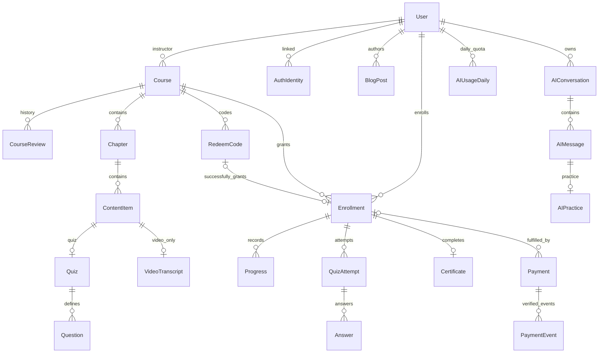

# Domain Model และ Database Design — Final 1.6 projection

วันที่ 10 ตุลาคม 2026 · Business-confirmed facts กับ physical/transaction proposalsแยกกัน · ไม่ใช่ migration script

## 1. Scope coverage / ownership

ครอบคลุมครบ 25 Domain จาก Scope §1.1; ตารางด้านล่างเป็น technical mapping, ไม่บังคับหนึ่ง Domainต่อหนึ่งtable. Fields/constraintsเชิงกายภาพเป็น PROPOSED จนSchema Ownerreview; business factsยังอ้างScope §4.3/4.5 และacceptanceเดิม.

| Domain | Write owner | Module facade | Fields ที่ต้องออกแบบ | Constraints / FK | Cardinality | Boundary |
| --- | --- | --- | --- | --- | --- | --- |
| User | auth | accounts | id/display_name/username/email/email_verified/origin; creator/time; multi-role grants; profile fields | UNIQUE normalized_username; email collision/link policy D02/D03; instructor/course FK | User 1:N Course/Enrollment/AuthIdentity/AIConversation | User profile projection through Accounts; Auth owns identity/role writes |
| AuthIdentity | auth | auth | user_id/provider/project/subject/method/email_verified/linked_at | UNIQUE(provider,project,subject); FK User | User 1:N AuthIdentity | Preserve internal User ID; no auto-email merge |
| EmailVerification | auth | auth | user/email/token_hash/created_at/expires_at/used_at/resend tracking | unique secret digest; consume compare-and-set; FK User | User 1:N EmailVerification | 24h one-use confirmed; physical owner conditional D03 |
| PasswordReset | auth | auth | user/token_hash/issued_at/expires_at/used_at/status | unique token digest; FK User; one-use transaction | User 1:N PasswordReset | No plaintext password/reset link stored in audit; D03 |
| EmailDelivery | auth | auth | user/recipient/type/status/provider_message_id/created_at/error_code | FK User; correlate to verification/reset | User 1:N EmailDelivery | Provider delivery != verification/reset success |
| Course | courses | courses | id/slug/title/subtitle/description/cover/category/level/outcomes/instructor/creator/editor/type/price/currency/status/revision/ai_enabled/published_at/timestamps | FK User(instructor); one instructor; opaque ID/unique slug when used; paid price checks | Instructor 1:N Course; Course 1:N Chapter/Review/Enrollment | ai_enabled written only through Admin AI service via Course-owned method |
| CourseReview | courses | courses | course/submitted_revision/submitted_by/reviewed_by/result/reason/timestamps | FK Course/User; revision precondition | Course 1:N CourseReview | Approval history tied to current reviewed learning revision |
| Chapter | courses | courses | id/course_id/title/position | FK Course; UNIQUE(course_id,position) technical proposal | Course 1:N Chapter; Chapter 1:N ContentItem | Reorder uses one aggregate transaction; temporary positions avoid collisions |
| ContentItem | courses | courses | chapter/type/title/position; article rich document or youtube source/url; content revision | FK Chapter; UNIQUE(chapter_id,position); type-specific invariant | Chapter 1:N Item; Item 0:1 Quiz/Transcript | No raw transcript in normal learner/public DTO; image policy D09 |
| VideoTranscript | ai | ai | video_item_id/plain_text/updated_by/updated_at | UNIQUE(video_item_id); FK Item; item kind video asserted server-side | Video Item 0:1 Transcript | Independent from learner content and course learning revision |
| Quiz | courses | courses | id/content_item_id/title/instructions/question set | UNIQUE(content_item_id); FK quiz-kind Item | Quiz Item 1:1 Quiz; Quiz 1:N Question/Attempt | Authoring owns definitions; assessments reads immutable projections |
| Question | courses | courses | quiz/type/prompt/options/correct key/max_score/order | FK Quiz; stable IDs; score bound; kind-specific data | Quiz 1:N Question | Answer keys private; images validated by approved media contract |
| Enrollment | enrollments | enrollments | user/course/source/granted_at/completed_at/completion_snapshot; source links | UNIQUE(user_id,course_id); FK User/Course | User/Course N:M via Enrollment; 1:N Progress/Attempt; 0:1 Certificate | Central grant + completion owner; completed snapshot never overwritten |
| Progress | enrollments | enrollments | enrollment/item/completed_at/resume data; accepted best completed quiz attempt reference | UNIQUE(enrollment_id,item_id); FK same course enforced via relations/guards | Enrollment 1:N Progress; Item 1:N Progress | Learning writes through Enrollment public service; no stale counters as truth |
| QuizAttempt | assessments | assessments | enrollment/quiz/question_snapshot/status/started_at/submitted_at/graded_at/score/max_score/result | FK Enrollment/Quiz; immutable snapshot; own course check | Enrollment/Quiz 1:N Attempt; Attempt 1:N Answer | Question snapshot keys remain server-only; best comparison D06 |
| Answer | assessments | assessments | attempt/snapshot_question_id/choice/text/image_ref/score/feedback/grader/time | UNIQUE(attempt_id,snapshot_question_id); FK Attempt; score 0..snapshot max | Attempt 1:N Answer | FK live Question is not sole truth; removed/edited question keeps old answer snapshot |
| RedeemCode | redeem | redeem | code/course/status/issued_by/issued_at/used_by/used_at/enrollment/revoked_by/revoked_at | UNIQUE code; FK Course/User/Enrollment; used enrollment unique | Course 1:N Code; Used code 1:1 granted Enrollment | No expiry; existing Enrollment returns without consuming new code |
| Payment | payments | payments | user/course/amount_minor/currency/request_id/session/payment_intent/status/paid_at/fulfillment_status/enrollment | UNIQUE checkout_session; request dedupe scope D10; FK User/Course/Enrollment | User/Course 1:N Payment; Enrollment 1:N successful Payments | Amount/currency snapshot; preserve all actual successful payments; no refund rule |
| PaymentEvent | payments | payments | provider/event_id/type/payment/session/received_at/status/processed_at/error | UNIQUE(provider,event_id); FK Payment when linked | Payment 1:N events | Only verified events; raw payload minimization/retention D11 |
| Certificate | certificates | certificates | code/enrollment/recipient_name/course_name/issued_at/completion snapshot ref/file metadata | UNIQUE enrollment_id; UNIQUE code; FK completed Enrollment validated in coordinator | Enrollment 0:1 Certificate | Record issued atomically with completion; file rendering retry outside DB tx |
| BlogPost | blog | blog | id/title/slug/cover/excerpt/content_doc/author/editor/status/revision/published_at/timestamps | UNIQUE slug; FK User; revision CAS | User 1:N BlogPost | Distinct from Lesson; published save immediate; delete/retention D11 |
| AIConversation | ai | ai | id/user/title/title_source/selected_course/created_at/updated_at | FK User; own-only; selected course nullable | User 1:N Conversation; Conversation 1:N Message | Chosen current course doesn't rewrite old message context |
| AIMessage | ai | ai | id/conversation/user/role/content/context snapshot/request/status/timestamps/error | FK own Conversation/User; stable order; request relation | Conversation 1:N Message; assistant Message 0:1 Practice | Accepted questions persisted before provider; no draft-keystroke logging |
| AIUsageDaily | ai | ai | user/usage_date/success_count/pending reservations | UNIQUE(user_id,usage_date); nonnegative counts; row lock/reservation | User 1:N daily rows | Asia/Bangkok; 20 successes shared all roles; deleting history no refund |
| AIPractice | ai | ai | assistant_message/user/topic/context/question/options/key/explanations/answers_latest/timestamps | UNIQUE(message_id); FK Message; stable question/option IDs in snapshot | Assistant Message 0:1 Practice | Validated choice-only set; answers do not update academic results |

## 2. Technical supporting entities — PROPOSED

| Entity | Owner | Fields | Constraints | Reason/status |
| --- | --- | --- | --- | --- |
| LocalCredential | auth | user_id/password_hash/hash_metadata | UNIQUE user_id; FK User | Existing technical entity; hash policy D01/D02; no old-data migration |
| AppSession | auth | token_hash/user_id/audience/expires_at/revoked_at | UNIQUE token_hash; FK User; index(user,audience) | Transport/TTL D01; no token returned in public DTO |
| UserRole | auth | user_id/role | UNIQUE(user_id,role); FK User | PROPOSED normalized physical mapping replaces comma-separated roles without changing wire roles[] |
| InstructorGrantAudit | auth | actor/target/role/added_at | FK User; idempotent grant reference | Confirmed audit need; physical table PROPOSED |
| AIRequest | ai | user/request_id/payload_hash/usage_date/reservation/status/result refs/expiry | UNIQUE(user_id,request_id); FK User/Conversation | PROPOSED separate coordination row for multi-message prompts, replay and deletion-safe quota |
| AuditRecord | per-module | actor/event/resource/revision/time/outcome | Domain-linked records; no secrets/raw tokens | PROPOSED shared shape, feature-owned storage; not an event platform |

## 3. Logical ER view

## 4. Physical schema strategy — PROPOSED

- คงPrismaและprojectเดิม; PostgreSQL targetได้รับการเลือกแล้ว แต่ SQLite schema8modelsปัจจุบันยังเป็นprototype.
- Canonical IDเป็นopaque string; UUID mappingเป็นtechnicalproposal ไม่แปลงprefix mockเป็นbusinesskey. Fresh test data ไม่มีlegacy mapping.
- ใช้timestamptzสำหรับinstant, dateสำหรับusage_dateที่คำนวณAsia/Bangkok; JSONBสำหรับrich documentsและimmutable snapshots ไม่เก็บJSONเป็นStringโดยอัตโนมัติ.
- Price amount_minorเป็นinteger+currency; scoresใช้numericที่ไม่ปัดก่อน >70 comparison (score*100 > max*70). Precision/storage defaultsต้องreviewกับwire finite numbers.
- Normalize rolesเป็นrelation uniqueuser/role; profilejsonkeysคงcamelCaseตามHTTP; email/usernamecollisionsต้องตามD02/D03 ไม่เพิ่มcase-foldpolicyใหม่เอง.
- Quiz snapshotsมีquestion/options/key/max ณstart; AnswerผูกsnapshotID ไม่พึ่งliveQuestionหลังedit/delete. Completion snapshotเก็บitems/results/attemptrefsณจบ.
- ใช้FK/uniqueสำหรับstructuralintegrityและscope guardsสำหรับcross-course nested IDs; order reindexทั้งหมดอยู่transactionเดียว.
- Delete/Cascadeที่กระทบhistoricalattempt/payment/completion/certหรือAIquotaยังไม่อนุมัติ; defaultdesignpreserve/history-restrictจนD11ปิด.
- Schema Owner รวม DB-01(core public read + compatible existing models), DB-02(entitlement/progress/cert), DB-03(assessment), DB-04(payment/redeem), DB-05(blog/AI), DB-06(Auth identity/verification/reset หลัง D03); dependency ตามใบงานและ migration execution serial แม้ design แยกทำได้.
- Provider proof/tokenไม่เก็บplaintextทั่วไป; secretsอยู่ENV/configไม่อยู่docs/fixturesที่เป็นข้อมูลจริง. อย่านำdemoPBKDF2หรือcookieTTLจากprototypeเป็นproductionpolicy.

## 5. State machines — BUSINESS CONFIRMED / wire DRAFT

| Aggregate | Business lifecycle | Rules / unresolved wire |
| --- | --- | --- |
| Course | Draft → pending_review → Approved → Published; return→Draft; Approved edit→Draft; Published edit stays Published | §5.2; Admin review+publish permitted with approval history. archived in Draft enum is not V1 scope; D04 revision preconditions |
| RedeemCode | Unused → Used OR Revoked | §5.4/4.5; terminal used cannot revoke; no expiry; exactly one winner |
| QuizAttempt | Started/open → Submitted → pending manual grades OR final completed | §5.6; exact wire enum from subset; retry new attempt only; threshold >70; D06 comparisons |
| Enrollment | granted → first completed | §5.5; no expiry; immutablecompleted_at/snapshot; new content doesn't reset completed |
| Payment | pending/processing → succeeded/failed/cancelled/expired | §5.11; browsercancelnotauthoritative; succeeded not regressed; fulfillment separately pending/granted/failed |
| Blog | Draft → Published → Draft viaunpublish | §5.9; Publishedsaveimmediate; delete/retentionD11 |
| AI request | pending → succeeded OR failed | §5.10; success only after usable persisted answer; reserve not success; pending anchoredtooriginalThai date |
| Email links | issued → used OR expired/invalid | §2.1/5.8; one-use24hverification; providerownershipD03 |

## 6. Critical transactions and invariants

รายละเอียดต่อไปนี้เป็น PROPOSED execution mechanism ที่ทำให้ confirmed invariantsผ่าน; ห้ามตีความเป็นbusinesspolicyใหม่.

### READ — Read scoped projections

No write; apply principal/resource/Published scope before selecting fields; deterministic sort and page limits from canonical. No public GET grants/charges/completes.

### NO_WRITE — HTTP foundation/unavailable capability

No business DB write/file upload; error response follows canonical; startup does not seed/migrate.

### TX-DB — Reviewed schema evolution

Schema Owner generates SQL/Prisma migrations once per batch; review FK/index/unique/rollback; apply only to explicitly isolated Test PostgreSQL with authorization. Never rewrite existing applied migration.

### TX-AUTH — Auth/reset

Verify proof/credential then atomically consume local reset proof/change password or create/revoke one app session. No provider password duplication; remote mail/provider I/O outside DB transaction; exact revocation policy D01/D03.

### TX-LINK — Identity/verification consume

Lock original User/link proof; unique provider/project/subject; conditional unused/unexpired consumption and verified flag/link update together. Collision cannot move ownership. Provider verification before transaction.

### TX-PROFILE — Profile patch

Validate allowed fields and approved canonical null semantics; uniqueness enforced by DB; update allowed fields atomically through Auth-owned method. Use preconditions only where the approved contract defines them; do not add a profile revision field/header independently. Accounts facade uses exported Auth interface.

### TX-USER — Create/grant

Create User+local credential+initial role+actor audit in one transaction. Instructor grant via unique role relation; replay returns prior grant and does not duplicate successful audit.

### TX-COURSE — Course aggregate

Authorize actor and every nested ID, compare approved revision, replace/update aggregate as agreed D04, order changes and content revision+audit atomic. No overwrite of Transcript/AI settings; published edits immediate; approved edit invalidates prior approval.

### TX-REVIEW — Review/publish

Lock Course and review revision, compare snapshot opened by Admin; approve/return result+actor/time+status atomic; publish verifies approval of current nonempty learning content. Stale data fails; Admin review+publish records approval rather than bypassing it.

### TX-GRANT — One entitlement

Check eligibility/published/type/owner from server; lock/recheck relevant state and create-or-return via UNIQUE(user,course). Recover uniqueness/serialization conflicts to same valid result; never check-then-create without conflict handling. Keep immutable source of original grant.

### TX-REDEEM — Redeem vs revoke

Lock Code and entitlement key in consistent order; recheck Unused and eligibility. Existing Enrollment returns without consuming. Code used_by/time/enrollment+central grant commit together. Revoke competes on same Unused row; failure rollback. No expiry added.

### TX-ASSESS — Attempt start/answer/submit

Start stores immutable full question/max/key snapshot; answer upsert only on owned open attempt and valid snapshot ID. Acquire Course/Enrollment/Attempt locks in the shared order before submit; freeze answers and server scoring. Pending written answers prevent final pass. Completed result calls Enrollment completion with verified best-result proof in the same transaction; replay rules D10.

### TX-GRADE — Last manual grade

Owner Instructor only; acquire Course/Enrollment/Attempt/Answer locks in shared order, recheck ownership and validate snapshot max and revision/idempotency D10. Recompute result when all grades complete, select best completed result under D06 and update Progress/completion/cert through owner services sharing transaction.

### TX-COMPLETE — Progress/course completion

Enrollment owns Progress and completion coordinator. Lock Enrollment; record legitimate manual article/video or backend-derived fully graded Quiz proof; unique Progress. Compare completed current items exactly (no rounded100). First completion writes immutable snapshot/time and Certificate record via issuer in same transaction. Already completed retains old snapshot despite later content. PDF/network work outside transaction.

### TX-CERT — Private download/retry

Certificate issue is internal participant of TX-COMPLETE, UNIQUE enrollment/code. Download verifies persisted owner/completion, builds/reads file under approved format D07; failure never resets completion or issues another Certificate.

### TX-CHECKOUT — External Checkout

Persist server price/currency/request intent first; perform Stripe I/O outside DB transaction using approved provider idempotency. Persist session ID/result; timeout requires lookup/reconciliation rather than another charge. GET/success/cancel URL only reads authoritative state.

### TX-PAYMENT — Verified event + grant

Verify raw-body signature and trusted identifiers/amount/currency before any grant. T-money durably records unique provider event and authoritative financial state, never regressing succeeded. T-fulfill acquires Course/Payment/Enrollment locks and atomically central-grants or reuses Enrollment, attaches it, sets granted fulfillment and records processing outcome. If T-fulfill rolls back, a separate T-failure records failed/pending fulfillment without undoing T-money. Duplicate verified delivery/reconciliation resumes incomplete fulfillment on the same Payment; it never charges again. ACK/retry/event selection remain D08/D10. External calls stay outside retryable DB transactions.

### TX-TRANSCRIPT — AI-only fields

Authorize Admin and video/course link; upsert Plain Text or set ai flag through declared Course method. Does not mutate learning revision, Review, Progress or Completion.

### TX-CHAT — Owned history mutations

Authorize owner before read/write. Keep ordered durable messages and context snapshot; title<=80 and preserve manual naming. Delete behavior/in-flight race D11, quota/dedupe accounting remains durable and unchanged.

### TX-AI — Reserve/provider/finalize

T1 authorize owner/context and check user/request_id payload, lock (user,Bangkok date), reserve if success+reserved <20, persist Pending/context/date. Call configured provider outside tx. T2 atomically persist validated response/practice snapshot, success_count+1, release reservation. Failed/no usable answer releases without success. Replay returns durable prior state; pending crosses midnight on original date. Cleanup/recovery/timeout protocol D12; do not hold DB transaction during model call.

### TX-PRACTICE — Answer latest snapshot

Own persisted practice and question/option IDs; derive correctness from server key, upsert latest answer/result in one practice transaction. No provider call, no quota or academic writes.

### TX-BLOG — Revision protected blog

Admin and current expected_revision; validate safe document under D05, save content/editor/time/revision atomic. Publish saved state; unpublish hides public. DELETE retains canonical JSON precondition until approved change; physical retention D11. Blog never updates learning entities.

### TEST-WORKFLOW — Isolated feature acceptance workflow

Exercise real feature HTTP writes/reads and their reviewed transactions on isolated Test PostgreSQL. Fixture setup is test-owned and never app-startup seed. Capture UI/contract/permission/persistence/concurrency/recovery evidence; clean up only the explicit test dataset. No provider production calls, cloud resources, release deployment or live migration.

## 7. Schema handoff and evidence

- DB taskมีproposed Prisma diff/DDL/constraints/testfixtures/migrationstrategy; feature taskมีentitiesและowner interfaces. ห้ามหลายagentแก้schemaพร้อมกัน.
- Reviewsource/hashก่อนphysicalmigration; approvalofdesignไม่ใช่approvalofliveDBmigration.
- PGtestproofต้องมีenvironment/commands/FKunique/race/rollback/read-back; ไม่ใช้SQLiteผลผ่านแทน.
- Completion/payment/AI recoveryต้องverifyfault-injectionทั้งก่อนcommitหลังprovidercallและหลังpersistresult.
- รายละเอียดretention/provider/sessionยังNEEDS_DECISIONในDECISIONS; ไม่มีplannedoperationเพื่อCRUDครบของtechnicalentities.
