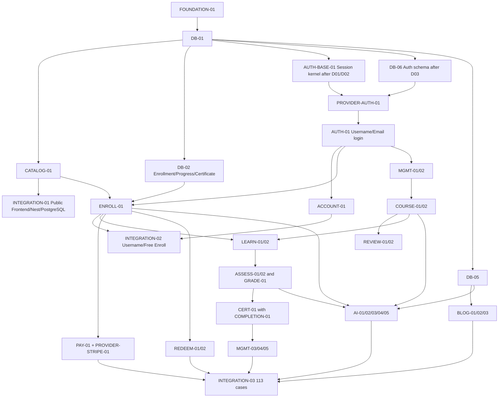

# Execution Plan — Melearn NestJS V1

Planning blueprint · 10 ตุลาคม 2026 · ไม่มีAPIimplementationในชุดงานนี้

Continuation 11 ต.ค.: งานรอคำตอบ/remaining gates เป็น **PENDING** และข้ามเฉพาะ
behavior ที่ยังไม่ชัด. ใช้ [CONTINUATION_QUEUE](CONTINUATION_QUEUE.json) เลือก
operation อิสระใน Wave 1–17; planning dependencies ทั้ง task ไม่กั้น component
ที่มี schema/authority/transaction พร้อม. Current HTTP components25/86;
ดู [checkpoint](PROFILE_REDEEM_MANAGED_ATTEMPT_COMPONENT.md). ชุด C provider
ownership confirmed และ [concrete design](FIREBASE_PROVIDER_DESIGN.md) จัดทำแล้ว.

เริ่ม execution แล้ว 11 ตุลาคม 2026 ตามคำสั่งทำ Wave 1–17; ตารางด้านล่างคง planning baseline สำหรับ traceability. ดู [สถานะและหลักฐานปัจจุบัน](EXECUTION_STATUS.md) / [machine-readable board](EXECUTION_STATUS.json) ก่อนเลือกใบงาน. Foundation, DB-01/02/05/03/04 และ CI-01 ผ่านแล้ว; ไม่ถือว่า business acceptance ผ่านจากการปิดสองงานนี้.

## 1. Inventory and readiness

86 defined operations แบ่งเป็น 35 feature packages; 5 deferred provider records รวม 2 protocol packages; รวม Auth kernel/foundation/DB/completion/integration/CI ทั้งหมด 50 tasks.

Status คือ execution readiness: READY=ไม่มี decision/dependency ค้าง; BLOCKED=รอ task/environment; NEEDS_DECISION=มี policy/protocol ค้างแม้ dependencies ยังไม่พร้อม. Handler 13 รายการของ prototype เป็น PARTIAL_UNVERIFIED.

AUTH-BASE-01 สร้าง internal session/principal kernel ก่อน provider; PROVIDER-AUTH-01 รอ kernel/DB-06; AUTH-01 จึง implement Username/Email HTTP login ครบ owner ที่อนุมัติแล้ว. ไม่ถือ local-Username-only implementation ว่าจบ operation ที่รองรับ Email ด้วย และไม่เกิด Auth/provider dependency cycle.

## 2. First three implementation tasks

| Order | Task | Current status | Reason |
| --- | --- | --- | --- |
| 1 | [FOUNDATION-01](tasks/FOUNDATION-01.md) | READY | ปรับbootstrap/validation/errors/DTO/testisolationจากโครงเดิม ก่อนใช้ฐานจริง |
| 2 | [DB-01](tasks/DB-01.md) | BLOCKED | หลังFoundationและoperatorมีisolatedTestPG; reviewedPrismamigration/readschema ไม่ใช้SQLiteผลผ่าน |
| 3 | [CATALOG-01](tasks/CATALOG-01.md) | NEEDS_DECISION | หลัง DB และ D16 Catalog query review; 2 public GET ไม่รอ Auth/provider แล้วต่อ INTEGRATION-01 ทันที |

Task 2/3 เป็นคิวถัดไป ไม่อ้างว่า READY ตอนนี้. ก่อน DB-01 ต้องระบุและตรวจ connection ของ Test PostgreSQL แยก; ไม่ใช้ live DB หรือ SQLite แทน. ปิด D16 เฉพาะ Catalog ระหว่าง Foundation/DB ได้.

## 3. Dependency graph (execution graph, not module import graph)

รูปนี้สรุปgates; dependencyที่ authoritativeต่อtaskอยู่ตาราง/JSON (รวมDB-03/04/providerdecisions). ไม่ให้graphสรุปoverrideใบงาน.

## 4. Task board

เรียงตาม dependency waves; wave เดียวกันยังต้องผ่าน decisions และ file ownership ก่อนทำพร้อมกัน. Priority ใช้เลือกงานที่ prerequisites พร้อมแล้ว ไม่ข้าม dependency.

| Wave | Task | Module | Ops | Priority | Status | Dependencies | Decisions |
| --- | --- | --- | --- | --- | --- | --- | --- |
| 1 | [FOUNDATION-01](tasks/FOUNDATION-01.md) | foundation | 0 | P0 | READY | — | — |
| 2 | [DB-01](tasks/DB-01.md) | database | 0 | P0 | BLOCKED | FOUNDATION-01 | — |
| 3 | [AUTH-BASE-01](tasks/AUTH-BASE-01.md) | auth | 0 | P0 | READY | FOUNDATION-01, DB-01 | approved lifetime/constraints; technical transport review |
| 3 | [CATALOG-01](tasks/CATALOG-01.md) | courses | 2 | P0 | NEEDS_DECISION | DB-01 | D16 |
| 3 | [DB-02](tasks/DB-02.md) | database | 0 | P0 | BLOCKED | DB-01 | — |
| 3 | [CI-01](tasks/CI-01.md) | foundation | 0 | P1 | NEEDS_DECISION | FOUNDATION-01, DB-01 | D13 |
| 3 | [DB-05](tasks/DB-05.md) | database | 0 | P1 | BLOCKED | DB-01 | — |
| 3 | [DB-06](tasks/DB-06.md) | database | 0 | P1 | NEEDS_DECISION | DB-01 | D03 |
| 4 | [INTEGRATION-01](tasks/INTEGRATION-01.md) | integration | 0 | P0 | BLOCKED | CATALOG-01 | — |
| 4 | [CATALOG-02](tasks/CATALOG-02.md) | courses | 2 | P1 | NEEDS_DECISION | CATALOG-01 | D16 |
| 4 | [COMPLETION-01](tasks/COMPLETION-01.md) | enrollments | 0 | P1 | BLOCKED | DB-02 | — |
| 4 | [DB-03](tasks/DB-03.md) | database | 0 | P1 | BLOCKED | DB-02 | — |
| 4 | [DB-04](tasks/DB-04.md) | database | 0 | P1 | BLOCKED | DB-02 | — |
| 4 | [PROVIDER-AUTH-01](tasks/PROVIDER-AUTH-01.md) | auth | 0 | P1 | NEEDS_DECISION | AUTH-BASE-01, DB-06 | D01, D03 |
| 4 | [BLOG-01](tasks/BLOG-01.md) | blog | 2 | P2 | NEEDS_DECISION | DB-05 | D16 |
| 5 | [AUTH-01](tasks/AUTH-01.md) | auth | 2 | P0 | NEEDS_DECISION | AUTH-BASE-01, PROVIDER-AUTH-01 | D01, D02, D03 |
| 6 | [ACCOUNT-01](tasks/ACCOUNT-01.md) | accounts | 2 | P0 | NEEDS_DECISION | AUTH-01 | D02, D09 |
| 6 | [ENROLL-01](tasks/ENROLL-01.md) | enrollments | 2 | P0 | BLOCKED | AUTH-01, CATALOG-01, DB-02 | — |
| 6 | [AUTH-02](tasks/AUTH-02.md) | auth | 3 | P1 | NEEDS_DECISION | AUTH-01, PROVIDER-AUTH-01 | D03 |
| 6 | [AUTH-03](tasks/AUTH-03.md) | auth | 2 | P1 | NEEDS_DECISION | AUTH-01, PROVIDER-AUTH-01 | D03 |
| 6 | [VIDEO-01](tasks/VIDEO-01.md) | courses | 1 | P1 | BLOCKED | FOUNDATION-01, AUTH-01 | — |
| 6 | [AI-02](tasks/AI-02.md) | ai | 3 | P2 | NEEDS_DECISION | AUTH-01, DB-05 | D16 |
| 6 | [BLOG-02](tasks/BLOG-02.md) | blog | 4 | P2 | NEEDS_DECISION | AUTH-01, BLOG-01 | D05, D09 |
| 6 | [CERT-01](tasks/CERT-01.md) | certificates | 3 | P2 | NEEDS_DECISION | COMPLETION-01, AUTH-01 | D07 |
| 7 | [INTEGRATION-02](tasks/INTEGRATION-02.md) | integration | 0 | P0 | BLOCKED | AUTH-01, ACCOUNT-01, ENROLL-01, INTEGRATION-01 | — |
| 7 | [PAY-01](tasks/PAY-01.md) | payments | 2 | P1 | NEEDS_DECISION | ENROLL-01, DB-04 | D08, D10 |
| 7 | [AI-05](tasks/AI-05.md) | ai | 2 | P2 | NEEDS_DECISION | AI-02 | D11 |
| 7 | [BLOG-03](tasks/BLOG-03.md) | blog | 3 | P2 | NEEDS_DECISION | BLOG-02 | D11 |
| 7 | [MGMT-01](tasks/MGMT-01.md) | management | 3 | P2 | NEEDS_DECISION | AUTH-01, ACCOUNT-01 | D02, D03, D16 |
| 8 | [PAY-02](tasks/PAY-02.md) | payments | 1 | P1 | BLOCKED | PAY-01 | — |
| 8 | [PROVIDER-STRIPE-01](tasks/PROVIDER-STRIPE-01.md) | payments | 0 | P1 | NEEDS_DECISION | PAY-01 | D08, D10 |
| 8 | [MGMT-02](tasks/MGMT-02.md) | management | 2 | P2 | BLOCKED | AUTH-01, MGMT-01 | — |
| 9 | [COURSE-01](tasks/COURSE-01.md) | courses | 4 | P1 | NEEDS_DECISION | AUTH-01, MGMT-02, DB-02 | D10 |
| 10 | [COURSE-02](tasks/COURSE-02.md) | courses | 4 | P1 | NEEDS_DECISION | COURSE-01, DB-03 | D04, D05, D09 |
| 10 | [REDEEM-01](tasks/REDEEM-01.md) | redeem | 3 | P1 | BLOCKED | COURSE-01, DB-04, AUTH-01 | — |
| 11 | [LEARN-01](tasks/LEARN-01.md) | learning | 3 | P1 | BLOCKED | ENROLL-01, COURSE-02 | — |
| 11 | [REDEEM-02](tasks/REDEEM-02.md) | redeem | 1 | P1 | BLOCKED | REDEEM-01, ENROLL-01 | — |
| 11 | [REVIEW-01](tasks/REVIEW-01.md) | courses | 2 | P1 | BLOCKED | COURSE-02 | — |
| 11 | [AI-01](tasks/AI-01.md) | ai | 3 | P2 | BLOCKED | COURSE-02, DB-05 | — |
| 12 | [ASSESS-01](tasks/ASSESS-01.md) | assessments | 3 | P1 | NEEDS_DECISION | LEARN-01, DB-03, COMPLETION-01 | D06, D09, D10 |
| 12 | [LEARN-02](tasks/LEARN-02.md) | learning | 2 | P1 | BLOCKED | LEARN-01, COMPLETION-01 | — |
| 12 | [REVIEW-02](tasks/REVIEW-02.md) | courses | 3 | P1 | NEEDS_DECISION | REVIEW-01 | D04 |
| 13 | [ASSESS-02](tasks/ASSESS-02.md) | assessments | 2 | P1 | NEEDS_DECISION | ASSESS-01 | D06 |
| 13 | [GRADE-01](tasks/GRADE-01.md) | assessments | 2 | P1 | NEEDS_DECISION | ASSESS-01, COMPLETION-01 | D06, D10 |
| 14 | [AI-03](tasks/AI-03.md) | ai | 2 | P2 | NEEDS_DECISION | AI-01, AI-02, ENROLL-01, DB-05, ASSESS-02 | D12 |
| 14 | [MGMT-03](tasks/MGMT-03.md) | management | 4 | P2 | NEEDS_DECISION | COURSE-02, ENROLL-01, ASSESS-02 | D16 |
| 15 | [AI-04](tasks/AI-04.md) | ai | 1 | P2 | BLOCKED | AI-03 | — |
| 15 | [MGMT-04](tasks/MGMT-04.md) | management | 4 | P2 | NEEDS_DECISION | MGMT-03, GRADE-01 | D16 |
| 16 | [MGMT-05](tasks/MGMT-05.md) | management | 2 | P2 | BLOCKED | MGMT-04, CERT-01 | — |
| 17 | [INTEGRATION-03](tasks/INTEGRATION-03.md) | integration | 0 | P2 | BLOCKED | AI-04, AI-05, AUTH-02, AUTH-03, BLOG-03, CATALOG-02, CI-01, INTEGRATION-02, LEARN-02, MGMT-05, PAY-02, PROVIDER-STRIPE-01, REDEEM-02, REVIEW-02, VIDEO-01 | — |

## 5. Integration and parallel lanes

- Gate0 design: inventory86/5/113, logicaldomain25, taskcontractsandblockersครบ; contractยังDraft.
- Gate1 Foundation+DB-01: isolatedPostgreSQLและruntimebootstrapไม่มีseed/migrate; testhostใช้configเดียวกับserver.
- Gate2 CATALOG-01→INTEGRATION-01: realpubliccatalogUI+SQL read-back/restart; fixturesไม่แทนAuthoringreview.
- Gate3 Authdecisions→AUTH-01/ACCOUNT-01/ENROLL-01→INTEGRATION-02: Usernameไม่มีemail, Web/Adminisolation, freegrantdurableและrace-safe.
- หลังreadschema/authพร้อม: BlogกับCourseAuthoringพัฒนาแยกได้; read-onlyInstructorCatalogกับotherdomainunitdesignแยกได้.
- RedeemกับStripeproviderpreparationแยกcodeownershipแต่ใช้centralgrantcontractเดียว; AIhistoryเริ่มก่อนproviderได้ แยกAI-05deleteที่รอretention.
- DB-02–06 designs เตรียมแยกได้ แต่ schema/migrations apply/review เข้าคิว Schema Owner; Auth provider schema รอ D03. หลาย agent ห้ามแก้ shared files พร้อมกัน.
- Featureintegrationทำหลังแต่ละfeatureพร้อม มีUI+realAPI+durabledata evidence; ไม่รอ86endpoints.
- RedeemและAI supportต้องพร้อมส่งมอบร่วมกันตามScope§2.9; แยกimplementationไม่ตัดAIออกV1.
- INTEGRATION-03ปิด113casesเมื่อevidenceรวมครบ ไม่ใช้52C#tests/13Nesttestsหรือhandlercoverageเป็นacceptanceprogress.

Feature gates ต่อไปนี้เกิดเมื่อ task ของ feature พร้อม; เก็บ evidence แยกก่อนรวม INTEGRATION-03. ไม่ใช้ final gate เป็นจุดเริ่ม integration.

| Gate | Prerequisites | Frontend/API/persistence evidence |
| --- | --- | --- |
| G-AUTH | AUTH-01/02/03, ACCOUNT-01, PROVIDER-AUTH-01 | Web/Admin session isolation, verification/recovery/link preserve user; first local slice INTEGRATION-02 |
| G-COURSE | CATALOG-01/02, COURSE-01/02, REVIEW-01/02, VIDEO-01 | Editor→review→publish→Catalog/learn; stale revisions; YouTube and unavailable upload; first public slice INTEGRATION-01 |
| G-LEARNING | ENROLL-01, LEARN-01/02, COMPLETION-01 | Free enrollment, remote lesson/resume/relogin, exact denominator and immutable completion |
| G-ASSESSMENT | ASSESS-01/02, GRADE-01 | Attempt submit→owner grading→result/progress with historical snapshots and >70 threshold |
| G-CERTIFICATE | COMPLETION-01, CERT-01 | Auto-issue, owned real file download/retry, unchanged historical snapshot |
| G-PAYMENT | PAY-01/02, PROVIDER-STRIPE-01 | Sandbox checkout/webhook→entitlement; close browser; failed fulfillment/recovery; success page read-only |
| G-REDEEM | REDEEM-01/02, ENROLL-01 | Issue/revoke/redeem→durable entitlement; race/rollback; deliver together with G-AI |
| G-AI | AI-01/02/03/04/05 | Admin transcript/settings→owned chat/history/practice; quota/replay/midnight/failure; provider sandbox |
| G-BLOG | BLOG-01/02/03 | Admin save/preview/publish/unpublish→public view; conflicts and images; unrelated learning unchanged |
| G-MANAGEMENT | MGMT-01/02/03/04/05 | Admin account/grant, scoped rosters/attempts/summaries; direct URL ownership and no Admin grading |

## 6. Agent workflow and testing gates

Read Task + context → check dependencies/decisions/source hash → implement owned files → targeted tests → contract/permission/PostgreSQL tests → review → merge/integrate → feature gate.

Component DoD แยกจาก Feature Accepted: ปิด backend task ด้วย targeted/contract/persistence evidence ก่อน; feature gate ตรวจหลัง prerequisite tasks ของ feature ครบ จึงไม่เกิดวงจรที่ task ต้องรอ gate ซึ่งรอ task เอง. INTEGRATION-03 รอทุก task ผ่าน DAG และทุก feature gate มี evidence.

| Trigger | Check | Restrictions |
| --- | --- | --- |
| During task | targetedunit/authorization/usecase tests | ไม่fullbuildทุกendpoint |
| Task complete | pnpm.cmd exec tsc --noEmit; relevantJest/SuperTest; runtime JSON schema against subset | แยกTestPG; no destructivecurrentE2E until isolationfixed |
| Schema change | SchemaOwnergenerate/reviewSQL/migrationtest+FK/unique/concurrency/rollback | no schema delta=no migration/codegenซ้ำ |
| Merge | fullNestbuild+relevantfullsuite/CI+sourcehashcheck | D13Git/CIplacementก่อนclaimhostedpass |
| Feature integration | FrontendrealAPI/TestPG, browsererror/permission, restart/read-back | VITE_API_MODEremote; failureไม่mockfallback; perfeature adapters |
| Release future | Staging/provider tests/migrationapproval/smoke/rollback evidence | ไม่deploy/cloud/liveDBในงานplanning |

## 7. Completion of planning vs completion of product

Planningผ่านเมื่อstructuralchecksและ113mappingครบพร้อมblockersชัด ไม่หมายความว่า113casesผ่านruntimeแล้ว. READYมีเพียงFoundationตอนbaselineนี้; tasksอื่นเปลี่ยนstatusหลังdependencies/decisionsมีevidence. ดู VALIDATION_REPORT.md และ ACCEPTANCE_MAP.md.

## Execution correction — 2026-10-11

D13 is confirmed: Nest backend is tracked in the fullstack branch; root CI passed. COMPLETION-01 depends on DB-03 as well as DB-02, and D06 best-result selection remains unresolved. This supplements the historical wave table; use EXECUTION_STATUS.json for current readiness. [Next decision packet](NEXT_DECISIONS_TH.md) keeps concrete proposals separate from approved requirements.

## Auth approval / execution update — 11 ต.ค. 2026

D01 session lifetime/revocation, D02 constraints/profile semantics และ D03 provider direction confirmed; ไม่ถามอนุมัติชุดเดิมซ้ำ. Draft.2 canonical constraints sync กับ task subsets และ Frontend types. AUTH-BASE-01 local kernel มี 18 PostgreSQL + 6 unit tests; ยังไม่เปลี่ยน Login HTTP เป็น production credential flow. ลำดับต่อ: kernel/transport cutover → reviewed Firebase exchange/link/recovery contract → PROVIDER-AUTH-01 → AUTH-01 full Username/Email → real browser/persistence gate. ดู AUTH_LOCAL_KERNEL_COMPONENT.md; technical tests ไม่เพิ่มจำนวน accepted operations/cases.
